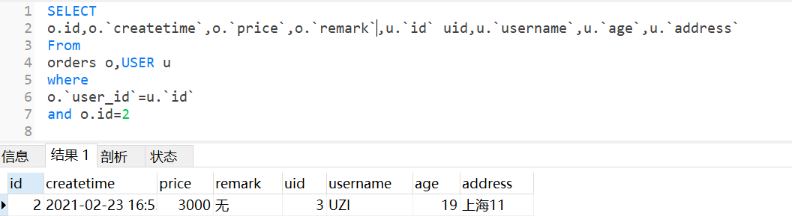

# Mybatis

- MyBatis 是一款优秀的持久层框架。
- MyBatis 免除了几乎所有的 JDBC 代码以及设置参数和获取结果集的工作。
- 官网：https://mybatis.org/mybatis-3/zh/#

## 简单地过一下使用流程

速览流程：

1. 创建数据库，数据准备
2. 导入相关依赖：Mybatis和MySql驱动
3. 创建mybatis-config.xml文件，配置相关信息（主要是数据源和映射xml文件的位置）
4. 创建实体类
5. 创建对应实体类的dao（mapper）层接口，添加方法
6. 创建dao层接口对应的映射xml文件，用sql语句实现接口的方法
7. 去测试类中测试一下

**数据库以及数据准备**

```mysql
CREATE DATABASE /*!32312 IF NOT EXISTS*/`mybatis_db` /*!40100 DEFAULT CHARACTER SET utf8 */;
USE `mybatis_db`;
DROP TABLE IF EXISTS `user`;
CREATE TABLE `user` (
  `id` int(11) NOT NULL AUTO_INCREMENT,
  `username` varchar(50) DEFAULT NULL,
  `age` int(11) DEFAULT NULL,
  `address` varchar(50) DEFAULT NULL,
  PRIMARY KEY (`id`)
) ENGINE=InnoDB AUTO_INCREMENT=3 DEFAULT CHARSET=utf8;
insert  into `user`(`id`,`username`,`age`,`address`) values (1,'UZI',19,'上海'),(2,'PDD',25,'上海');
```


**导入mysql，mybatis，lombox依赖**

```xml
<!--mysql驱动-->
<dependency>
    <groupId>mysql</groupId>
    <artifactId>mysql-connector-java</artifactId>
    <version>8.0.27</version>
</dependency>
<!--mybatis依赖-->
<dependency>
    <groupId>org.mybatis</groupId>
    <artifactId>mybatis</artifactId>
    <version>3.5.7</version>
</dependency>
<dependency>
    <groupId>org.projectlombok</groupId>
    <artifactId>lombok</artifactId>
    <version>1.18.22</version>
    <scope>provided</scope>
</dependency>
```

**在资源目录下创建：mybatis-config.xml配置文件**

```xml
<?xml version="1.0" encoding="UTF-8" ?>
<!DOCTYPE configuration
        PUBLIC "-//mybatis.org//DTD Config 3.0//EN"
        "http://mybatis.org/dtd/mybatis-3-config.dtd">
<configuration>
    <environments default="development">
        <environment id="development">
            <transactionManager type="JDBC"/>
            <dataSource type="POOLED">
                <property name="driver" value="com.mysql.jdbc.Driver"/>
                <property name="url" value="jdbc:mysql://localhost:3306/mybatis_db"/>
                <property name="username" value="root"/>
                <property name="password" value="cronaldo7"/>
            </dataSource>
        </environment>
    </environments>
    <mappers>
        <mapper resource="com/sangeng/dao/UserDao.xml"/>
    </mappers>
</configuration>
```

**实体类**

```java
@Data
@AllArgsConstructor
@NoArgsConstructor
public class User {
    private Integer id;
    private String username;
    private Integer age;
    private String address;
}
```

**定义接口及对应的xml映射文件**

>底层是动态代理：读取xml映射文件，生成接口的代理对象，代理对象在调用对应的方法时执行的是xml映射文件的sql语句

com.sangeng.dao.UserDao:

```java
public interface UserDao {
    List<User> findAll();
}
```

Resource下对应的映射文件（**用/而不是.创建目录**）：com/sangeng/dao/UserDao.xml（创建目录的路径和UserDao的路径一致）

```xml
<?xml version="1.0" encoding="UTF-8" ?>
<!DOCTYPE mapper
        PUBLIC "-//mybatis.org//DTD Mapper 3.0//EN"
        "http://mybatis.org/dtd/mybatis-3-mapper.dtd">
<mapper namespace="com.sangeng.dao.UserDao">

    <select id="findAll" resultType="com.sangeng.pojo.User">
      select * from user
    </select>
</mapper>
```

**编写测试类Demo.java**

获取SqlSession,通过SqlSession获取UserDao调用对应的方法

```java
    public static void main(String[] args) throws IOException {
        //定义mybatis配置文件的路径
        String resource = "mybatis-config.xml";
        InputStream inputStream = Resources.getResourceAsStream(resource);
        SqlSessionFactory sqlSessionFactory = new SqlSessionFactoryBuilder().build(inputStream);
        //获取Sqlsession对象
        SqlSession sqlSession = sqlSessionFactory.openSession();
        //获取UserDao实现类对象
        UserDao userDao = sqlSession.getMapper(UserDao.class);
        //调用方法测试
        List<User> userList = userDao.findAll();
        System.out.println(userList);
        //释放资源
        sqlSession.close();
    }
```

## 核心类

**SqlSessionFactory**

​SqlSessionFactory是一个SqlSession的工厂类。主要用来获取SqlSession对象。

成员方法如下：

```java
SqlSession openSession();
//获取SqlSession对象，传入的参数代表创建的SqlSession是否自动提交
SqlSession openSession(boolean autoCommit);//默认是false，只是查询的时候没关系，但增删改的时候要注意打开自动提交
```

**SqlSession**

​SqlSession提供了在数据库执行SQL命令所需的所有方法,它还提供了事务的相关操作。

成员方法如下：

```java
T getMapper(Class<T> type);//获取mapper对象
void commit();//提交事务
void rollback();//回滚事务
void close();//释放资源
```

## mybatis-config.xml配置文件详解

### properties

>可以使用properties读取properties配置文件。使用其中的resource属性来设置配置文件的路径。然后使用${key}来获取配置文件中的值

例如：

在resources目录下有jdbc.properties文件，内容如下：

```properties
jdbc.url=jdbc:mysql://localhost:3306/mybatis_db
jdbc.driver=com.mysql.jdbc.Driver
jdbc.username=root
jdbc.password=cronaldo7
```

在mybatis-config.xml中：

```xml
<?xml version="1.0" encoding="UTF-8" ?>
<!DOCTYPE configuration
        PUBLIC "-//mybatis.org//DTD Config 3.0//EN"
        "http://mybatis.org/dtd/mybatis-3-config.dtd">
<configuration>
    <!--设置配置文件所在的路径-->
    <properties resource="jdbc.properties"></properties>
    <environments default="development">
        <environment id="development">
            <transactionManager type="JDBC"/>
            <dataSource type="POOLED">
                <!--获取配置文件中配置的对应的值来设置连接相关参数-->
                <property name="driver" value="${jdbc.driver}"/>
                <property name="url" value="${jdbc.url}"/>
                <property name="username" value="${jdbc.username}"/>
                <property name="password" value="${jdbc.password}"/>
            </dataSource>
        </environment>
    </environments>
</configuration>
```

### settings

>​可以使用该标签来设置进行一些设置

例如：

```xml
    <settings>
        <!--开启自动驼峰命名映射-->
        <setting name="mapUnderscoreToCamelCase" value="true"/>
    </settings>
```

具体的设置参考：https://mybatis.org/mybatis-3/zh/configuration.html#settings

### typeAliases

>​可以用来设置给全类名设置别名，简化书写。一般设置一个包下的类全部具有默认别名。默认别名是类目首字母小写。例如：com.sangeng.pojo.User别名为user

*注：没啥卵用，之后下载了插件，这些（select,...）标签自动生成的，起不起别名都没关系*

```java
   <typeAliases>
        <package name="com.sangeng.dao"></package>
    </typeAliases>
```

那么
```xml
<select id="findAll" resultType="com.sangeng.pojo.User">
      select * from user
</select>
```

可以改为

```xml
<select id="findAll" resultType="user">
      select * from user
</select>
```

### environments

>配置数据库相关的环境，例如事物管理器，连接池相关参数等。

```xml
    <!--设置默认环境-->
	<environments default="development">
        
        <!--设置该环境的唯一标识-->
        <environment id="development">
            <transactionManager type="JDBC"/>
            <dataSource type="POOLED">
                <!--获取配置文件中配置的对应的值来设置连接相关参数-->
                <property name="driver" value="${jdbc.driver}"/>
                <property name="url" value="${jdbc.url}"/>
                <property name="username" value="${jdbc.username}"/>
                <property name="password" value="${jdbc.password}"/>
            </dataSource>
        </environment>
    </environments>
```

### mappers

>该标签的作用是加载映射，加载方式有如下几种(**主要使用第四种**)：

1. 使用相对于类路径的资源引用，例如：

```xml
<!-- 使用相对于类路径的资源引用 -->
<mappers>
  <mapper resource="org/mybatis/builder/AuthorMapper.xml"/>
  <mapper resource="org/mybatis/builder/BlogMapper.xml"/>
  <mapper resource="org/mybatis/builder/PostMapper.xml"/>
</mappers>
```

2. 使用完全限定资源定位符（URL），例如：

```xml
<!-- 使用完全限定资源定位符（URL） -->
<mappers>
  <mapper url="file:///var/mappers/AuthorMapper.xml"/>
  <mapper url="file:///var/mappers/BlogMapper.xml"/>
  <mapper url="file:///var/mappers/PostMapper.xml"/>
</mappers>
```

3. 使用映射器接口实现类的完全限定类名（注解开发），例如：

```xml
<!-- 使用映射器接口实现类的完全限定类名 -->
<mappers>
  <mapper class="org.mybatis.builder.AuthorMapper"/>
  <mapper class="org.mybatis.builder.BlogMapper"/>
  <mapper class="org.mybatis.builder.PostMapper"/>
</mappers>
```

4. 将包内的映射器接口实现全部注册为映射器（最重要,一劳永逸），例如：

```xml
<!-- 定义dao接口所在的包。要求xml文件存放的路径和dao接口的包名要对应 -->
<mappers>
  <package name="com.sangeng.dao"/>
</mappers>
```

## 高效编程(非常方便！！！)

对于繁杂，重复性的操作(mybatis-config.xml通用的文件头，mapper映射文件select，update标签...)，可以用一些工具帮助我们完成，实现高效编程

### 配置代码模板(mybatis-config.xml)


### Mybatis插件

​下载安装Free Mybatis plugin，安装完后重启IDEA

这个插件可以方便开发：

* alter+enter接口类，就可以选择生成对应的mapper xml文件，不用自己手动创建了
* alter+enter接口类中的方法，就可以选择在对应mapper xml文件中创建它的sql语句的框架
* 快速从代码跳转到mapper及从mapper返回代码
* mybatis自动补全及语法错误提示
* 集成mybatis generator gui界面
* 根据数据库注解，生成swagger model注解

## 参数获取

### 一个参数

**基本参数**

使用#{}直接来取值，写任意名字都可以获取到参数。但是一般用方法的参数名来取。

例如：

接口中方法定义如下

```java
User findById(Integer id);
```

xml中内容如下:

```xml
<select id="findById" resultType="com.sangeng.pojo.User">  select * from user where id = #{id}</select>
```

**传参是POJO实体类**

使用POJO中的属性名来获取对应的值。

例如：

接口中方法定义如下

```java
User findByUser(User user);
```

xml中内容如下：

```xml
    <select id="findByUser" resultType="com.sangeng.pojo.User">
        select * from user where id = #{id} and username = #{username} and age = #{age} and address = #{address}
    </select>
```

**传参是map类型**

使用map中的key来获取对应的值

例如：

接口中方法定义如下

```java
User findByMap(Map map);
```

xml中内容如下：

```java
    <select id="findByMap" resultType="com.sangeng.pojo.User">
        select * from user where id = #{id} and username = #{username} and age = #{age} and address = #{address}
    </select>
```

方法调用：

```java
        Map map = new HashMap();
        map.put("id",2);
        map.put("username","PDD");
        map.put("age",25);
        map.put("address","上海");
        userDao.findByMap(map);
```

### 多个参数

**方法参数前使用`@Param`来设置参数名**

​Mybatis会把多个参数放入一个Map集合中，默认的key是argx和paramx这种格式。

例如：

接口中方法定义如下

```java
User findByCondition(Integer id,String username);
```

最终map中的键值对如下：

```java
{arg1=PDD, arg0=2, param1=2, param2=PDD}
```

虽然可以使用对应的默认key来获取值，但是这种方式可读性不好。一般在方法参数前使用`@Param`来设置参数名。

例如：

接口中方法定义

```java
User findByCondition(@Param("id") Integer id,@Param("username") String username);
```

最终map中的键值对如下：

```
{id=2, param1=2, username=PDD, param2=PDD}
```

所以我们就可以使用如下方式来获取参数

```xml
    <select id="findByCondition" resultType="com.sangeng.pojo.User">
         select * from user where id = #{id} and username = #{username}
    </select>
```

### #{}和${}的区别

**尽可能的使用#{}，因为它安全**

 #{}是预编译的sql,可以防止SQL注入攻击

 ​${}是直接把参数值拿来进行拼接，这样会有SQL注入的危险

如果使用的是#{}来获取参数值日志如下：

```
Preparing: select * from user where id = ? and username = ? and age = ? and address = ? 
Parameters: 2(Integer), 小红(String), 20(Integer), 广州(String)
```

如果使用${}来获取参数值日志如下：

```
Preparing: select * from user where id = 2 and username = 小红 and age = 20 and address = 广州 
```

### 总结

​如果只有一个参数的时候不用做什么特殊处理。如果是有多个参数的情况下一定要加上`@Param`来设置参数名。

## 实现增删改查

**注意：增删改的时候要记得提交事务**

### 新增

接口中增加相关方法

```java
void insertUser(User user);
```

映射文件UserDao.xml增加响应的标签

```xml
    <insert id="insertUser">
        insert into user values(null,#{username},#{age},#{address})
    </insert>
```

测试类

```java
userDao.insertUser(new User(null,"小红",35,"广州"));
sqlSession.commit();//提交事务
```

### 删除

接口中增加相关方法

```java
void deleteById(Integer id);
```

映射文件UserDao.xml增加响应的标签

```xml
    <delete id="deleteById">
        delete from user where id = #{id}
    </delete>
```

测试类

```java
userDao.deleteById(3);
sqlSession.commit();//提交事务
```

### 修改

接口中增加相关方法

```java
void updateUser(User user);
```

映射文件UserDao.xml增加响应的标签

```xml
    <!--更新用户-->
    <update id="updateUser">
        UPDATE USER SET age = #{age} , username = #{username},address = #{address} WHERE id = #{id}
    </update>
```

测试类
```java
userDao.updateUser(new User(2,"pdd",20,"上海1983"));
sqlSession.commit();//提交事务
```

### 查询

**例一：根据id查询**

接口中增加相关方法

```java
User findById(Integer id);
```

映射文件UserDao.xml增加响应的标签

```xml
   <select id="findById" resultType="com.sangeng.pojo.User">
      select * from user where id = #{id}
    </select>
```

**例二：查询所有**

接口中增加相关方法

```java
List<User> findAll();
```

映射文件UserDao.xml增加响应的标签

```xml
    <select id="findAll" resultType="com.sangeng.pojo.User">
      select * from user
    </select>
```

## 打印日志

1. log4j配置  

在resources目录下创建log4j.properties文件，内容如下：

```properties
### direct log messages to stdout ###
log4j.appender.stdout=org.apache.log4j.ConsoleAppender
log4j.appender.stdout.Target=System.out
log4j.appender.stdout.layout=org.apache.log4j.PatternLayout
log4j.appender.stdout.layout.ConversionPattern=%d{ABSOLUTE} %5p %c{1}:%L - %m%n

### direct messages to file mylog.log ###
log4j.appender.file=org.apache.log4j.FileAppender
log4j.appender.file.File=c:/mylog.log
log4j.appender.file.layout=org.apache.log4j.PatternLayout
log4j.appender.file.layout.ConversionPattern=%d{ABSOLUTE} %5p %c{1}:%L - %m%n

### set log levels - for more verbose logging change 'info' to 'debug' ###

log4j.rootLogger=debug, stdout
```

2. 引入依赖

```xml
        <dependency>
            <groupId>log4j</groupId>
            <artifactId>log4j</artifactId>
            <version>1.2.17</version>
        </dependency>
```

## 注解开发(不推荐)

用注解开发可以替换掉xml。

使用注解来映射简单语句会使代码显得更加简洁，但对于稍微复杂一点的语句，Java注解不仅力不从心，还会让本就复杂的SQL语句更加混乱不堪。 

所以在企业开发中一般都是使用XML的形式。

**用一个例子展示注解开发的步骤**

1. 在核心配置文件mybatis-config.xml中配置mapper接口所在的包名

```xml
    <mappers>
        <package name="com.sangeng.dao"></package>
    </mappers>
```

2. 在接口对应方法上使用注解来配置需要执行的sql

```java
public interface UserDao {

    @Select("select * from user")
    List<User> findAll();

    @Insert("insert into user values(null,#{username},#{age},#{address})")
    void insertUser(User user);

    @Update("UPDATE USER SET age = #{age} , username = #{username},address = #{address} WHERE id = #{id}")
    void updateUser(User user);

    @Delete("delete from user where id = #{id}")
    void deleteById(Integer id);
}
```

3. 和之前的一样获取Mapper调用方法即可

```java
    public static void main(String[] args) throws IOException {
        //定义mybatis配置文件的路径
        String resource = "mybatis-config.xml";
        InputStream inputStream = Resources.getResourceAsStream(resource);
        SqlSessionFactory sqlSessionFactory = new SqlSessionFactoryBuilder().build(inputStream);
        //获取Sqlsession对象
        SqlSession sqlSession = sqlSessionFactory.openSession();
        //获取UserDao实现类对象
        UserDao userDao = sqlSession.getMapper(UserDao.class);
        //调用方法测试
        List<User> userList = userDao.findAll();
        System.out.println(userList);
        //释放资源
        sqlSession.close();
    }
```

## 动态SQL

​在实际开发中的SQL语句很多时候需要根据传入的参数情况动态地生成SQL语句。Mybatis提供了动态SQL相关的标签。

### if标签

>可以使用if标签进行条件判断，条件成立才会把if标签中的内容拼接进sql语句

例如：

如果参数username为null则执行的sql为：**select * from user where id = ?** 

如果参数username不为null则执行的sql为：**select * from user where id = ? and username = ?** 

```xml
    <select id="findByCondition" resultType="com.sangeng.pojo.User">
         select * from user
         where  id = #{id}
        <if test="username!=null">
           and username = #{username}
        </if>
    </select>
```

**注意：在test属性中表示参数的时候不需要写#{}，写了会出问题。**

### trim标签（一般用where，set来代替）

>可以使用该标签动态地添加前缀或后缀，也可以使用该标签动态地消除前缀。

**prefixOverrides属性**

​用来设置需要被清除的前缀,多个值可以用|分隔，注意|前后不要有空格

例如：

最终执行的sql为： select * from user where id = ? 前缀and被清除了

```xml
    <select id="findByCondition" resultType="com.sangeng.pojo.User">
        select * from user where
        <trim prefixOverrides="and|or" >
            and id=#{id}
        </trim>
    </select>
```

**suffixOverrides属性**

​用来设置需要被清除的后缀,多个值可以用|分隔，注意|前后不要有空格

例如：

最终执行的sql为： select * from user  去掉了后缀like

```xml
    <select id="findByCondition" resultType="com.sangeng.pojo.User">
        select * from user
        <trim suffixOverrides="like|and" >
            where 1=1 like
        </trim>
    </select>
```

**prefix属性**

​用来设置动态添加的前缀，如果标签中有内容就会添加上设置的前缀

例如：

最终执行的sql为：select * from user where 1=1   动态增加了前缀where

```xml
    <select id="findByCondition" resultType="com.sangeng.pojo.User">
        select * from user
        <trim prefix="where" >
           1=1
        </trim>
    </select>
```

**suffix属性**

​用来设置动态添加的后缀，如果标签中有内容就会添加上设置的后缀

例如：

最终执行的sql为：select * from user where 1=1   动态增加了后缀1=1

```xml
    <select id="findByCondition" resultType="com.sangeng.pojo.User">
        select * from user
        <trim suffix="1=1" >
           where
        </trim>
    </select>
```

**综合运用一下**

调用方法时如果传入的id和username都为null则执行的SQL为：select * from user

调用方法时如果传入的id和username都不为null则执行的SQL为：select * from user where id = ? and username = ?

调用方法时如果传入的id为null，username不为null，则执行的SQL为：select * from user where username = ?

调用方法时如果传入的id不为null，username为null，则执行的SQL为：select * from user where id = ?


```java
User findByCondition(@Param("id") Integer id,@Param("username") String username);
```

```xml
    <select id="findByCondition" resultType="com.sangeng.pojo.User">
        select * from user
        <trim prefix="where" prefixOverrides="and|or" >
            <if test="id!=null">
                id = #{id}
            </if>
            <if test="username!=null">
                and username = #{username}
            </if>
        </trim>
    </select>
```

### where标签

​where标签等价于：

**​可以使用where标签动态地拼接where并且去除前缀的and或者or**

```xml
<trim prefix="where" prefixOverrides="and|or" ></trim>
```

例如：

如果id和username都为null，则执行的sql为：select * from user

如果id为null，username不为null，则执行的sql为：select * from user  where username = ? 

```xml
    <select id="findByCondition" resultType="com.sangeng.pojo.User">
        select * from user
        <where>
            <if test="id!=null">
                id = #{id}
            </if>
            <if test="username!=null">
                and username = #{username}
            </if>
        </where>
    </select>
```

### set标签

​set标签等价于：

**​可以使用set标签动态的拼接set并且去除后缀的逗号**

```xml
<trim prefix="set" suffixOverrides="," ></trim>
```

例如：

如果调用方法时传入的User对象的id为2，username不为null，其他属性都为null则最终执行的sql为：UPDATE USER SET username = ? where id = ?

```xml
    <update id="updateUser">
        UPDATE USER
        <set>
            <if test="username!=null">
                username = #{username},
            </if>
            <if test="age!=null">
                age = #{age},
            </if>
            <if test="address!=null">
                address = #{address},
            </if>
        </set>
        where id = #{id}
    </update>
```

### foreach标签

**​可以使用foreach标签遍历集合或者数组类型的方法参数，获取其中的元素拿来动态的拼接SQL语句**

* collection：表示要遍历的参数(方法参数中@Param里面的名字)
* open:表示遍历开始时拼接的语句
* item：表示给当前遍历到的元素取的名字
* separator：表示每遍历完一次拼接的分隔符
* close：表示最后一次遍历完拼接的语句

*注意：如果方法参数是数组类型，默认的参数名是array，如果方法参数是list集合默认的参数名是list。建议遇到数组或者集合类型的参数统一使用@Param注解进行命名。*

例子：

方法定义

>期望动态地根据实际传入的数组的长度拼接SQL语句。例如传入长度为4个数组最终执行的SQL为：select * from User WHERE id in( ? , ? , ? , ?) 

```java
List<User> findByIds(@Param("ids") Integer[] ids);
```

在xml映射文件中可以使用以下写法

```xml
	<select id="findByIds" resultType="com.sangeng.pojo.User">
        select * from User
        <where>
            <foreach collection="ids" open="id in(" close=")" item="id" separator=",">
                #{id}
            </foreach>
        </where>
    </select>
```

### choose、when、otherwise标签

一个choose标签中最多只会有一个when中的判断成立。从上到下去进行判断。如果成立了就把标签体的内容拼接到sql中，并且不会进行其它when的判断和拼接。如果所有的when都不成立则拼接otherwise中的语句。

* choose类似于java中的switch
* when类似于java中的case
* otherwise类似于java中的dufault


例如:

>如果user对象的id不为空时就通过id查询。
如果id为null,username不为null就通过username查询
如果id和username都是null就查询id为3的用户

接口中方法定义如下

```java
List<User> selectChose(User user);
```

xml映射文件如下

```xml
 	<select id="selectChose" resultType="com.sangeng.pojo.User">
        select * from user
        <where>
            <choose>
                <when test="id!=null">
                    id = #{id}
                </when>
                <when test="username!=null">
                    username = #{username}
                </when>
                <otherwise>
                    id = 3
                </otherwise>
            </choose>
        </where>
    </select>
```

## SQL片段抽取（复用性，维护性）

在xml映射文件中编写SQL语句的时候可能会遇到**重复的SQL片段**。这种SQL片段可以使用sql标签来进行抽取。然后在需要使用的时候使用**include标签**进行使用。

例如：

最终执行的sql为：select id,username,age,address from user

```xml
    <sql id="baseSelect" >id,username,age,address</sql>
    <select id="findAll" resultType="com.sangeng.pojo.User">
        select <include refid="baseSelect"/>  from user
    </select>
```

## 这集往后的例子代码初始化

### 案例数据初始化sql

在之前只有user表的前提下进行拓展

orders表：订单创建时间，订单价格，备注，所属用户的用户id（订单和用户是一对一，用户和订单是一对多）

role表：角色名，描述（一个用户可以有多个角色，一个角色也可以有多个用户）

中间表user_role：反映用户和角色的中间关系表


```mysql
CREATE DATABASE /*!32312 IF NOT EXISTS*/`mybatis_db` /*!40100 DEFAULT CHARACTER SET utf8 */;

USE `mybatis_db`;
DROP TABLE IF EXISTS `orders`;
CREATE TABLE `orders` (
  `id` int(11) NOT NULL AUTO_INCREMENT,
  `createtime` timestamp NOT NULL DEFAULT CURRENT_TIMESTAMP ON UPDATE CURRENT_TIMESTAMP COMMENT '创建时间',
  `price` int(11) DEFAULT NULL COMMENT '价格',
  `remark` varchar(100) DEFAULT NULL COMMENT '备注',
  `user_id` int(11) DEFAULT NULL COMMENT '用户id',
  PRIMARY KEY (`id`)
) ENGINE=InnoDB AUTO_INCREMENT=4 DEFAULT CHARSET=utf8;
insert  into `orders`(`id`,`createtime`,`price`,`remark`,`user_id`) values (1,'2014-06-26 16:55:43',2000,'无',2),(2,'2021-02-23 16:55:57',3000,'无',3),(3,'2021-02-23 16:56:21',4000,'无',2);
DROP TABLE IF EXISTS `role`;

CREATE TABLE `role` (
  `id` int(11) NOT NULL AUTO_INCREMENT,
  `name` varchar(100) DEFAULT NULL COMMENT '角色名',
  `desc` varchar(100) DEFAULT NULL COMMENT '角色描述',
  PRIMARY KEY (`id`)
) ENGINE=InnoDB AUTO_INCREMENT=3 DEFAULT CHARSET=utf8;

/*Data for the table `role` */

insert  into `role`(`id`,`name`,`desc`) values (1,'总经理','一人之下'),(2,'CFO',NULL);

/*Table structure for table `user` */

DROP TABLE IF EXISTS `user`;

CREATE TABLE `user` (
  `id` int(11) NOT NULL AUTO_INCREMENT,
  `username` varchar(50) DEFAULT NULL,
  `age` int(11) DEFAULT NULL,
  `address` varchar(50) DEFAULT NULL,
  PRIMARY KEY (`id`)
) ENGINE=InnoDB AUTO_INCREMENT=33 DEFAULT CHARSET=utf8;

/*Data for the table `user` */

insert  into `user`(`id`,`username`,`age`,`address`) values (2,'pdd',26,NULL),(3,'UZI',19,'上海11'),(4,'RF',19,NULL);

/*Table structure for table `user_role` */

DROP TABLE IF EXISTS `user_role`;

CREATE TABLE `user_role` (
  `user_id` int(11) DEFAULT NULL,
  `role_id` int(11) DEFAULT NULL
) ENGINE=InnoDB DEFAULT CHARSET=utf8;

/*Data for the table `user_role` */

insert  into `user_role`(`user_id`,`role_id`) values (2,2),(2,1),(3,1);
```

### 实体类

**User.java**

```java
@Data
@AllArgsConstructor
@NoArgsConstructor
public class User {
    private Integer id;
    private String username;
    private Integer age;
    private String address;
}
```

**Order.java**

```java
@Data
@AllArgsConstructor
@NoArgsConstructor
public class Order {
        private Integer id;
        private Date createtime;
        private Integer price;
        private String remark;
        private Integer userId;
}
```

**Role.java**

```java
@Data
@AllArgsConstructor
@NoArgsConstructor
public class Role {
    private Integer id;
    private String name;
    private String desc;
}
```

**针对Order.java创建OrderDao接口类和对应的映射文件**

```java
public interface OrderDao {
    public List<Order> findAll();
}
```

### junit进行测试

**导入依赖**
```xml
<dependency>
    <groupId>junit</groupId>
    <artifactId>junit</artifactId>
    <version>4.12</version>
    <scope>test</scope>
</dependency>
```

**test目录下编写测试**

test.java.com.sangeng.MybatisTest

```java
public class MybatisTest {
    private SqlSession sqlSession;
    @Before
    public void init() throws IOException {
        //定义mybatis配置文件的路径
        String resource = "mybatis-config.xml";
        //传入对应配置文件的输入流
        InputStream inputStream = Resources.getResourceAsStream(resource);
        //读取配置文件，获得SqlSessionFactory
        SqlSessionFactory sqlSessionFactory = new SqlSessionFactoryBuilder().build(inputStream);
        //获取Sqlsession对象(理解为数据库连接)
        sqlSession = sqlSessionFactory.openSession();
    }
    @Test
    public void testUserDao(){
        UserDao userDao= sqlSession.getMapper(UserDao.class);
        System.out.println(userDao.findAll());
    }
    @Test
    public void testOrderDao(){
        OrderDao orderDao=sqlSession.getMapper(OrderDao.class);
    }
    @After
    public void destory(){
        //提交事务，释放资源
        sqlSession.commit();
        sqlSession.close();
    }
}
```

## ResultMap结果集映射

当数据库的列名和实体类的属性名不一致，自动映射将会失败（比如orders表里的列user_id就不能自动映射到Order实体类的UserId属性）

使用resultMap标签可以自定义结果集和实体类属性的映射规则。

基本使用示例：

```xml
    <!--
        resultMap 用来自定义结果集和实体类的映射
            属性：
                id 相当于这个resultMap的唯一标识
                type 用来指定映射到哪个实体类
        id标签  用来指定主键列的映射规则
            属性：
                property 要映射的实体类对应的属性名
                column  对应的列名
        result标签 用来指定普通列的映射规则
            属性：
                property 要映射的实体类对应的属性名
                column 对应的列名
    -->
    <resultMap id="orderMap" type="com.sangeng.pojo.Order" >
        <id column="id" property="id"></id>
        <result column="createtime" property="createtime"></result>
        <result column="price" property="price"></result>
        <result column="remark" property="remark"></result>
        <result column="user_id" property="userId"></result>
    </resultMap>

	<!--使用我们自定义的映射规则-->
    <select id="findAll" resultMap="orderMap">
        SELECT id,createtime,price,remark,user_id  FROM ORDERS
    </select>
```

### 自动映射

​定义resultMap时默认情况下自动映射是开启状态的。也就是如果结果集的列名和实体类对应的属性名相同是会自动映射的

*注：把resultMap的autoMapping属性设置为false可以选择关闭自动映射（复杂的多表操作一般要将自动映射关闭）*

**那么实际上只需要写特殊情况的映射关系即可**

例如：

下面这种写法和上面的写法会有相同的效果，因为其他属性的属性名和结果集的列名都是相同的会自动映射。

```xml
    <resultMap id="orderMap" type="com.sangeng.pojo.Order" >
        <result column="user_id" property="userId"></result>
    </resultMap>
	<!--使用我们自定义的映射规则-->
    <select id="findAll" resultMap="orderMap">
        SELECT id,createtime,price,remark,user_id  FROM ORDERS
    </select>
```

### 继承映射关系（提高复用性）

使用resultMap的extends属性来指定一个resultMap，从而复用重复的映射关系配置。

例如：

```xml
  	<!--定义个父映射，供其他resultMap继承-->
	<resultMap id="baseOrderMap" type="com.sangeng.pojo.Order" >
        <id column="id" property="id"></id>
        <result column="createtime" property="createtime"></result>
        <result column="price" property="price"></result>
        <result column="remark" property="remark"></result>
    </resultMap>
	<!--继承baseOrderMap，然后只需要写自己特有的映射关系即可-->
    <resultMap id="orderMap" type="com.sangeng.pojo.Order" autoMapping="false" extends="baseOrderMap">
        <result column="user_id" property="userId"></result>
    </resultMap>
```

## 多表查询

有的时候需要查询多张表的数据才可以得到结果，有两种方法实现：

1. 直接写一个多表关联的SQL进行查询
2. 也可以分步进行多次的查询来拿到结果

中大型项目，用分布查询更好：

1. 如果要查的表太多，多表关联查询的效率会很低
2. 分布查询可以按需加载

### 多表关联查询

#### 一对一关系

例如:查询一个订单，要求还需要获取下单用户的数据。（这里的订单相对于用户是一对一的关系）

因为期望Order中还能包含下单用户的数据，所以在Order中增加一个属性

```java
private User user;
```

方法定义

```java
    //根据订单id查询订单，要求把下单用户的信息也查询出来
    Order findById(Integer id);
```

SQL语句如下

```mysql
SELECT 
	o.id,o.`createtime`,o.`price`,o.`remark`,u.`id` uid,u.`username`,u.`age`,u.`address`
FROM 
	orders o,USER u
WHERE
	o.`user_id` = u.`id`
	AND o.id = 2
```

结果集



如果直接复制上述sql语句到映射文件里，会有问题：
前几个属性没问题，但用户相关的数据无法自动映射（uid,username,age,address），因为在Order实体类中没有对应的属性（只有一个User属性）

```java
@Test
    public void testOrderDao(){
        OrderDao orderDao=sqlSession.getMapper(OrderDao.class);
        System.out.println(orderDao.findById(2));
    }
```

日志：

```
Order(id=2, createtime=Tue Feb 23 16:55:57 CST 2021, price=3000, remark=无, userId=null, user=null)
```

可以使用如下两种方式封装结果集。

##### 使用ResultMap对所有字段进行映射来封装结果集

​可以使用ResultMap设置user对象的属性的映射规则。

①resultMap定义:主要是对user对象的属性设置映射规则(前两个之前写了)

```xml
 	<resultMap id="baseOrderMap" type="com.sangeng.pojo.Order" >
        <id column="id" property="id"></id>
        <result column="createtime" property="createtime"></result>
        <result column="price" property="price"></result>
        <result column="remark" property="remark"></result>
    </resultMap>

    <resultMap id="orderMap" type="com.sangeng.pojo.Order" autoMapping="false" extends="baseOrderMap">
        <result column="user_id" property="userId"></result>
    </resultMap>

    <!--Order和User关联的映射-->
    <resultMap id="orderUserMap" type="com.sangeng.pojo.Order" autoMapping="false" extends="orderMap">
        <result property="user.id" column="uid"></result>
        <result property="user.username" column="username"></result>
        <result property="user.age" column="age"></result>
        <result property="user.address" column="address"></result>
    </resultMap>
```

②使用定义好的resultMap

```xml
<!--根据订单id查询订单，要求把下单用户的信息也查询出来-->
    <select id="findById" resultMap="orderUserMap">
        SELECT
            o.`id`,o.`createtime`,o.`price`,o.`remark`,o.`user_id`,u.`id` uid,u.`username`,u.`age`,u.`address`
        FROM
            orders o,`user` u
        WHERE
            o.id = #{id} AND
            o.`user_id`=u.`id`
    </select>
```

##### 使用ResultMap中的association来封装结果集（更直观点）

​可以使用ResultMap中的子标签association来设置关联实体类的映射规则

①定义resultMap

```xml
 	<resultMap id="baseOrderMap" type="com.sangeng.pojo.Order" >
        <id column="id" property="id"></id>
        <result column="createtime" property="createtime"></result>
        <result column="price" property="price"></result>
        <result column="remark" property="remark"></result>
    </resultMap>

    <resultMap id="orderMap" type="com.sangeng.pojo.Order" autoMapping="false" extends="baseOrderMap">
        <result column="user_id" property="userId"></result>
    </resultMap>

    <!--Order和User关联的映射（使用association）-->
    <resultMap id="orderUserMapUseAssociation" type="com.sangeng.pojo.Order" autoMapping="false" extends="orderMap">
        <association property="user" javaType="com.sangeng.pojo.User">
            <id property="id" column="uid"></id>
            <result property="username" column="username"></result>
            <result property="age" column="age"></result>
            <result property="address" column="address"></result>
        </association>
    </resultMap>
```

②使用resultMap

```xml
<!--根据订单id查询订单，要求把下单用户的信息也查询出来-->
    <select id="findById" resultMap="orderUserMapUseAssociation">
        SELECT
            o.`id`,o.`createtime`,o.`price`,o.`remark`,o.`user_id`,u.`id` uid,u.`username`,u.`age`,u.`address`
        FROM
            orders o,`user` u
        WHERE
            o.id = #{id} AND
            o.`user_id`=u.`id`
    </select>
```

#### 一对多关系

例如：需要查询用户，要求还需要获取该用户所具有的角色信息（这里的用户相对于角色是一对多的）

因为期望User中还能包含该用户所具有的角色信息，所以在User中增加一个属性

```java
//该用户所具有的角色
    private List<Role> roles;
```

方法定义如下

```java
    //根据id查询用户，并且要求把该用户所具有的角色信息也查询出来
    User findById(Integer id);
```

SQL语句如下

```mysql
SELECT 
	u.`id`,u.`username`,u.`age`,u.`address`,r.id rid,r.name,r.desc
FROM 
	USER u,user_role ur,role r
WHERE 
	u.id=ur.user_id AND ur.role_id = r.id
	and u.id=2
```

结果集


##### 使用ResultMap中的collection来封装结果集

​可以使用ResultMap中的子标签collection（因为结果集中的映射是一对多的）来设置关联实体类的映射规则

①定义ResultMap

```xml
	<!--定义User基本属性映射规则-->
	<resultMap id="userMap" type="com.sangeng.pojo.User">
        <id property="id" column="id"></id>
        <result property="username" column="username"></result>
        <result property="age" column="age"></result>
        <result property="address" column="address"></result>
    </resultMap>
	
    <resultMap id="userRoleMap" type="com.sangeng.pojo.User"  extends="userMap">
        <collection property="roles" ofType="com.sangeng.pojo.Role" >
            <id property="id" column="rid"></id>
            <result property="name" column="name"></result>
            <result property="desc" column="desc"></result>
        </collection>
    </resultMap>
```

②使用ResultMap

```xml
    
    <select id="findById" resultMap="userRoleMap" >
        SELECT 
            u.`id`,u.`username`,u.`age`,u.`address`,r.id rid,r.name,r.desc
        FROM 
            USER u,user_role ur,role r
        WHERE 
            u.id=ur.user_id AND ur.role_id = r.id
            AND u.id = #{id}
    </select>
```

最终封装完的结果如下：


### 分步查询

多表查询也可以选择用多次查询的方式来查询出想要的数据。

​例如：需要查询用户，还需要查询出该用户所具有的角色信息。那就可以选择先去User表查询到用户信息，然后再去查询关联的角色信息。	

#### 实现步骤

**①定义查询方法**

要分两步查询: 
1. 查询User 
2. 根据用户的id查询Role  

所以需要定义下面两个方法，并且把对应的标签也先写好

1. 查询User

```java
    //根据用户名查询用户，并且要求把该用户所具有的角色信息也查询出来
    User findByUsername(String username);
```

```xml
    <!--根据用户名查询用户-->
    <select id="findByUsername" resultType="com.sangeng.pojo.User">
        select id,username,age,address from user where username = #{username}
    </select>
```

2. 根据user_id查询Role

```java
public interface RoleDao {
	//根据userId查询所具有的角色
    List<Role> findRoleByUserId(Integer userId);
}

```

```xml
    <!--根据userId查询所具有的角色-->
    <select id="findRoleByUserId" resultType="com.sangeng.pojo.Role">
        select 
            r.id,r.name,r.desc
        from 
            role r,user_role ur
        where 
            ur.role_id = r.id
            and ur.user_id = #{userId}
    </select>
```

**②配置分步查询**

期望的效果是调用findByUsername方法查询出来的结果中就包含角色的信息。所以可以设置findByUsername方法的RestltMap，指定分步查询

```xml
    <resultMap id="userMap" type="com.sangeng.pojo.User">
        <id property="id" column="id"></id>
        <result property="username" column="username"></result>
        <result property="age" column="age"></result>
        <result property="address" column="address"></result>
    </resultMap>
    <!--
           select属性：指定用哪个查询来查询当前属性的数据 写法：包名.接口名.方法名
           column属性：设置当前结果集中哪列的数据作为select属性指定的查询方法需要参数
       -->
	<resultMap id="userRoleMapBySelect" type="com.sangeng.pojo.User" extends="userMap">
        <collection property="roles"
                    ofType="com.sangeng.pojo.Role"
                    select="com.sangeng.dao.RoleDao.findRoleByUserId"
                    column="id">
        </collection>
    </resultMap>
```

​指定findByUsername使用刚刚创建的resultMap

```xml
    <!--根据用户名查询用户-->
    <select id="findByUsername" resultMap="userRoleMapBySelect">
        select id,username,age,address from user where username = #{username}
    </select>
```

#### 设置按需加载

>按需加载：需要用到关联数据的时候才会去查询关联数据。

​有两种方式可以配置分别是*全局配置*和*局部配置*

1. 局部配置

   设置fetchType属性为lazy

   ```xml
   	<resultMap id="userRoleMapBySelect" type="com.sangeng.pojo.User" extends="userMap">
           <collection property="roles"
                       ofType="com.sangeng.pojo.Role"
                       select="com.sangeng.dao.RoleDao.findRoleByUserId"
                       column="id" fetchType="lazy">
           </collection>
       </resultMap>
   ```

2. 全局配置

   设置lazyLoadingEnabled为true

   ```xml
       <settings>
          <setting name="lazyLoadingEnabled" value="true"/>
       </settings>
   ```

## 分页查询-PageHelper

使用PageHelper实现分页查询的需求，就不需要自己在SQL中拼接SQL相关参数了，并且能非常方便地获取到总页数总条数等分页相关数据。

### 实现步骤

**①定义方法查询方法以及生成对应标签**

```java
	List<User> findAll();
```

```xml
    <select id="findAll" resultType="com.sangeng.pojo.User">
        select id,username,age,address from user
    </select>
```

**②引入依赖**

```xml
<dependency>
    <groupId>com.github.pagehelper</groupId>
    <artifactId>pagehelper</artifactId>
    <version>4.0.0</version>
</dependency>
```

**③在mybatis-config.xml配置文件中使用分页插件**

```xml
 <plugins>
        <!-- 注意：分页助手的插件  配置在通用馆mapper之前 -->
        <plugin interceptor="com.github.pagehelper.PageHelper">
            <!-- 指定方言 -->
            <property name="dialect" value="mysql"/>
        </plugin>
    </plugins>
```

**④开始分页查询**

只需要在使用查询方法前设置分页参数即可

```java
    //设置分页参数
	UserDao userDao = session.getMapper(UserDao.class);
    //设置分页查询参数
    PageHelper.startPage(1,1);//查询第几页，每页存几条数据
    List<User> users = userDao.findAll();
    System.out.println(users.get(0));//输出该页的第一条数据
    System.out.println(users.get(1));//输出该页的第二条数据
```

如果需要获取总页数总条数等分页相关数据，只需要创建一个`PageInfo`对象，把刚刚查询出的返回值做为构造方法参数传入。然后使用pageInfo对象获取即可。

```java
	PageInfo<User> pageInfo = new PageInfo<User>(users);
    System.out.println("总条数："+pageInfo.getTotal());
	System.out.println("总页数："+pageInfo.getPages());
	System.out.println("当前页："+pageInfo.getPageNum());
	System.out.println("每页显示长度："+pageInfo.getPageSize());
```

### 一对多的多表查询分页问题

在进行一对多的多表查询时，如果使用了PageHelper进行分页，会出现关联数据不全的情况。

使用分步查询的方式解决该问题。

## Mybatis缓存

​Mybatis的缓存其实就是把之前查到的数据内存（map）,下次如果还是查相同的东西，就可以直接从缓存中取，从而提高效率。

​Mybatis有一级缓存和二级缓存之分：

* 一级缓存（默认开启）：sqlsession级别的缓存，之前查到的数据会存放到Session对象中的一个map集合里。
* 二级缓存：相当于mapper级别的缓存，之前查到的数据会放到这个mapper中。

一般只会用一级缓存，二级缓存用不到

因为如果开启二级缓存，那么即使使用了新的sqlsession，依然会获得缓存数据，不安全。（比如：服务器A查询id=2的用户信息后，关闭连接；然后服务器B修改了id=2的用户的相关信息。那么当服务器A再次开启，访问id=2的用户时，直接从mapper缓存中拿到的还是旧的用户信息）

### 一级缓存

几种不会使用一级缓存的情况

   1. 调用相同方法但是传入的参数不同（查的东西不一样，之前没有记录）
   2. 调用相同方法，参数也相同，但是使用的是另外一个SqlSession
   3. 如果查询完后，对同一个表进行了增，删，改的操作，都会清空这sqlSession上的缓存
   4. 如果手动调用SqlSession的clearCache方法清除缓存了，后面也使用不了缓存

### 二级缓存

二级缓存在实际开发中基本不会使用。

注意：只有sqlsession调用了close或者commit后的数据才会进入二级缓存

**涉及到的实体类要实现序列化Serializable接口**

**先在全局开启二级缓存**

在mybatis-config.xml配置文件中配置

```xml
    <settings>
        <setting name="cacheEnabled" value="true"/>
    </settings>
```

**然后在局部开启二级缓存**

在要开启二级缓存的mapper映射文件中设置cache标签

```xml
<?xml version="1.0" encoding="UTF-8" ?>
<!DOCTYPE mapper PUBLIC "-//mybatis.org//DTD Mapper 3.0//EN" "http://mybatis.org/dtd/mybatis-3-mapper.dtd" >
<mapper namespace="com.sangeng.dao.RoleDao">
    <cache></cache>
</mapper>
```