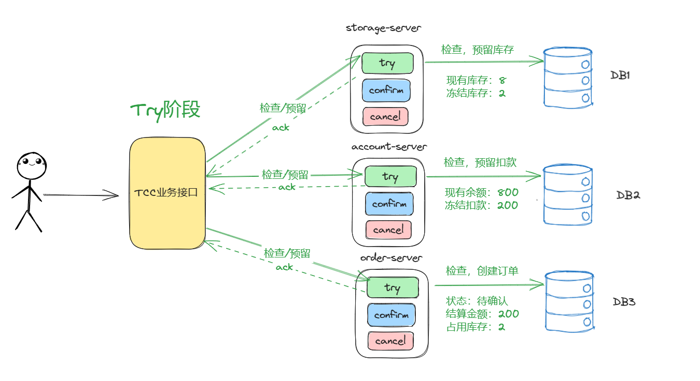
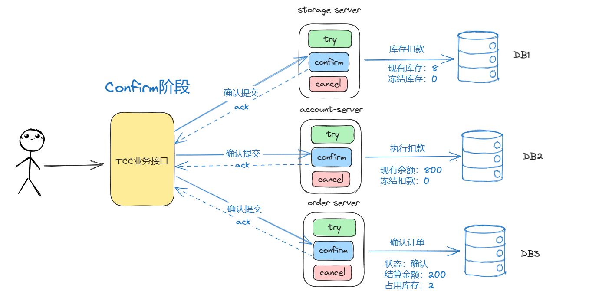
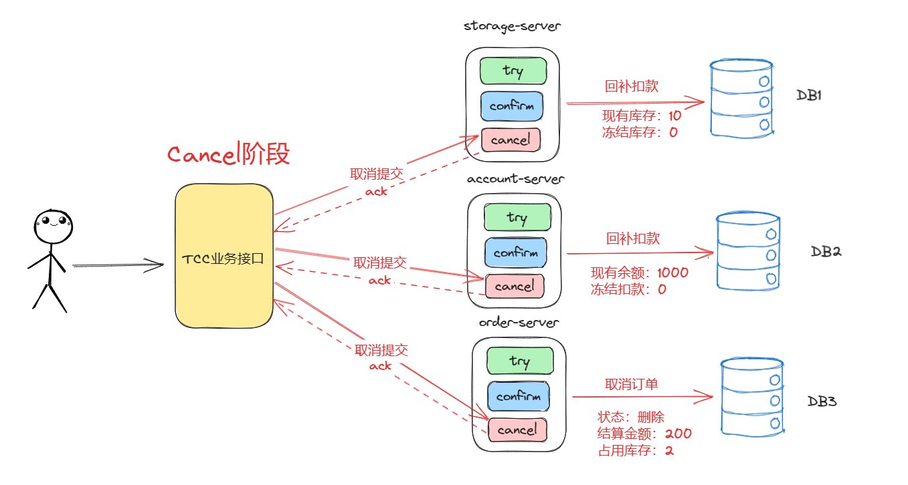
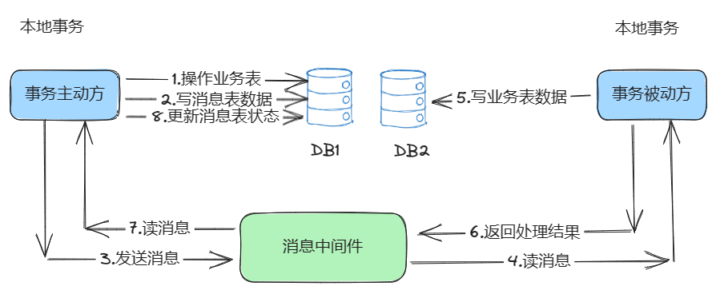
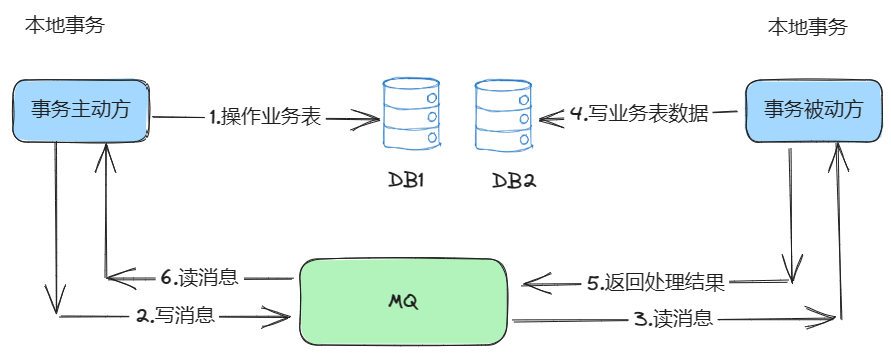
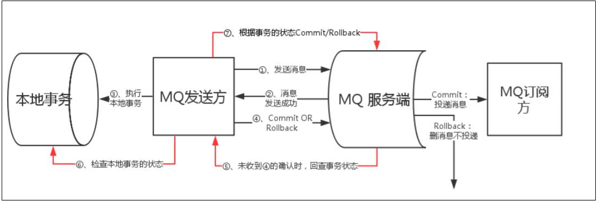
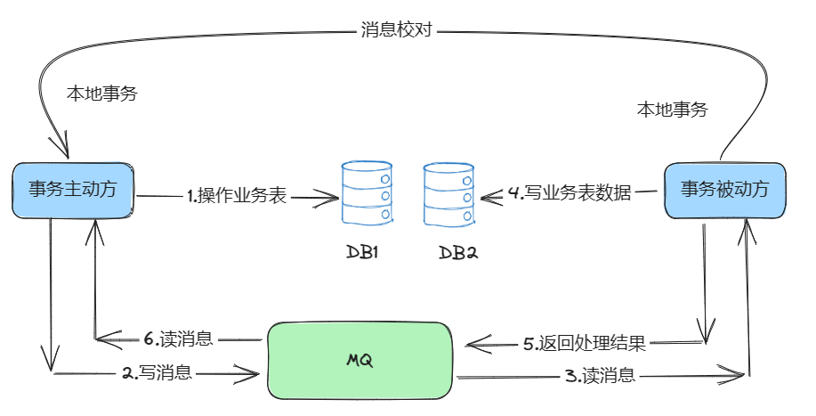

# mysql本地事务实现原理

以MySQL 的InnoDB （InnoDB 是 MySQL 的一个存储引擎）为例，说明单一数据库的事务实现原理。

InnoDB 是通过 日志和锁 来保证的事务的 ACID特性，具体如下：

（1）通过数据库锁的机制，保障事务的隔离性；

（2）通过 Redo Log（重做日志）来，保障事务的持久性；

（3）通过 Undo Log （撤销日志）来，保障事务的原子性；

（4）通过 Undo Log （撤销日志）来，保障事务的一致性；

Undo Log 如何保障事务的原子性呢？
>具体的方式为：在操作任何数据之前，首先将数据备份到一个地方（这个存储数据备份的地方称为 Undo Log），然后进行数据的修改。如果出现了错误或者用户执行了 Rollback 语句，系统可以利用 Undo Log 中的备份将数据恢复到事务开始之前的状态。

Redo Log如何保障事务的持久性呢？
>具体的方式为：Redo Log 记录的是新数据的备份（和 Undo Log 相反）。在事务提交前，只要将 Redo Log 持久化即可，不需要将数据持久化。当系统崩溃时，虽然数据没有持久化，但是 Redo Log 已经持久化。系统可以根据 Redo Log 的内容，将所有数据恢复到崩溃之前的状态。


# 分布式事务简介

分布式事务：在分布式系统中一次操作需要由多个(微)服务协同完成，这种由不同的服务之间通过网络协同完成的事务称为分布式事务

通俗讲，就是一次大的操作由不同的小操作组成，这些小的操作分布在不同的服务器上，且属于不同的应用，分布式事务需要保证这些小操作要么全部成功，要么全部失败，也就是在分布式环境下保证各个事务的ACID

# 分布式事务场景

## 跨库事务

跨库事务指的是，一个相对复杂的逻辑功能需要操作多个库数据，不同的库中存储不同的业务数据。


此时操作需要考虑DB1事务，也需要考虑DB2的事务，妥妥的分布式事务。

## 分库分表

当一个库/或者一张表数据量比较大或者预期未来的数据量会有比较大增长时，再设计表是考虑水平拆分，即分库分表。


DB2分库分表之后，执行DML操作时，需要考虑分区1，分区2操作一起成功，一起失败。此时service面临着分布式事务的问题。

## 微服务化

一个逻辑多个微服务参与，涉及多个数据库数据改动，又是一个分布式事务场景。


# 分布式事务特性

## CAP概念

>CAP定理是分布式系统中的重要理论，它不仅仅体现在分布式事务中

**一致性**（Consistency）："all nodes see the same data at the same time"，即更新操作成功后，所有节点在同一时间的数据完全一致

**可用性**（Availability）："reads and writes always succeed"，即服务一直可用且能够正常响应（不保证返回的是最新写入的数据）

**分区容错性**（Partition tolerance）："the system continues to operate despite arbitrary message loss or failure of part of the system"，即分布式系统在遇到某节点或网络分区故障的时候，仍然能够对外提供满足一致性和可用性的服务


如上图所示，在一个分布式系统中最多只能同时满足CAP这三项中的两项

## CAP选择

> 对于分布式系统来说，**P是不能放弃的**，因此架构师通常选择CP或AP

**CA**
放弃P，放弃分区容错性的话，则放弃了分布式，放弃了系统的可扩展性

**CP**
放弃A，放弃可用性的话，则在遇到网络分区或其他故障时，受影响的服务需要等待一定的时间，在此期间无法对外提供政策的服务，即不可用

**AP**
放弃C，放弃一致性的话，则系统无法保证数据保持实时的一致性，在数据达到**最终一致性**前，有个时间窗口，在时间窗口内，数据是不一致的。

## CAP为何无法共存


**理想操作：**
用户第一次访问，通过Nginx后，走网段1，执行数据添加，数据同步到网段2的数据库中

用户第二次访问，通过Nginx后，走网段2，执行数据查询，查询到第一次访问时添加的data数据

**非理想状态**
用户第一次访问，通过Nginx后，走网段1，执行数据添加，数据无法同步到网段2的数据库

用户第二次访问，通过Nginx后，走网段2，执行数据查询

分布式系统存在意义，最低要求必须保证**分区容错性**成立，那么就意味着，上面操作存在2种选择。
* 选择可用性(A)，牺牲一致性(C)：返回空数据，
* 选择一致性(C)，牺牲可用性(A)：阻塞等待，直到网段1，网段2连通，数据同步完成之后，再返回data数据。

## BASE

BASE是Basically Available(基本可用)、Soft state(软状态)和Eventually consistent(最终一致性)三个短语的简写。

BASE是对CAP中一致性和可用性权衡的结果，源于对大规模互联网系统分布式实践的总结，是**基于CAP定理逐步演化**而来的，其核心思想是即使无法做到强一致性，但每个应用都可以根据自身的业务特点，采用适当的方法来使系统达到**最终一致性**。

**Basically Available基本可用**
指分布式系统在出现故障时，系统允许损失部分可用性，即保证核心功能或者当前最重要功能可用。
对于用户来说，他们当前最关注的功能或者最常用的功能的可用性将会获得保证，但是其他功能会被削弱

**Soft state软状态**
允许系统中的数据存在中间状态，并认为该状态不影响系统的整体可用性，即允许系统在多个不同节点的数据副本存在数据延时。

**Eventually consistent最终一致性**
不可能一直是软状态，必须有个时间期限。在期限过后，应当保证所有副本保持数据一致性，从而达到数据的最终一致性。这个时间期限取决于网络延时、系统负载、数据复制方案设计等等因素。

**总结**
总的来说，BASE 理论面向的是大型高可用可扩展的分布式系统，**和传统事务的 ACID 是相反的**，它完全不同于 ACID 的强一致性模型，而是**通过牺牲强一致性**来获得可用性，并允许数据在一段时间是不一致的。

# 分布式事务问题

## 需求

需求：用户下单，扣款，扣库存。


## 项目演示

根据上面分析，项目设计出3个微服务

业务服务：business-service

订单服务：order-service

账户服务：account-service

库存服务：stock-service

代码如下

**

### 2.2.1 数据库准备

创建3个数据库与3张表   

**seata-account**     

```sql
CREATE TABLE `t_account`
(
    `id`      int(11) NOT NULL AUTO_INCREMENT,
    `user_id` varchar(255) DEFAULT NULL,
    `money`   int(11) DEFAULT 0,
    PRIMARY KEY (`id`)
) ENGINE=InnoDB DEFAULT CHARSET=utf8;

INSERT INTO `t_account` VALUES (1, 'U100000', 900);
```

**seata-order**   

```sql
CREATE TABLE `t_order`
(
    `id`             int(11) NOT NULL AUTO_INCREMENT,
    `user_id`        varchar(255) DEFAULT NULL,
    `commodity_code` varchar(255) DEFAULT NULL,
    `count`          int(11) DEFAULT 0,
    `money`          int(11) DEFAULT 0,
    PRIMARY KEY (`id`)
) ENGINE=InnoDB DEFAULT CHARSET=utf8;
```

**seata-stock**

```sql
CREATE TABLE `t_stock`
(
    `id`             int(11) NOT NULL AUTO_INCREMENT,
    `commodity_code` varchar(255) DEFAULT NULL,
    `count`          int(11) DEFAULT 0,
    PRIMARY KEY (`id`),
    UNIQUE KEY (`commodity_code`)
) ENGINE=InnoDB DEFAULT CHARSET=utf8;

INSERT INTO `t_stock` VALUES (1, 'C100000', 10);
```

### 库存服务

**stock-service**

**依赖**

```xml
<dependencies>
    <!-- bootstrap 启动器 -->
    <dependency>
        <groupId>org.springframework.cloud</groupId>
        <artifactId>spring-cloud-starter-bootstrap</artifactId>
    </dependency>
    <dependency>
        <groupId>org.springframework.boot</groupId>
        <artifactId>spring-boot-starter-web</artifactId>
    </dependency>
    <dependency>
        <groupId>mysql</groupId>
        <artifactId>mysql-connector-java</artifactId>
    </dependency>
    <dependency>
        <groupId>com.alibaba</groupId>
        <artifactId>fastjson</artifactId>
        <version>1.2.56</version>
    </dependency>
    <dependency>
        <groupId>com.baomidou</groupId>
        <artifactId>mybatis-plus-boot-starter</artifactId>
        <version>3.4.2</version>
    </dependency>

    <!--nacos客户端-->
    <dependency>
        <groupId>com.alibaba.cloud</groupId>
        <artifactId>spring-cloud-starter-alibaba-nacos-discovery</artifactId>
    </dependency>

    <!--fegin组件-->
    <dependency>
        <groupId>org.springframework.cloud</groupId>
        <artifactId>spring-cloud-starter-openfeign</artifactId>
    </dependency>

    <!--sentinel组件-->
    <dependency>
        <groupId>com.alibaba.cloud</groupId>
        <artifactId>spring-cloud-starter-alibaba-sentinel</artifactId>
    </dependency>

    <dependency>
        <groupId>com.alibaba.cloud</groupId>
        <artifactId>spring-cloud-starter-alibaba-nacos-config</artifactId>
    </dependency>

    <dependency>
        <groupId>org.projectlombok</groupId>
        <artifactId>lombok</artifactId>
    </dependency>
    <dependency>
        <groupId>org.springframework.cloud</groupId>
        <artifactId>spring-cloud-loadbalancer</artifactId>
    </dependency>
</dependencies>
```

**配置文件**

```yaml
# Tomcat
server:
  port: 8083
# Spring
spring:
  application:
    # 应用名称
    name: stock-service
  profiles:
    # 环境配置
    active: dev
  cloud:
    nacos:
      discovery:
        # 服务注册地址
        server-addr: 127.0.0.1:8848
  datasource:
    driver-class-name: com.mysql.cj.jdbc.Driver
    url: jdbc:mysql:///seata-stock?serverTimezone=UTC&useUnicode=true&characterEncoding=utf-8&useSSL=true
    username: root
    password: admin
mybatis-plus:
  configuration:
    log-impl: org.apache.ibatis.logging.stdout.StdOutImpl
```

**domain**

```java
package cn.wolfcode.tx.stock.domain;

import com.baomidou.mybatisplus.annotation.IdType;
import com.baomidou.mybatisplus.annotation.TableId;
import com.baomidou.mybatisplus.annotation.TableName;
import lombok.Data;

@Data
@TableName("t_stock")
public class Stock {
    @TableId(type = IdType.AUTO)
    private Integer id;
    private String commodityCode;
    private Integer count;
}

```

**mapper**

```java
package cn.wolfcode.tx.stock.mapper;

import cn.wolfcode.tx.stock.domain.Stock;
import com.baomidou.mybatisplus.core.mapper.BaseMapper;

public interface StockMapper  extends BaseMapper<Stock> {
}

```

**service**

```java
package cn.wolfcode.tx.stock.service;

import cn.wolfcode.tx.stock.domain.Stock;
import com.baomidou.mybatisplus.extension.service.IService;

public interface IStockService  extends IService<Stock> {

    /**
     * 扣库存
     * @param commodityCode
     * @param count
     */
    void deduct(String commodityCode, int count);
}

```

**service.impl**

```java
package cn.wolfcode.tx.stock.service.impl;

import cn.wolfcode.tx.stock.domain.Stock;
import cn.wolfcode.tx.stock.mapper.StockMapper;
import cn.wolfcode.tx.stock.service.IStockService;
import com.baomidou.mybatisplus.extension.service.impl.ServiceImpl;
import io.seata.core.context.RootContext;
import org.springframework.stereotype.Service;
import org.springframework.transaction.annotation.Transactional;

@Service
public class StockServiceImpl extends ServiceImpl<StockMapper, Stock> implements IStockService {
    @Override
    @Transactional
    public void deduct(String commodityCode, int count) {
        Stock one = lambdaQuery().eq(Stock::getCommodityCode, commodityCode).one();
        if(one != null && one.getCount() < count){
            throw new RuntimeException("Not Enough Count ...");
        }

        lambdaUpdate().setSql("count = count-" + count)
                .eq(Stock::getCommodityCode, commodityCode)
                .update();
       
    }
}

```

**controller**

```java
package cn.wolfcode.tx.stock.controller;

import cn.wolfcode.tx.stock.service.IStockService;
import org.springframework.beans.factory.annotation.Autowired;
import org.springframework.web.bind.annotation.*;

@RestController
@RequestMapping("stocks")
public class StockController {
    @Autowired
    private IStockService StockService;

    @Autowired
    private IStockService stockService;

    @GetMapping(value = "/deduct")
    public String deduct(String commodityCode, int count) {
        try {
            stockService.deduct(commodityCode, count);
        } catch (Exception exx) {
            exx.printStackTrace();
            return "FAIL";
        }
        return "SUCCESS";
    }
}

```

**启动类**

```java
package cn.wolfcode.tx;

import org.mybatis.spring.annotation.MapperScan;
import org.springframework.boot.SpringApplication;
import org.springframework.boot.autoconfigure.SpringBootApplication;
import org.springframework.cloud.client.discovery.EnableDiscoveryClient;
import org.springframework.cloud.openfeign.EnableFeignClients;

@SpringBootApplication
@EnableDiscoveryClient
@EnableFeignClients
@MapperScan("cn.wolfcode.tx.stock.mapper")
public class StockApplication {
    public static void main(String[] args) {
        SpringApplication.run(StockApplication.class, args);
    }
}

```

### 账户服务

**account-service**

**依赖**

```xml
<dependencies>
    <!-- bootstrap 启动器 -->
    <dependency>
        <groupId>org.springframework.cloud</groupId>
        <artifactId>spring-cloud-starter-bootstrap</artifactId>
    </dependency>
    <dependency>
        <groupId>org.springframework.boot</groupId>
        <artifactId>spring-boot-starter-web</artifactId>
    </dependency>
    <dependency>
        <groupId>mysql</groupId>
        <artifactId>mysql-connector-java</artifactId>
    </dependency>
    <dependency>
        <groupId>com.alibaba</groupId>
        <artifactId>fastjson</artifactId>
        <version>1.2.56</version>
    </dependency>
    <dependency>
        <groupId>com.baomidou</groupId>
        <artifactId>mybatis-plus-boot-starter</artifactId>
        <version>3.4.2</version>
    </dependency>

    <!--nacos客户端-->
    <dependency>
        <groupId>com.alibaba.cloud</groupId>
        <artifactId>spring-cloud-starter-alibaba-nacos-discovery</artifactId>
    </dependency>

    <!--fegin组件-->
    <dependency>
        <groupId>org.springframework.cloud</groupId>
        <artifactId>spring-cloud-starter-openfeign</artifactId>
    </dependency>

    <!--sentinel组件-->
    <dependency>
        <groupId>com.alibaba.cloud</groupId>
        <artifactId>spring-cloud-starter-alibaba-sentinel</artifactId>
    </dependency>

    <dependency>
        <groupId>com.alibaba.cloud</groupId>
        <artifactId>spring-cloud-starter-alibaba-nacos-config</artifactId>
    </dependency>

    <dependency>
        <groupId>org.projectlombok</groupId>
        <artifactId>lombok</artifactId>
    </dependency>
</dependencies>
```

**配置文件**

```yaml
# Tomcat
server:
  port: 8081
# Spring
spring:
  application:
    # 应用名称
    name: account-service
  profiles:
    # 环境配置
    active: dev
  cloud:
    nacos:
      discovery:
        # 服务注册地址
        server-addr: 127.0.0.1:8848
  datasource:
    driver-class-name: com.mysql.cj.jdbc.Driver
    url: jdbc:mysql:///seata-account?serverTimezone=UTC&useUnicode=true&characterEncoding=utf-8&useSSL=true
    username: root
    password: admin
mybatis-plus:
  configuration:
    log-impl: org.apache.ibatis.logging.stdout.StdOutImpl

```

**domain**

```java
package cn.wolfcode.tx.account.domain;

import com.baomidou.mybatisplus.annotation.IdType;
import com.baomidou.mybatisplus.annotation.TableId;
import com.baomidou.mybatisplus.annotation.TableName;
import lombok.Data;

@Data
@TableName("t_account")
public class Account {
    @TableId(type = IdType.AUTO)
    private Integer id;
    private String userId;
    private int money;
}

```

**mapper**

```java
package cn.wolfcode.tx.account.mapper;

import cn.wolfcode.tx.account.domain.Account;
import com.baomidou.mybatisplus.core.mapper.BaseMapper;

public interface AccountMapper  extends BaseMapper<Account> {
}

```

**service**

```java
package cn.wolfcode.tx.account.service;

import cn.wolfcode.tx.account.domain.Account;
import com.baomidou.mybatisplus.extension.service.IService;

public interface IAccountService  extends IService<Account> {

    /**
     * 账户扣款
     * @param userId
     * @param money
     * @return
     */
    void reduce(String userId, int money);
}

```

**service.impl**

```java
package cn.wolfcode.tx.account.service.impl;

import cn.wolfcode.tx.account.domain.Account;
import cn.wolfcode.tx.account.mapper.AccountMapper;
import cn.wolfcode.tx.account.service.IAccountService;
import com.baomidou.mybatisplus.extension.service.impl.ServiceImpl;
import io.seata.core.context.RootContext;
import org.springframework.stereotype.Service;
import org.springframework.transaction.annotation.Transactional;

@Service
public class AccountServiceImpl extends ServiceImpl<AccountMapper, Account> implements IAccountService {

    @Override
    @Transactional
    public void reduce(String userId, int money) {
        Account one = lambdaQuery().eq(Account::getUserId, userId).one();
        if(one != null && one.getMoney() < money){
            throw new RuntimeException("Not Enough Money ...");
        }
        lambdaUpdate().setSql("money = money - " + money)
                        .eq(Account::getUserId, userId)
                        .update();

    }
}

```

**controller**

```java
package cn.wolfcode.tx.account.controller;

import cn.wolfcode.tx.account.domain.Account;
import cn.wolfcode.tx.account.service.IAccountService;
import org.springframework.beans.factory.annotation.Autowired;
import org.springframework.http.ResponseEntity;
import org.springframework.web.bind.annotation.*;

@RestController
@RequestMapping("accounts")
public class AccountController {

    @Autowired
    private IAccountService accountService;

    @GetMapping(value = "/reduce")
    public String reduce(String userId, int money) {
        try {
            accountService.reduce(userId, money);
        } catch (Exception exx) {
            exx.printStackTrace();
            return "FAIL";
        }
        return "SUCCESS";
    }

}

```

**启动类**

```java
package cn.wolfcode.tx;


import org.mybatis.spring.annotation.MapperScan;
import org.springframework.boot.SpringApplication;
import org.springframework.boot.autoconfigure.SpringBootApplication;
import org.springframework.cloud.client.discovery.EnableDiscoveryClient;
import org.springframework.cloud.openfeign.EnableFeignClients;

@SpringBootApplication
@MapperScan("cn.wolfcode.tx.account.mapper")
@EnableDiscoveryClient
@EnableFeignClients
public class AccountApplication {

    public static void main(String[] args) {
        SpringApplication.run(AccountApplication.class, args);
    }
}

```

### 订单服务

**order-service**

**依赖**

```xml
<dependencies>
    <!-- bootstrap 启动器 -->
    <dependency>
        <groupId>org.springframework.cloud</groupId>
        <artifactId>spring-cloud-starter-bootstrap</artifactId>
    </dependency>
    <dependency>
        <groupId>org.springframework.boot</groupId>
        <artifactId>spring-boot-starter-web</artifactId>
    </dependency>
    <dependency>
        <groupId>mysql</groupId>
        <artifactId>mysql-connector-java</artifactId>
    </dependency>
    <dependency>
        <groupId>com.alibaba</groupId>
        <artifactId>fastjson</artifactId>
        <version>1.2.56</version>
    </dependency>
    <dependency>
        <groupId>com.baomidou</groupId>
        <artifactId>mybatis-plus-boot-starter</artifactId>
        <version>3.4.2</version>
    </dependency>

    <!--nacos客户端-->
    <dependency>
        <groupId>com.alibaba.cloud</groupId>
        <artifactId>spring-cloud-starter-alibaba-nacos-discovery</artifactId>
    </dependency>

    <!--fegin组件-->
    <dependency>
        <groupId>org.springframework.cloud</groupId>
        <artifactId>spring-cloud-starter-openfeign</artifactId>
    </dependency>

    <!--sentinel组件-->
    <dependency>
        <groupId>com.alibaba.cloud</groupId>
        <artifactId>spring-cloud-starter-alibaba-sentinel</artifactId>
    </dependency>

    <dependency>
        <groupId>com.alibaba.cloud</groupId>
        <artifactId>spring-cloud-starter-alibaba-nacos-config</artifactId>
    </dependency>

    <dependency>
        <groupId>org.projectlombok</groupId>
        <artifactId>lombok</artifactId>
    </dependency>
    <dependency>
        <groupId>org.springframework.cloud</groupId>
        <artifactId>spring-cloud-loadbalancer</artifactId>
    </dependency>
</dependencies>
```

**配置文件**

```yaml
# Tomcat
server:
  port: 8082
# Spring
spring:
  application:
    # 应用名称
    name: order-service
  profiles:
    # 环境配置
    active: dev
  cloud:
    nacos:
      discovery:
        # 服务注册地址
        server-addr: 127.0.0.1:8848
  datasource:
    driver-class-name: com.mysql.cj.jdbc.Driver
    url: jdbc:mysql:///seata-order?serverTimezone=UTC&useUnicode=true&characterEncoding=utf-8&useSSL=true
    username: root
    password: admin

mybatis-plus:
  configuration:
    log-impl: org.apache.ibatis.logging.stdout.StdOutImpl
```

**domain**

```java
package cn.wolfcode.tx.order.domain;

import com.baomidou.mybatisplus.annotation.IdType;
import com.baomidou.mybatisplus.annotation.TableId;
import com.baomidou.mybatisplus.annotation.TableName;
import lombok.Data;

@Data
@TableName("t_order")
public class Order {
    @TableId(type = IdType.AUTO)
    private Integer id;
    private String userId;
    private String commodityCode;
    private Integer count;
    private Integer money;
}

```

**mapper**

```java
package cn.wolfcode.tx.order.mapper;

import cn.wolfcode.tx.order.domain.Order;
import com.baomidou.mybatisplus.core.mapper.BaseMapper;

public interface OrderMapper  extends BaseMapper<Order> {
}

```

**service**

```java
package cn.wolfcode.tx.order.service;

import cn.wolfcode.tx.order.domain.Order;
import com.baomidou.mybatisplus.extension.service.IService;

public interface IOrderService  extends IService<Order> {

    /**
     * 创建订单
     */
    void create(String userId, String commodityCode, int orderCount);
}

```


**service.impl**

```java
package cn.wolfcode.tx.order.service.impl;

import cn.wolfcode.tx.order.domain.Order;
import cn.wolfcode.tx.order.feign.AccountFeignClient;
import cn.wolfcode.tx.order.mapper.OrderMapper;
import cn.wolfcode.tx.order.service.IOrderService;
import com.baomidou.mybatisplus.extension.service.impl.ServiceImpl;
import io.seata.core.context.RootContext;
import org.springframework.beans.factory.annotation.Autowired;
import org.springframework.stereotype.Service;
import org.springframework.transaction.annotation.Transactional;

@Service
@Transactional
public class OrderServiceImpl extends ServiceImpl<OrderMapper, Order> implements IOrderService {

    @Autowired
    private AccountFeignClient accountFeignClient;

    @Override
    @Transactional
    public void create(String userId, String commodityCode, int count) {
        // 定单总价 = 订购数量(count) * 商品单价(100)
        int orderMoney = count * 100;
        // 生成订单
        Order order = new Order();
        order.setCount(count);
        order.setCommodityCode(commodityCode);
        order.setUserId(userId);
        order.setMoney(orderMoney);
        super.save(order);

        // 调用账户余额扣减
        String result = accountFeignClient.reduce(userId, orderMoney);
        if (!"SUCCESS".equals(result)) {
            throw new RuntimeException("Failed to call Account Service. ");
        }

    }
}

```

**controller**

```java
package cn.wolfcode.tx.order.controller;

import cn.wolfcode.tx.order.domain.Order;
import cn.wolfcode.tx.order.service.IOrderService;
import org.springframework.beans.factory.annotation.Autowired;
import org.springframework.http.ResponseEntity;
import org.springframework.web.bind.annotation.*;

@RestController
@RequestMapping("orders")
public class OrderController {
    @Autowired
    private IOrderService orderService;

    @GetMapping(value = "/create")
    public String create(String userId, String commodityCode, int orderCount) {
        try {
            orderService.create(userId, commodityCode, orderCount);
        } catch (Exception exx) {
            exx.printStackTrace();
            return "FAIL";
        }
        return "SUCCESS";
    }
}

```

**Feign接口**

```java
package cn.wolfcode.tx.order.feign;

import org.springframework.cloud.openfeign.FeignClient;
import org.springframework.web.bind.annotation.GetMapping;
import org.springframework.web.bind.annotation.RequestParam;

@FeignClient(name = "account-service")
public interface AccountFeignClient {
    @GetMapping("/accounts/reduce")
    String reduce(@RequestParam("userId") String userId, @RequestParam("money") int money);
}

```

**启动类**

```java
package cn.wolfcode.tx;

import org.mybatis.spring.annotation.MapperScan;
import org.springframework.boot.SpringApplication;
import org.springframework.boot.autoconfigure.SpringBootApplication;
import org.springframework.cloud.client.discovery.EnableDiscoveryClient;
import org.springframework.cloud.openfeign.EnableFeignClients;

@SpringBootApplication
@MapperScan("cn.wolfcode.tx.order.mapper")
@EnableDiscoveryClient
@EnableFeignClients
public class OrderApplication {
    public static void main(String[] args) {
        SpringApplication.run(OrderApplication.class, args);
    }
}

```

### 业务服务

**business-service**

**依赖**

```xml
<dependencies>
    <!-- bootstrap 启动器 -->
    <dependency>
        <groupId>org.springframework.cloud</groupId>
        <artifactId>spring-cloud-starter-bootstrap</artifactId>
    </dependency>
    <dependency>
        <groupId>org.springframework.boot</groupId>
        <artifactId>spring-boot-starter-web</artifactId>
    </dependency>

    <dependency>
        <groupId>com.alibaba</groupId>
        <artifactId>fastjson</artifactId>
        <version>1.2.56</version>
    </dependency>

    <!--nacos客户端-->
    <dependency>
        <groupId>com.alibaba.cloud</groupId>
        <artifactId>spring-cloud-starter-alibaba-nacos-discovery</artifactId>
    </dependency>

    <!--fegin组件-->
    <dependency>
        <groupId>org.springframework.cloud</groupId>
        <artifactId>spring-cloud-starter-openfeign</artifactId>
    </dependency>

    <!--sentinel组件-->
    <dependency>
        <groupId>com.alibaba.cloud</groupId>
        <artifactId>spring-cloud-starter-alibaba-sentinel</artifactId>
    </dependency>

    <dependency>
        <groupId>com.alibaba.cloud</groupId>
        <artifactId>spring-cloud-starter-alibaba-nacos-config</artifactId>
    </dependency>

    <dependency>
        <groupId>org.projectlombok</groupId>
        <artifactId>lombok</artifactId>
    </dependency>

    <dependency>
        <groupId>org.springframework.cloud</groupId>
        <artifactId>spring-cloud-loadbalancer</artifactId>
    </dependency>
</dependencies>
```

**配置文件**

```yaml
# Tomcat
server:
  port: 8088
# Spring
spring:
  application:
    # 应用名称
    name: business-service
  profiles:
    # 环境配置
    active: dev
  cloud:
    nacos:
      discovery:
        # 服务注册地址
        server-addr: 127.0.0.1:8848

```

**测试数据**

```java
package cn.wolfcode.tx.business;

public class TestDatas {
    public static final String USER_ID = "U100000";
    public static final String COMMODITY_CODE = "C100000";
}

```

**service**

```java
package cn.wolfcode.tx.business.service;


public interface IBusinessService{
    void purchase(String userId, String commodityCode, int orderCount, boolean rollback);
}

```

**service.impl**

```java
package cn.wolfcode.tx.business.service.impl;


import cn.wolfcode.tx.business.feign.OrderFeignClient;
import cn.wolfcode.tx.business.feign.StockFeignClient;
import cn.wolfcode.tx.business.service.IBusinessService;
import org.slf4j.Logger;
import org.slf4j.LoggerFactory;
import org.springframework.beans.factory.annotation.Autowired;
import org.springframework.stereotype.Service;

@Service
public class BusinessServiceImpl implements IBusinessService {
    private static final Logger LOGGER = LoggerFactory.getLogger(BusinessServiceImpl.class);

    @Autowired
    private StockFeignClient stockFeignClient;

    @Autowired
    private OrderFeignClient orderFeignClient;


    @Override
    public void purchase(String userId, String commodityCode, int orderCount, boolean rollback) {
        String result = stockFeignClient.deduct(commodityCode, orderCount);

        if (!"SUCCESS".equals(result)) {
            throw new RuntimeException("库存服务调用失败,事务回滚!");
        }

        result = orderFeignClient.create(userId, commodityCode, orderCount);

        if (!"SUCCESS".equals(result)) {
            throw new RuntimeException("订单服务调用失败,事务回滚!");
        }

        if (rollback) {
            throw new RuntimeException("Force rollback ... ");
        }
    }
}

```

**feign接口**

```java
package cn.wolfcode.tx.business.feign;

import org.springframework.cloud.openfeign.FeignClient;
import org.springframework.web.bind.annotation.GetMapping;
import org.springframework.web.bind.annotation.RequestParam;

@FeignClient(name = "order-service")
public interface OrderFeignClient {

    @GetMapping("/orders/create")
    String create(@RequestParam("userId") String userId, @RequestParam("commodityCode") String commodityCode,
                  @RequestParam("orderCount") int orderCount);

}

```

```java
package cn.wolfcode.tx.business.feign;

import org.springframework.cloud.openfeign.FeignClient;
import org.springframework.web.bind.annotation.GetMapping;
import org.springframework.web.bind.annotation.RequestParam;

@FeignClient(name = "stock-service")
public interface StockFeignClient {

    @GetMapping("/stocks/deduct")
    String deduct(@RequestParam("commodityCode") String commodityCode, @RequestParam("count") int count);

}

```

**controller**

```java
package cn.wolfcode.tx.business.controller;


import cn.wolfcode.tx.business.TestDatas;
import cn.wolfcode.tx.business.service.IBusinessService;
import org.springframework.beans.factory.annotation.Autowired;
import org.springframework.web.bind.annotation.GetMapping;
import org.springframework.web.bind.annotation.RequestMapping;
import org.springframework.web.bind.annotation.RestController;

@RestController
@RequestMapping("businesses")
public class BusinessController {
    @Autowired
    private IBusinessService businessService;

    @GetMapping(value = "/purchase")
    public String purchase(Boolean rollback, Integer count) {
        int orderCount = 10;
        if (count != null) {
            orderCount = count;
        }
        try {
            businessService.purchase(TestDatas.USER_ID, TestDatas.COMMODITY_CODE, orderCount,
                    rollback == null ? false : rollback.booleanValue());
        } catch (Exception exx) {
            return "Purchase Failed:" + exx.getMessage();
        }
        return "SUCCESS";
    }
}

```

**启动类**

```java
package cn.wolfcode.tx;

import org.springframework.boot.SpringApplication;
import org.springframework.boot.autoconfigure.SpringBootApplication;
import org.springframework.cloud.client.discovery.EnableDiscoveryClient;
import org.springframework.cloud.openfeign.EnableFeignClients;

@SpringBootApplication
@EnableDiscoveryClient
@EnableFeignClients
public class BusinessApplication {
    public static void main(String[] args) {
        SpringApplication.run(BusinessApplication.class, args);
    }
}

```


### 测试

启动nacos, 启动4个服务, 

访问: http://localhost:8088/businesses/purchase?rollback=false&count=10

## 2.3 提出问题

关闭order-service 再发起请求会怎样？


此时该怎么办? 此时就需要用到分布式事务啦~

# 分布式事务常用方案

## 方案汇总

参考：https://blog.csdn.net/crazymakercircle/article/details/109459593


可以看出，分布式事务后续演变成2条路径

**CP(一致性 + 分区)**
放弃可用性，保证数据强一致性. 
典型的有2PC和3PC

**AP(可用性 + 分区)**
暂时放弃一致性,保证可用，后续通过某种手段(比如: MQ/程序补偿)达到最终一致性性.
典型的有本地消息表，MQ消息事务，TCC，SAGA

## 方案1：2PC

### XA协议

XA协议是X/Open的组织定义的分布式事务处理标准规范(DTP)。它定义了全局的事务管理器（Transaction Manager，用于协调全局事务）和局部的资源管理器（Resource Manager，用于驱动本地事务）之间的通讯接口。在TM与多个RM之间形成一个双向通信桥梁，从而在多个数据库资源下保证ACID四个特性。目前几乎所有的主流数据库都对XA规范提供了支持。

XA协议包含有几个角色：

- **AP**(Application Program) : 既应用程序，可以理解为使用DTP分布式事务的程序。
- **RM**(Resource Manager) : 即资源管理器，可以理解为事务的参与者，一般情况下是指一个数据库实例，通过资源管理器对该数据库进行控制，资源管理器控制着分支事务。
- **TM**(Transaction Manager) : 事务管理器，负责协调和管理事务，事务管理器控制着全局事务，管理事务生命周期，并协调各个RM。全局事务是指分布式事务处理环境中，需要操作多个数据库共同完成一个工作，这个工作即是一个全局事务。


2PC（Two-phase commit protocol），也就是二阶段提交。 **二阶段提交是一种强一致性设计**，2PC 引入一个事务协调者(**TM**)的角色来协调管理各参与者（也可称之为各本地资源**RM**）的提交和回滚。

二阶段分别指的是准备和提交两个阶段

### 准备阶段

**准备阶段**，事务协调者(TM)会给各事务参与者(RM)发送准备命令(prepare)，参与者准备成功后返回(ready)


- 协调者向所有参与者发送事务操作指令，参与者**执行除了事务提交外所有操作**
- 如参与者执行成功，给协调者反馈执行成功，否则反馈中止，表示事务失败

### 提交阶段

协调者收到各个参与者的准备消息后，根据反馈情况通知各个参与者commit提交或者rollback回滚

**1>commit提交**
当第一阶段所有参与者都反馈成功时，协调者发起正式提交事务的请求，当所有参与者都回复提交成功时，则意味着完成事务。

- 协调者节点向所有参与者发出正式提交的 commit 请求。
- 收到协调者的 commit 请求后，参与者正式执行事务提交操作，并释放在整个事务期间内占用的资源。
- 参与者完成事务提交后，向协调者节点发送已提交消息。
- 协调者节点收到所有参与者节点反馈的已提交消息后，完成事务。

**2>rollback回滚**
如果任意一个参与者节点在第一阶段返回的消息为中止(或者异常)，或者协调者节点在第一阶段的询问超时，无法获取到全部参数者反馈，那么这个事务将会被回滚。

- 协调者向所有参与者发出 rollback 回滚操作的请求
- 参与者执行事务回滚，并释放在整个事务期间内占用的资源
- 参与者在完成事务回滚之后，向协调者发送回滚完成的反馈消息
- 协调者收到所有参与者反馈的消息后，取消事务

### 优缺点

**缺点**

- **性能问题**：执行过程中，**所有参与节点都是事务阻塞性的**，当参与者占有公共资源时，其他第三方节点访问公共资源就不得不处于阻塞状态，为了数据的一致性而牺牲了可用性，对性能影响较大，不适合高并发高性能场景

- **可靠性问题**：2PC非常依赖协调者，当协调者发生故障时，尤其是第二阶段，那么所有的参与者就会都处于锁定事务资源的状态中，而无法继续完成事务操作

- **数据一致性问题**：在阶段二中，当协调者向参与者发送commit请求之后，发生了局部网络异常或者在发送commit请求过程中协调者发生了故障，这回导致只有一部分参与者接受到了commit请求。而在这部分参与者接到commit请求之后就会执行commit操作。但是其他部分未接到commit请求的机器则无法执行事务提交。于是整个分布式系统便出现了数据不一致性的现象。

- **二阶段无法解决的问题**：协调者在发出 commit 消息之后宕机，而唯一接收到这条消息的参与者同时也宕机了，那么即使协调者通过选举协议产生了新的协调者，这条事务的状态也是不确定的，没人知道事务是否被已经提交。

**优点**
尽量保证了数据的强一致，适合对数据强一致要求很高的关键领域。

## 方案2：3PC

### 概念

3PC，三阶段提交协议，是二阶段提交协议的改进版本，以解决2PC存在的缺陷问题, 具体改进如下:

- 在协调者和参与者中都引入超时机制

- 引入确认机制，当所有参与者能正常工作才执行事务

 所以3PC分为3个阶段：**CanCommit** 准备阶段、**PreCommit** 预提交阶段、**DoCommit** 提交阶段。


### CanCommit准备阶段

协调者向参与者发送 canCommit 请求，参与者如果可以提交就返回Yes响应，否则返回No响应，具体流程如下：

* 事务询问：协调者向所有参与者发出包含事务内容的 canCommit 请求，询问是否可以提交事务，并等待所有参与者答复。
* 响应反馈：参与者收到 canCommit 请求后，如果认为可以执行事务操作，则反馈 yes 并进入预备状态，否则反馈 no。

### PreCommit 阶段

协调者根据参与者的反应情况来决定是否可以进行事务的 PreCommit 操作。根据响应情况，有以下两种可能：

**返回都是yes，执行事务**
所有参与者向协调者发送了Yes响应，将会执行执行事务

- 协调者向参与者发送 PreCommit 请求，并进入准备阶段
- 参与者接收到 PreCommit 请求后，会执行本地事务操作，但不提交事务
- 参与者成功的执行了事务操作后，返回ACK响应，同时开始等待最终指令。


**返回存在no，中断事务**
如果存在一个参与者向协调者发送了No响应，或者等待超时之后，协调者都没有接到参与者的响应，那么就执行事务的中断

- 协调者向所有参与者发送 abort 请求。
- 参与者收到来自协调者的 abort 请求之后（或超时之后，仍未收到协调者的请求），执行事务的中断。


### doCommit阶段

该阶段进行真正的事务提交，也存在2种情况：

**返回都是yes，提交事务**
第二阶段的preCommit 请求，所有参与者向协调者发送了Yes响应，将会提交事务

- 协调接收到所有参与者发送的ACK响应，那么他将从预提交状态进入到提交状态，并向所有参与者发送 doCommit 请求
- 参与者接收到doCommit请求之后，执行正式的事务提交，并在完成事务提交之后释放所有事务资源
- 事务提交完之后，参与者向协调者发送ack响应。
- 协调者接收到所有参与者的ack响应之后，完成事务。


**返回存在no，中断事务**
如果存在一个参与者向协调者发送了No响应，或者等待超时之后，协调者都没有接到参与者的响应，那么就执行事务的中断

- 协调者处向所有参与者发出 abort 请求
- 参与者接收到abort请求之后，马上回滚事务，释放所有的事务资源。
- 参与者完成事务回滚之后，向协调者反馈ACK消息
- 协调者接收到参与者反馈的ACK消息之后，执行事务的中断。
  


### 优缺点

**缺点**
数据不一致问题依然存在，当在参与者收到 `preCommit` 请求后等待 `doCommit` 指令时，此时如果协调者请求中断事务，而协调者无法与参与者正常通信，会导致参与者继续提交事务，造成数据不一致。

**优点**
相比二阶段提交，三阶段提交降低了阻塞范围，在等待超时后协调者或参与者会中断事务。避免了协调者单点问题，阶段 3 中协调者出现问题时，参与者会继续提交事务。

## 方案3：TCC

### 概念

TCC（Try Confirm Cancel）方案是一种应用层面侵入业务的两阶段提交，是目前最火的一种分布式事务方案。
其核心思想是：**针对每个操作，都要注册一个与其对应的确认和补偿（撤销）操作**。


一个完整的 TCC 业务由一个主业务服务和若干个从业务服务组成，主业务服务发起并完成整个业务活动，TCC 模式要求从服务提供三个接口：Try、Confirm、Cancel。

**Try**
这个过程并未执行业务，只是完成所有业务的一致性检查，并预留好执行所需的全部资源

**Confirm**
确认执行业务操作，不做任何业务检查，只使用Try阶段预留的业务资源。通常情况下，采用TCC则认为 Confirm阶段是不会出错的。即：只要Try成功，Confirm一定成功。若Confirm阶段真的出错了，需引入重试机制或人工处理。

**Cancel**
取消Try阶段预留的业务资源。通常情况下，采用TCC则认为Cancel阶段也是一定成功的。若Cancel阶段真的出错了，需引入重试机制或人工处理。

**注意**
由于 confirm 或者 cancel 有可能会重试，因此对应的部分需要支持幂等。

### 经典案例

**需求：用户下单，扣库存，扣款**

假设： 库存总数10，购买2，账户余额1000，扣款200







### 优缺点

**优点**

- 性能提升：具体业务来实现，控制资源锁的粒度变小，不会锁定整个资源。
- 数据最终一致性：基于 Confirm 和 Cancel 的幂等性，保证事务最终完成确认或者取消，保证数据的一致性。
- 可靠性：解决了 XA 协议的协调者单点故障问题，由主业务方发起并控制整个业务活动，业务活动管理器也变成多点，引入集群

**缺点**
TCC 的 Try、Confirm 和 Cancel 操作功能要按具体业务来实现，业务耦合度较高，提高了开发成本。
  
## 方案4：SAGA

### 概念

Saga最初出现在1987年Hector Garcaa-Molrna & Kenneth Salem发表的论文[SAGAS](https://www.cs.cornell.edu/andru/cs711/2002fa/reading/sagas.pdf)里。

Saga是由一系列的本地事务构成。每一个本地事务在更新完数据库之后，会发布一条消息或者一个事件来触发Saga中的下一个本地事务的执行。如果一个本地事务因为某些业务规则无法满足而失败，Saga会执行在这个失败的事务之前成功提交的所有事务的补偿操作。

Saga的实现有很多种方式，其中最流行的两种方式是：

- **命令协调（Order Orchestrator）**：这种方式的工作形式就像一只乐队，由一个指挥家（协调中心）来协调大家的工作。协调中心来告诉Saga的参与方应该执行哪一个本地事务。

- **事件编排（Event Choreographyo）**：这种方式没有协调中心，整个模式的工作方式就像舞蹈一样，各个舞蹈演员按照预先编排的动作和走位各自表演，最终形成一只舞蹈。处于当前Saga下的各个服务，会产生某类事件，或者监听其它服务产生的事件并决定是否需要针对监听到的事件做出响应。

### 命令协调

中央协调器（Orchestrator，简称 OSO）以命令/回复的方式与每项服务进行通信，全权负责告诉每个参与者该做什么以及什么时候该做什么。


- 主业务接口发起事务业务，开启订单事务
- Saga协调器库存服务请求扣减库存，库存服务操作后，回复处理结果。
- Saga协调器账户服务请求扣减余额，账户服务操作后，回复处理结果。处理结果。
- Saga协调器订单服务请求创建订单，订单服务操作后，回复
- 主业务逻辑接收并处理Saga协调器事务处理结果回复。

中央协调器 OSO 必须事先知道执行整个事务所需的流程，如果有任何失败，它还负责通过向每个参与者发送命令来撤销之前的操作来协调分布式的回滚
基于中央协调器协调一切时，回滚要容易得多，因为协调器默认是执行正向流程，回滚时只要执行反向流程即可。

**执行顺序： A-->B-->C    回滚顺序： C-->B-->A**


### 事件编排

在基于事件的方式中，第一个服务执行完本地事务之后，会产生一个事件。其它服务会监听这个事件，触发该服务本地事务的执行，并产生新的事件。当最后一个服务执行本地事务并且不发布任何事件时，意味着分布式事务结束，或者它发布的事件没有被任何 Saga 参与者听到都意味着事务结束。


- 主业务接口发布下单事件。
- 库存服务监听下单事件，扣减库存，并发布库存已扣减事件。
- 账户服务监听已扣减库存事件，扣减余额，并发已扣减余额事件。
- 订单服务监听已扣减余额事件，创建订单，并发布下单成功事件。
- 主业务逻辑监听下单成功事件后，执行后续处理。

### 异常恢复

在本地事务因为某些业务规则无法满足而失败，Saga会执行在这个失败的事务之前成功提交的所有事务的补偿操作。

可以理解为，saga模式下，每个事务参与者提供一对接口，一个做正常事务操作，一个做异常事务回滚操作。比如：支付与退款，扣款与回补等。

saga支持事务恢复策略

**向后恢复(backward recovery)：**
当执行事务失败时，补偿所有已完成的事务，是“一退到底”的方式。
这种做法的效果是撤销掉之前所有成功的子事务，使得整个 Saga 的执行结果撤销。


从上图可知事务执行到了支付事务T3，但是失败了，因此事务回滚需要从C3,C2,C1依次进行回滚补偿，对应的执行顺序为：T1,T2,T3,C3,C2,C1。

**向前恢复(forward recovery)：**
对于执行不通过的事务，会尝试重试事务，这里有一个假设就是每个子事务最终都会成功，这种方式适用于必须要成功的场景，事务失败了重试，不需要补偿。

### 优缺点

**命令协调设计**

**优点**

- 服务之间关系简单，避免服务间循环依赖，因为 Saga 协调器会调用 Saga 参与者，但参与者不会调用协调器。
- 程序开发简单，只需要执行命令/回复(其实回复消息也是一种事件消息)，降低参与者的复杂性。
- 易维护扩展，在添加新步骤时，事务复杂性保持线性，回滚更容易管理，更容易实施和测试。

**缺点**

- 中央协调器处理逻辑容易变得庞大复杂，导致难以维护。
- 存在协调器单点故障风险。

***

**事件编排设计**

**优点**

- 避免中央协调器单点故障风险。
- 当涉及的步骤较少服务开发简单，容易实现。

**缺点**

- 服务之间存在循环依赖的风险。
- 当涉及的步骤较多，服务间关系混乱，难以追踪调测。


### 命令or事件

- 系统复杂性：如果系统的业务逻辑复杂，事务需要严格控制和编排，命令方式可以提供更好的可见性和可控性。
- 系统扩展性：如果系统需要频繁扩展和修改，需要一定的灵活性，事件方式可以提供解耦和扩展性更好的架构。
- 性能需求：如果需要更好的性能和可伸缩性，并行执行事务的各个步骤，事件方式更适合。
- 异步需求：如果系统需要异步处理和解耦，事件方式提供了更好的可行性。

## 方案5：本地消息表

### 操作流程

本地消息表的核心思路就是将分布式事务拆分成本地事务进行处理，在该方案中主要有两种角色：事务主动方和事务被动方。事务主动发起方需要额外新建事务消息表，并在本地事务中完成业务处理和记录事务消息，并轮询事务消息表的数据发送事务消息，事务被动方基于消息中间件消费事务消息表中的事务。



操作步骤：

1>发生分布式事务操作时， 事务主动方在DB1中的操作业务表， 记录事务信息在消息表中，状态为未处理

2>事务主动方向消息中间件，推送一个事务操作消息，并通知事务被动方处理事务消息。

3>事务被动方，监控消息中间件，读取事务消息，完成DB2中业务操作，往消息中间件返回ack

4>事务主动方，监控消息中间件，读取事务消息，更新消息表状态为已处理


异常情况处理：

当1处理出错，事务主动方在本地事务中，直接回滚就行。

当2处理出错，由于DB1中还是保存事务消息，可以设置轮询逻辑，将消息重新推送给消息中间件，在通知事务被动方。

当3处理出错，重复获取消息，重复执行即可。

如果是业务上处理失败，事务被动方可以发消息给事务主动方回滚事务

如果事务被动方已经消费了消息，事务主动方需要回滚事务的话，需要发消息通知事务主动方进行回滚事务。

### 优缺点

**优点**

- 从应用设计开发的角度实现了消息数据的可靠性，消息数据的可靠性不依赖于消息中间件，弱化了对 MQ 中间件特性的依赖。
- 方案轻量，容易实现。

**缺点**

- 与具体的业务场景绑定，耦合性强，不可公用
- 消息数据与业务数据同库，占用业务系统资源
- 业务系统在使用关系型数据库的情况下，消息服务性能会受到关系型数据库并发性能的局限

## 方案6：MQ消息事务

### 操作流程

 基于MQ的分布式事务方案本质上是对本地消息表的封装，整体流程与本地消息表一致，唯一不同的就是将本地消息表存在了MQ内部，而不是业务数据库中



以RocketMQ为例子




**1)事务消息发送及提交**

(1) 发送消息(half消息)

(2) 服务端响应消息写入结果

(3) 根据发送结果执行本地事务(如果写入失败,此时half消息对业务不可见，本地逻辑不执行)

(4) 根据本地事务状态执行Commit或者Rollback(Commit操作生产消息索引，消息对消费者可见)

**2) 事务补偿**

(1) 对没有Commit/Rollback的事务消息(pending状态的消息),从服务端发起一次“回查”

(2) Producer收到回查消息，检查回查消息对于的本地事务的状态

(3) 根据本地事务状态，重新Commit或者Rollback

其中，补偿阶段用户解决消息Commit或者Rollback发生超时或者失效的情况

**3) 事务消息状态**

事务消息共有三种状态，提交状态，回查状态，中间状态:

- TransactionStatus.CommitTransaction: 提交事务，它允许消费者消费此消息
- TransactionStatus.RollbackTransaction: 回滚事务，它代表消息将被删除，不允许被消费
- TransactionStatus.Unknown: 中间状态，它代表需要消息队列来确认状态

### 优缺点

优点

- 消息数据独立存储 ，降低业务系统与消息系统之间的耦合
- 吞吐量大于使用本地消息表方案

缺点

- 一次消息发送需要两次网络请求(half 消息 + commit/rollback 消息) 。
- 业务处理服务需要实现消息状态回查接口。
  
## 方案7：最大努力通知

最大努力通知也称为定期校对，是对MQ事务方案的进一步优化。它在事务主动方增加了消息校对的接口，如果事务被动方没有接收到主动方发送的消息，此时可以调用事务主动方提供的消息校对的接口主动获取



在可靠消息事务中，事务主动方需要将消息发送出去，并且让接收方成功接收消息，这种可靠性发送是由事务主动方保证的；但是最大努力通知，事务主动方仅仅是尽最大努力（重试，轮询....）将事务发送给事务接收方，所以存在事务被动方接收不到消息的情况，此时需要事务被动方主动调用事务主动方的消息校对接口查询业务消息并消费，这种通知的可靠性是由事务被动方保证的。


## 方案选择

| 属性       | 2PC/3PC | TCC  | Saga | 本地消息表 | 尽最大努力通知(MQ) |
| ---------- | ------- | ---- | ---- | ---------- | ------------------ |
| 事务一致性 | 强      | 弱   | 弱   | 弱         | 弱                 |
| 复杂性     | 中      | 高   | 中   | 低         | 低                 |
| 业务侵入性 | 小      | 大   | 小   | 中         | 中                 |
| 使用局限性 | 大      | 大   | 中   | 小         | 中                 |
| 性能       | 低      | 中   | 高   | 高         | 高                 |
| 维护成本   | 低      | 高   | 中   | 低         | 中                 |


- 2PC/3PC：依赖于数据库，能够很好的**提供强一致性和强事务性**，但延迟比较高，比较适合传统的单体应用，在同一个方法中存在跨库操作的情况，不适合高并发和高性能要求的场景。
- TCC：适用于执行时间确定且较短，**实时性要求高**，对数据一致性要求高，比如互联网金融企业最核心的三个服务：交易、支付、账务。
- 本地消息表/MQ 事务：适用于事务中参与方支持操作幂等，**对一致性要求不高**，业务上能容忍数据不一致到一个人工检查周期，事务涉及的参与方、参与环节较少，业务上有对账/校验系统兜底， **性能高**。
- Saga 事务：由于 Saga 事务不能保证隔离性，需要在业务层控制并发，适合于业务场景事务并发操作同一资源较少的情况。Saga 由于缺少预提交动作，导致补偿动作的实现比较麻烦，例如业务是发送短信，补偿动作则得再发送一次短信说明撤销，用户体验比较差。所以，Saga 事务较适用于补偿动作容易处理的场景