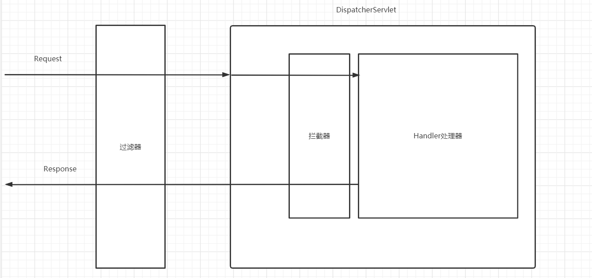

# SpringMVC

SpringMVC为Web应用程序开发中带来的巨大便捷。

## MVC理论基础

**为啥要引入SpringMVC**

三层架构：


最关键的当属*表示层*，它相当于直接与用户的浏览器打交道的一层，并且所有的请求都会经过它进行解析，然后再告知业务层进行处理，任何页面的返回和数据填充也全靠表示层来完成。

在之前的javaweb阶段，一个项目要编写大量的Servlet（也就是表示层实现）来处理来自浏览器的各种请求。仅仅是几个很小的功能，以及几个很基本的页面，都要编写将近十个Servlet，代码量大。

SpringMVC正是为了解决这种问题而生的，它是一种一种轻量级的、基于MVC的Web层应用框架。它能让我们对请求数据的处理，响应数据的处理，页面的跳转等等常见的web操作变得更加简单方便。


**什么是MVC**

* M是指业务模型（Model）：通俗的讲就是用于封装数据传递的实体类。
* V是指用户界面（View）：一般指的是前端页面。
* C则是控制器（Controller）：控制器就相当于Servlet的基本功能，处理请求，返回响应。


SpringMVC正是希望这三者之间进行解耦，实现各干各的，更加精细地划分对应的职责。最后再将View和Model进行渲染，得到最终的页面并返回给前端（就像Thymeleaf那样，把实体数据对象和前端页面都给到Thymeleaf，然后它会将其进行整合渲染得到最终有数据的页面）

## RestFul风格

前后端分离开发的项目中，前后端是通过接口规范进行请求和响应，后端向前端提供请求时就要对外暴露一个URL，这个URL需要遵循一定的规范

RESTful是一种Web api的标准，也就是一种url设计风格规范

通俗地解释：用URL定位资源、用HTTP动词（GET,POST,PUT,DELETE）描述操作。

RESTful特点

* 对网络上所有的资源都有一个资源标志符。
* 对资源的操作不会改变标识符。
* 同一资源有多种表现形式（xml、json）
* 所有操作都是无状态的（Stateless）

非Rest设计的增删改查（不同的URL（主要为使用动词）进行不同的操作）：

http://localhost:8080/admin/getUser （查询用户）

http://localhost:8080/admin/addUser （新增用户）

http://localhost:8080/admin/updateUser （更新用户）

http://localhost:8080/admin/deleteUser （删除用户）


Rest架构的增删改查(URL只指定资源，以HTTP方法动词进行不同的操作。用HTTP STATUS/CODE定义操作结果)：

GET http://localhost:8080/admin/user/{id} （查询用户）

POST http://localhost:8080/admin/user/ （新增用户）

PUT http://localhost:8080/admin/user （更新用户）

DELETE http://localhost:8080/admin/user/{id} （删除用户）

### RestFul设计原则

  1. 资源路径
     对于rest资源的定义，即URL的定义，是最重要的

  2. URL中不能有动词
     在Restful架构中，每个网址代表的是一种资源，所以网址中不能有动词，只能有名词。动词由HTTP的 get、post、put、delete 四种方法来表示。

  3. URL结尾不应该包含斜杠“/”
     斜杠（/）不会增加语义值，且可能导致混淆。REST API不允许一个尾部的斜杠，不应该将它们包含在提供给客户端的链接的结尾处。
     许多Web组件和框架将平等对待以下两个URI：
     http://api.canvas.com/shapes/
     http://api.canvas.com/shapes
     但是，实际上URI中的每个字符都会计入资源的唯一身份的识别中。两个不同的URI映射到两个不同的资源。如果URI不同，那么资源也是如此，反之亦然。因此，REST API必须生成和传递精确的URI，不能容忍任何的客户端尝试不精确的资源定位。
     正斜杠分隔符“/”必须用来指示层级关系，Restful路径中的正斜杠“/”字符用于指示资源之间的层次关系。

   4. 应该使用连字符”-“来提高URL的可读性，而不是使用下划线”_”
      一些文本查看器为了区分强调URI，常常会在URI下加上下划线。这样下划线“_”字符可能被文本查看器中默认的下划线部分地遮蔽或完全隐藏。为避免这种混淆，应该使用连字符“-”而不是下划线

   5. URL路径中首选小写字母
      RFC 3986将URI定义为区分大小写，但scheme和host components除外。

   6. URL路径名词均为复数
      为了保证url格式的一致性，建议使用复数形式。

### RESTful API对资源的操作

对于rest api资源的操作，由HTTP动词表示

**CURD操作**

*注：PATCH一般不用，用 PUT*

* GET: 从服务器获取资源
* POST： 在服务器新建资源
* PUT：在服务器更新资源（向客户端提供改变后的所有资源）
* PATCH: 在服务器更新资源（向客户端提供改变的属性）
* DELETE：删除资源

**资源过滤**

在获取资源的时候，有可能需要获取某些“过滤”后的资源，例如指定前10行数据

http://api.user.com/schools/grades/classes/boys?page=1&page-size=10

**返回状态码推荐标准HTTP状态码**

由于rest api是直接使用的HTTP协议，所以它的状态码也要尽量使用HTTP协议的状态码。

## 配置环境并搭建项目

### 方式一：web.xml+spring-mvc.xml

①导入相关依赖

```xml
 <dependencies>
        <!-- servlet依赖 -->
        <dependency>
            <groupId>javax.servlet</groupId>
            <artifactId>javax.servlet-api</artifactId>
            <version>3.1.0</version>
            <scope>provided</scope>
        </dependency>
        <!--jsp依赖 -->
        <dependency>
            <groupId>javax.servlet.jsp</groupId>
            <artifactId>jsp-api</artifactId>
            <version>2.1</version>
            <scope>provided</scope>
        </dependency>
        <!--springmvc的依赖-->
        <dependency>
            <groupId>org.springframework</groupId>
            <artifactId>spring-webmvc</artifactId>
            <version>5.3.13</version>
        </dependency>

        <!-- jackson，帮助进行json转换-->
        <dependency>
            <groupId>com.fasterxml.jackson.core</groupId>
            <artifactId>jackson-databind</artifactId>
            <version>2.9.0</version>
        </dependency>
 </dependencies>
```

②配置web.xml

```xml
	<servlet>
        <servlet-name>DispatcherServlet</servlet-name>
        <servlet-class>org.springframework.web.servlet.DispatcherServlet</servlet-class>
        <!--
            为DispatcherServlet提供初始化参数的
            设置springmvc配置文件的路径
                name是固定的，必须是contextConfigLocation
                value指的是SpringMVC配置文件的位置
         -->
        <init-param>
            <param-name>contextConfigLocation</param-name>
            <param-value>classpath:spring-mvc.xml</param-value>
        </init-param>
        <!--
            指定项目启动就初始化DispatcherServlet
         -->
        <load-on-startup>1</load-on-startup>
    </servlet>
    <servlet-mapping>
        <servlet-name>DispatcherServlet</servlet-name>
        <!--
             /           表示当前servlet映射除jsp之外的所有请求（包含静态资源）
             *.do        表示.do结尾的请求路径才能被SpringMVC处理(老项目会出现)
             /*          表示当前servlet映射所有请求（包含静态资源,jsp），不应该使用其配置DispatcherServlet
         -->
        <url-pattern>/</url-pattern>
    </servlet-mapping>


    <!--乱码处理过滤器，由SpringMVC提供-->
    <!-- 处理post请求乱码 -->
    <filter>
        <filter-name>CharacterEncodingFilter</filter-name>
        <filter-class>org.springframework.web.filter.CharacterEncodingFilter</filter-class>
        <init-param>
            <!-- name固定不变，value值根据需要设置 -->
            <param-name>encoding</param-name>
            <param-value>UTF-8</param-value>
        </init-param>
    </filter>
    <filter-mapping>
        <filter-name>CharacterEncodingFilter</filter-name>
        <!-- 所有请求都设置utf-8的编码 -->
        <url-pattern>/*</url-pattern>
    </filter-mapping>
```

③配置SpringMVC

resources目录下创建mvc的配置文件**spring-mvc.xml**

```xml
   <!--
        SpringMVC只扫描controller包即可
    -->
    <context:component-scan base-package="com.sangeng.controller"/>
    <!-- 解决静态资源访问问题，如果不加mvc:annotation-driven会导致无法访问handler-->
    <mvc:default-servlet-handler/>
    <!--解决响应乱码-->
    <mvc:annotation-driven>
        <mvc:message-converters>
            <bean class="org.springframework.http.converter.StringHttpMessageConverter">
                <constructor-arg value="utf-8"/>
            </bean>
        </mvc:message-converters>
    </mvc:annotation-driven>
```


### 方式二：web.xml+WebMvcConfigurer实现类

①导入相关依赖

```xml
<dependencies>
        <!-- servlet依赖 -->
        <dependency>
            <groupId>javax.servlet</groupId>
            <artifactId>javax.servlet-api</artifactId>
            <version>3.1.0</version>
            <scope>provided</scope>
        </dependency>
        <!--jsp依赖 -->
        <dependency>
            <groupId>javax.servlet.jsp</groupId>
            <artifactId>jsp-api</artifactId>
            <version>2.1</version>
            <scope>provided</scope>
        </dependency>
        <!--springmvc的依赖-->
        <dependency>
            <groupId>org.springframework</groupId>
            <artifactId>spring-webmvc</artifactId>
            <version>5.3.13</version>
        </dependency>

        <!-- jackson，帮助进行json转换-->
        <dependency>
            <groupId>com.fasterxml.jackson.core</groupId>
            <artifactId>jackson-databind</artifactId>
            <version>2.9.0</version>
        </dependency>
 </dependencies>
```

②配置web.xml

1. 用`DispatcherServlet`替换掉Tomcat自带的Servlet，url-pattern写为`/`
2. 为整个Web应用程序配置一个Spring上下文环境（也就是容器）

```xml
<?xml version="1.0" encoding="UTF-8"?>
<web-app xmlns="http://xmlns.jcp.org/xml/ns/javaee"
         xmlns:xsi="http://www.w3.org/2001/XMLSchema-instance"
         xsi:schemaLocation="http://xmlns.jcp.org/xml/ns/javaee http://xmlns.jcp.org/xml/ns/javaee/web-app_4_0.xsd"
         version="4.0">
    <servlet>
        <servlet-name>mvc</servlet-name>
        <servlet-class>org.springframework.web.servlet.DispatcherServlet</servlet-class>
        <init-param>
            <param-name>contextConfigLocation</param-name>
            <param-value>com.example.config.MvcConfiguration</param-value>
        </init-param>
        <init-param>
            <param-name>contextClass</param-name>
            <param-value>org.springframework.web.context.support.AnnotationConfigWebApplicationContext</param-value>
        </init-param>
    </servlet>
    <servlet-mapping>
        <servlet-name>mvc</servlet-name>
        <url-pattern>/</url-pattern>
    </servlet-mapping>
</web-app>
```

因为SpringMVC是基于Spring开发的，它直接利用Spring提供的容器来实现各种功能。这里直接使用注解方式进行配置，不再使用spring-mvc.xmlX配置文件：

```java
@Configuration
public class WebConfiguration implements WebMvcConfigurer {
}
```

### 方式三 ：纯注解配置

如果希望完完全全丢弃配置文件，可以直接添加一个类，Tomcat会在类路径中查找实现`ServletContainerInitializer` 接口的类，如果发现的话，就用它来配置Servlet容器。

Spring提供了这个接口的实现类 `SpringServletContainerInitializer` , 通过`@HandlesTypes`(WebApplicationInitializer.class)设置，这个类反过来会查找实现`WebApplicationInitializer` 的类，并将配置的任务交给他们来完成，因此直接实现接口即可：

```java
public class MainInitializer extends AbstractAnnotationConfigDispatcherServletInitializer {
    @Override
    protected Class<?>[] getRootConfigClasses() {
        return new Class[]{MainConfiguration.class};   //基本的Spring配置类，一般用于业务层配置
    }

    @Override
    protected Class<?>[] getServletConfigClasses() {
        return new Class[]{WebConfiguration.class};  //配置DispatcherServlet的配置类、主要用于Controller等配置
    }

    @Override
    protected String[] getServletMappings() {
        return new String[]{"/"};    //匹配路径，与上面一致
    }
}
```

**需要两个配置类**

MainConfiguration

基本的Spring配置类,一般用于业务层Services配置

```java
@Configuration
public class MainConfiguration implements WebMvcConfigurer {

}
```

WebConfiguration

配置DispatcherServlet的配置类，实现`WebMvcConfigurer`，主要用于Controller，viewResolver，HandlerMapping等配置

```java
@Configuration
public class WebConfiguration {
}
```

**为什么需要两个配置类**

DispatcherServlet里面实际有两个容器，一个web容器，一个根容器，负责范围不一样


现在任何请求都会优先经过`DispatcherServlet`进行集中处理

## Controller控制器

有了SpringMVC之后，不必再像javaweb那样一个请求地址创建一个Servlet了。使用`DispatcherServlet`替代Tomcat提供的默认的静态资源Servlet，现在所有的请求（除了jsp，因为Tomcat还提供了一个jsp的Servlet）都会经过`DispatcherServlet`进行处理。

### `DispatcherServlet`工作流程

请求到达Tomcat服务器之后，会交给当前的Web应用程序进行处理。SpringMVC使用`DispatcherServlet`来处理所有的请求，也就是说它被作为一个统一的访问点，所有的请求全部由它来进行调度。


当一个请求经过`DispatcherServlet`之后，会先走`HandlerMapping`，它会将请求映射为`HandlerExecutionChain`，依次经过`HandlerInterceptor`（SpringMVC的拦截器，类似于javaweb的过滤器），然后再交给`HandlerAdapter`，根据请求的路径选择合适的控制器进行处理。控制器处理完成之后，会返回一个`ModelAndView`对象，包括数据模型和视图，通俗的讲就是页面中数据和页面本身（只包含视图名称即可）。

返回`ModelAndView`之后，会交给`ViewResolver`（视图解析器）进行处理，视图解析器会对整个视图页面进行解析。这里可以使用Thymeleaf（SpringMVC自带的视图解析器只适用于JSP页面，）作为视图解析器，这样就可以根据给定的视图名称，直接读取HTML编写的页面，解析为一个真正的View。

解析完成后，就需要将页面中的数据全部渲染到View中，最后返回给`DispatcherServlet`一个包含所有数据的成形页面，再响应给浏览器，完成整个过程。

因此，实际上整个过程只需要编写对应请求路径的的Controller，配置好需要的ViewResolver，补充添加拦截器即可，而其他的流程由SpringMVC完成。

### 配置Thymeleaf视图解析器

使用Thymeleaf作为视图解析器，导入需要的依赖：

```xml
<dependency>
    <groupId>org.thymeleaf</groupId>
    <artifactId>thymeleaf-spring5</artifactId>
    <version>3.0.12.RELEASE</version>
</dependency>
```

在`WebConfiguration`配置类中将对应的`ViewResolver`注册为Bean

```java
@ComponentScan("com.example.controller")
@Configuration
@EnableWebMvc
public class WebConfiguration implements WebMvcConfigurer {

  //使用ThymeleafViewResolver作为视图解析器，并解析HTML页面
    @Bean
    public ThymeleafViewResolver thymeleafViewResolver(@Autowired SpringTemplateEngine springTemplateEngine){
        ThymeleafViewResolver resolver = new ThymeleafViewResolver();
        resolver.setOrder(1);   //可以存在多个视图解析器，并且可以为他们设定解析顺序
        resolver.setCharacterEncoding("UTF-8");   //编码格式是重中之重
        resolver.setTemplateEngine(springTemplateEngine);   //和之前JavaWeb阶段一样，需要使用模板引擎进行解析，所以这里也需要设定一下模板引擎
        return resolver;
    }
  
  	//配置模板解析器
  	@Bean
    public SpringResourceTemplateResolver templateResolver(){
        SpringResourceTemplateResolver resolver = new SpringResourceTemplateResolver();
        resolver.setCharacterEncoding("UTF-8");   //编码格式是重中之重
        resolver.setSuffix(".html");   //需要解析的后缀名称
        resolver.setPrefix("/WEB-INF/template/");   //需要解析的HTML页面文件存放的位置
        return resolver;
    }
  	
  	//配置模板引擎Bean
  	@Bean
    public SpringTemplateEngine springTemplateEngine(@Autowired ITemplateResolver resolver){
        SpringTemplateEngine engine = new SpringTemplateEngine();
        engine.setTemplateResolver(resolver);   //模板解析器，默认即可
        return engine;
    }
}
```

### 配置控制器

先在`WebConfiguration`配置类上方添加`@ComponentScan("com.example.controller")`扫描controller包下所有控制器

创建Controller只需在一个类上添加一个`@Controller`注解即可，它会被Spring扫描并自动注册为Controller类型的Bean。然后只需要在类中编写方法用于处理对应地址的请求即可：

**可以这么写**

这样访问https://localhost:8080/Mvc/test 就可以加载出/WEB-INF/template/index.html

```java
@Controller   //直接添加注解即可
public class MainController {

     //访问地址https://localhost:8080/Mvc/test
    @RequestMapping("/test")   //这里是访问路径
    public ModelAndView index(){
        return new ModelAndView("index");  //这里填入了视图的名称（html文件的文件名，这个文件的位置要配置在视图解析器）
        //返回后会经过视图解析器进行处理
    }
}
```

**页面中的数据可以直接向Model进行提供**

Thymeleaf接收传递的数据进行解析：
```html
<!DOCTYPE html>
<html lang="en" xmlns:th="http://www.thymeleaf.org">
<head>
    <meta charset="UTF-8">
    <title>Title</title>
    <script src="static/test.js"></script>
</head>
<body>
    HelloWorld！
    <div th:text="${name}"></div>
</body>
</html>
```

向页面传递数据

```java
@RequestMapping("/test")
public ModelAndView index(){
    ModelAndView modelAndView = new ModelAndView("index");
    modelAndView.getModel().put("name", "啊这");
    return modelAndView;
}
```

**直接返回View名称（文件名）**
此方法适用于仅仅是传递一个页面不需要任何的附加属性，SpringMVC会将其自动包装为ModelAndView对象：

```java
@RequestMapping("/test")
public String index(){
    return "index";
}
```

**可以将`Model`对象作为形参**

SpringMVC会自动传递实例对象：

```java
@RequestMapping(value = "/index")
public String index(Model model){  //这里不仅仅可以是Model，还可以是Map、ModelMap
    model.addAttribute("name", "yyds");
    return "index";
}
```

*注意*：一定要保证视图名称下面出现横线并且按住Ctrl可以跳转，配置才是正确的（最新版IDEA）

页面中可能还会包含一些静态资源，比如js、css。这就需要让配置类实现一下`WebMvcConfigurer`接口，使静态资源通过Tomcat提供的默认Servlet进行解析，这样在Web应用程序启动时，会根据重写方法里面的内容进行进一步的配置：

```java
@Override
public void configureDefaultServletHandling(DefaultServletHandlerConfigurer configurer) {
    configurer.enable();   //开启默认的Servlet
}

@Override
public void addResourceHandlers(ResourceHandlerRegistry registry) {
    registry.addResourceHandler("/static/**").addResourceLocations("/WEB-INF/static/");   
  	//配置静态资源的访问路径
}
```

编写一下前端内容：

```xml
<!DOCTYPE html>
<html lang="en" xmlns:th="http://www.thymeleaf.org">
<head>
    <meta charset="UTF-8">
    <title>Title</title>
      <!-- 引用静态资源，这里使用Thymeleaf的网址链接表达式，Thymeleaf会自动添加web应用程序的名称到链接前面 -->
    <script th:src="@{/static/test.js}"></script>
</head>
<body>
    HelloWorld！
</body>
</html>
```

创建`test.js`并编写如下内容：

```js
window.alert("欢迎来到GayHub全球最大同性交友网站")
```

### @RequestMapping建立请求映射

创建出一个控制器来处理请求后，需要在控制器添加一个方法用于处理对应的请求。

在javaweb的时候，处理请求需要完整地编写一个Servlet来实现，而现在只需要添加一个`@RequestMapping`即可实现。

`@RequestMapping`就是将请求和处理请求的方法建立一个映射关系，当收到请求时就可以根据映射关系调用对应的请求处理方法

`@RequestMapping`注解定义如下：

```java
@Mapping
public @interface RequestMapping {
    String name() default "";

    @AliasFor("path")
    String[] value() default {};

    @AliasFor("value")
    String[] path() default {};

    RequestMethod[] method() default {};

    String[] params() default {};

    String[] headers() default {};

    String[] consumes() default {};

    String[] produces() default {};
}
```
**path属性**

最关键的就是path属性（等价于value），它决定了当前方法处理的请求路径。

* 可以处理某一个请求路径，也可以处理多个请求路径：

路径必须全局唯一，任何路径只能有一个方法进行处理，它是一个数组，也就是说此方法可以处理某一个请求路径，也可以处理多个请求路径

比如下面的方法，访问/index或是/test都会经过此方法进行处理。

```java
@RequestMapping({"/index", "/test"})
public ModelAndView index(){
    return new ModelAndView("index");
}
```

* 也可以直接将`@RequestMapping`添加到类名上

那么此类中的所有请求映射添加一个路径前缀，比如：

现在需要访问`/yyds/index`或是`/yyds/test`才可以得到此页面。

```java
@Controller
@RequestMapping("/yyds")
public class MainController {

    @RequestMapping({"/index", "/test"})
    public ModelAndView index(){
        return new ModelAndView("index");
    }
}
```

* 路径还支持使用通配符进行匹配

>* ?：表示任意一个字符，比如`@RequestMapping("/index/x?")`可以匹配/index/xa、/index/xb等等。
>* *：表示任意0-n个字符，比如`@RequestMapping("/index/*")`可以匹配/index/lbwnb、/index/yyds等。
>* **：表示当前目录或基于当前目录的多级目录，比如`@RequestMapping("/index/**")`可以匹配/index、/index/xxx等。

**method属性**

通过method属性可以限定请求方式，比如：

现在如果直接使用浏览器访问此页面，会显示405方法不支持，因为浏览器默认是直接使用`GET`方法获取页面，而这里指定为POST方法访问此地址。

```java
@RequestMapping(value = "/index", method = RequestMethod.POST)
public ModelAndView index(){
    return new ModelAndView("index");
}
```

可以使用衍生注解直接设定为指定类型的请求映射：

比如`@PostMapping`直接指定为POST请求类型的请求映射，`@GetMapping`直接指定为GET请求方式，...

```java
@PostMapping(value = "/index")
public ModelAndView index(){
    return new ModelAndView("index");
}
```

**params属性**

使用`params`属性来指定请求必须携带哪些请求参数

比如以下方法要求请求中必须携带`username`和`password`属性，否则无法访问。

无法访问：http://localhost:8080/mvc/test

可以访问：http://localhost:8080/mvc/test?username=xxx&password=12345

```java
@RequestMapping(value = "/index", params = {"username", "password"})
public ModelAndView index(){
    return new ModelAndView("index");
}
```

它还支持表达式

比如：在username之前添加一个感叹号表示请求不允许携带此参数，否则无法访问

```java
@RequestMapping(value = "/index", params = {"!username", "password"})
public ModelAndView index(){
    return new ModelAndView("index");
}
```

还可以直接设定一个固定值

比如以下方法：请求参数username不允许为test，并且password必须为123，否则无法访问。

```java
@RequestMapping(value = "/index", params = {"username!=test", "password=123"})
public ModelAndView index(){
    return new ModelAndView("index");
}
```

**headers属性**

`headers`属性用法与`params`一致，但是它要求的是请求头中需要携带什么内容

比如以下方法：如果请求头中携带了`Connection`属性，将无法访问。

```java
@RequestMapping(value = "/index", headers = "!Connection")
public ModelAndView index(){
    return new ModelAndView("index");
}
```

**其他两个属性**

* consumes： 指定处理请求的提交内容类型（Content-Type），例如application/json, text/html;
* produces:  指定返回的内容类型，仅当request请求头中的(Accept)类型中包含该指定类型才返回；

### @RequestParam获取QueryString格式的请求参数

为方法添加一个形参，并在形参前面添加`@RequestParam`注解即可**获取到请求中的参数**。

**参数单独获取**

需要在`@RequestParam`中填写请求中的参数名称，参数的值会自动传递给形参。如果参数名称与形式参数名称相同，即使不添加`@RequestParam`也能获取到参数值。

比如：

不能访问：http://localhost:8080/mvc/test

可以访问：http://localhost:8080/mvc/test?username=hhh 而且控制台打印出“收到一个请求参数hhh”

```java
@RequestMapping("/test")
public ModelAndView index(@RequestParam("username") String username){
    System.out.println("接受到请求参数："+username);
    return new ModelAndView("index");
}
```

**将请求参数封装为一个实体类**

注意：
1. 实体类中的成员变量要和请求参数名对应上。并且要提供对应的set/get方法。
2. 这里不需要@RequestParam（因为添加的话就是在请求参数中去找名为形参的参数，如下例的user）

```java
@Data
public class User {
    String username;
    String password;
}
```

请求参数会自动根据类中的字段名称进行匹配：

```java
@RequestMapping("/test")
public ModelAndView index(User user){
    System.out.println("收到一个请求参数："+user);
    return new ModelAndView("index");
}
```

结果如下：

访问http://localhost:8080/mvc/test 控制台打印“收到一个请求参数User(username=null, password=null)”

访问http://localhost:8080/mvc/test?username=xxx&password=111 控制台打印“收到一个请求参数User(username=xxx, password=111)”

**也可以使用Servlet原本的一些类**

直接添加`HttpServletRequest`为形式参数即可，SpringMVC会自动传递该请求原本的`HttpServletRequest`对象

```java
@RequestMapping(value = "/index")
public ModelAndView index(HttpServletRequest request){
    System.out.println("接受到请求参数："+request.getParameterMap().keySet());
    return new ModelAndView("index");
}
```

同理也可以添加`HttpServletResponse`作为形式参数，甚至可以直接将`HttpSession`也作为参数传递：

```java
@RequestMapping(value = "/test")
public ModelAndView index(HttpSession session){
    System.out.println(session.getAttribute("test"));
    session.setAttribute("test", "鸡你太美");
    return new ModelAndView("index");
}
```

`@RequestHeader`与`@RequestParam`用法一致，不过它是用于获取请求头参数的

### @PathVariable获取请求路径上（RestFul风格）的参数

在@RequestMapping的路径请求中添加占位符，然后给方法添加用@PathVariable标注的对应的形参

**例一**

>要求定义一个RestFul风格的接口，该接口可以用来根据id查询用户。请求路径要求为/user  ，请求方式要求为GET。而请求参数id要写在请求路径上，例如：/user/1，这里的1就是id。

```java
@Controller
public class UserController {

    @RequestMapping(value = "/user/{id}",method = RequestMethod.GET)
    public String findUserById( @PathVariable("id")Integer id){
        System.out.println("findUserById");
        System.out.println(id);
        return "/success.jsp";
    }
}
```

**例二**

>定义一个RestFul风格接口，想根据id和username查询用户。请求路径要求为/user，请求方式要求为GET。请求参数id和name要写在请求路径上，例如/user/1/zs,这里的1就是id，zs是name。

```java
@Controller
public class UserController {
    @RequestMapping(value = "/user/{id}/{name}",method = RequestMethod.GET)
    public String findUser(@PathVariable("id") Integer id,@PathVariable("name") String name){
        System.out.println("findUser");
        System.out.println(id);
        System.out.println(name);
        return "/success.jsp";
    }
}
```
**例三**

同一个地址，按照不同功能进行划分：

* POST http://localhost:8080/mvc/test  -  添加用户信息，携带表单数据
* GET http://localhost:8080/mvc/test/{id}  -  获取用户信息，id直接放在请求路径中
* PUT http://localhost:8080/mvc/test  -  修改用户信息，携带表单数据
* DELETE http://localhost:8080/mvc/test/{id}  -  删除用户信息，id直接放在请求路径中

分别编写四个请求映射：

```java
@Controller
public class MainController {

     @RequestMapping(value = "/test/{id}", method = RequestMethod.GET)
    public String get(@PathVariable("id") String text){
        System.out.println("获取用户："+text);
        return "index";
    }

    @RequestMapping(value = "/test", method = RequestMethod.POST)
    public String post(@PathVariable("username")String username){
        System.out.println("添加用户："+username);
        return "index";
    }

    @RequestMapping(value = "/test/{id}", method = RequestMethod.DELETE)
    public String delete(@PathVariable("id") String text){
        System.out.println("删除用户："+text);
        return "index";
    }

    @RequestMapping(value = "/test", method = RequestMethod.PUT)
    public String put(@PathVariable("username")String username){
        System.out.println("修改用户："+username);
        return "index";
    }
}
```

### @RequestBody获取请求体中的Json格式参数

RestFul风格的接口一些比较复杂的参数会转换成Json通过请求体传递过来。这种时候可以使用`@RequestBody`注解获取请求体中的数据。

用法：映射方法添加由@RequestBody标注的形参（参数类型就是想要把获取到的Json数据包装成的类型）

**注意事项**

​如果需要使用@RequestBody来获取请求体中Json并且进行转换，要求请求头Content-Type的值要为：application/json

**配置**

​SpringMVC默认会使用jackson来进行json的解析,需要导入jackson的依赖

```xml
<!-- jackson，帮助进行json转换-->
<dependency>
    <groupId>com.fasterxml.jackson.core</groupId>
    <artifactId>jackson-databind</artifactId>
    <version>2.9.0</version>
</dependency>
```

**例子**

>要求定义一个RestFul风格的接口，该接口可以用来新建用户。请求路径要求为/user  ，请求方式要求为POST。用户数据会转换成json通过请求体传递。
​

请求体数据
```json
{"name":"三更","age":15}
```

​**获取参数封装成实体对象**

比如：​把Json数据获取出来封装成User对象：

User实体类：

```java
@Data
@NoArgsConstructor
@AllArgsConstructor
public class User {
    private Integer id;
    private String name;
    private Integer age;
}
```

方法：

```java
@Controller
public class UserController {
    @RequestMapping(value = "/user",method = RequestMethod.POST)
    public String insertUser(@RequestBody User user){
        System.out.println("insertUser");
        System.out.println(user);
        return "/success.jsp";
    }
}
```
​
**获取参数封装成Map集合**

​也可以把该数据获取出来封装成Map集合：

```java
    @RequestMapping(value = "/user",method = RequestMethod.POST)
    public String insertUser(@RequestBody Map map){
        System.out.println("insertUser");
        System.out.println(map);
        return "/success.jsp";
    }
```

**例子**

​如果请求体传递过来的数据是一个User集合转换成的json，Json数据可以这样定义：

```json
[{"name":"三更1","age":14},{"name":"三更2","age":15},{"name":"三更3","age":16}]
```

​方法定义：

```java
    @RequestMapping(value = "/users",method = RequestMethod.POST)
    public String insertUsers(@RequestBody List<User> users){
        System.out.println("insertUsers");
        System.out.println(users);
        return "/success.jsp";
    }
```

### 获取参数小结

**从以上几种获取参数的例子可以总结出**

用SpringMVC帮助获取数据时，只要在方法上添加对应的形参，然后再添加对应的注解（获取哪里的数据）即可。

上面提及到的`@RequestParam`，`@PathVariable`和`@RequestBody`和以后可能遇到的其他一些获取参数的注解，都有require和defaultValue这两个属性

**require属性**

代表是否必须，默认为true也就是必须要有对应的参数，没有就报错

拿`@RequestParam`为例

一旦添加`@RequestParam`，那么此请求必须携带指定参数。将`require`属性设定为false来将属性设定为非必须：

```java
@RequestMapping(value = "/test")
public ModelAndView index(@RequestParam(value = "username", required = false) String username){
    System.out.println("接受到请求参数："+username);
    return new ModelAndView("index");
}
```

**defaultValue属性**

当对应的参数缺失时，可以用defaultValue设置默认值

比如：

```java
@RequestMapping(value = "/test")
public ModelAndView index(@RequestParam(value = "username", required = false, defaultValue = "伞兵一号") String username){
    System.out.println("接受到请求参数："+username);
    return new ModelAndView("index");
}
```

### @CookieValue和@SessionAttrbutie

`@CookieValue`可以快速获取请求携带的Cookie信息：

```java
@RequestMapping(value = "/index")
public ModelAndView index(HttpServletResponse response,
                          @CookieValue(value = "test", required = false) String test){
    System.out.println("获取到cookie值为："+test);
    response.addCookie(new Cookie("test", "lbwnb"));
    return new ModelAndView("index");
}
```

同样的，`@SessionAttribute`可以注解快速获取Session信息：

```java
@RequestMapping(value = "/index")
public ModelAndView index(@SessionAttribute(value = "test", required = false) String test,
                          HttpSession session){
    session.setAttribute("test", "xxxx");
    System.out.println(test);
    return new ModelAndView("index");
}
```

### @ResponseBody将返回值以Json格式给到响应体

​无论是RestFul风格还是web阶段的异步请求，都需要把数据转换成Json放入响应体中。

**将数据放到响应体中**

​SpringMVC提供了`@ResponseBody`来把方法的返回值以Json的格式放到响应体中。

**将数据转换成Json格式**

1. 导入jackson依赖

```xml
<!-- jackson，帮助进行json转换-->
<dependency>
    <groupId>com.fasterxml.jackson.core</groupId>
    <artifactId>jackson-databind</artifactId>
    <version>2.9.0</version>
</dependency>
```

2. 开启mvc的注解驱动（好像之前配过了）

```xml
    <mvc:annotation-driven></mvc:annotation-driven>
```

**例一**

>定义个RestFul风格的接口，该接口可以用来根据id查询用户。请求路径要求为/response/user，请求方式要求为GET。请求参数id要写在请求路径上，例如/response/user/1,这里的1就是id。
要求获取参数id,去查询对应id的用户信息（模拟查询即可，可以选择直接new一个User对象），并且转换成json响应到响应体中。

```java
@Controller
@RequestMapping("/response")
public class ResponseController {
    @GetMapping("/user/{id}")
    @ResponseBody //这方法的返回值放入响应体中
    public User testResponse(@PathVariable Integer id){
        User user = new User(id,null,null,null);
        return user;//因为做过配置，所以会把返回值转换成json
    }
}
```

**例二**

>定义个RestFul风格的接口，该接口可以查询所有用户。请求路径要求为/response/user，请求方式要求为GET。
去查询所有的用户信息（模拟查询即可，可以选择直接创建集合，添加几个User对象），并且转换成json响应到响应体中。

```java
@Controller
@RequestMapping("/response")
@ResponseBody  //这类中所有方法的返回值都会放到响应体中
public class ResponseController {

    @GetMapping("/user/{id}")
    public User testResponse(@PathVariable Integer id){
        User user = new User(id,null,null,null);
        return user;
    }

    @GetMapping("/user")
    public List<User> testResponse2(){
        List<User> list = new ArrayList<User>();
        list.add(new User(1,"三更",15,null));
        list.add(new User(2,"四更",16,null));
        list.add(new User(3,"五更",17,null));
        return list;
    }
}
```

**小结@ResponseBody**

添加该注解的方法不会再返回视图（之前返回视图名称的那种方式会被识别为直接返回一个String类型的对象），而是将返回值转换成Json格式放入响应体中

​如果一个Controller中的所有方法返回值都要放入响应体，那么可以直接在Controller类上加@ResponseBody。也可以使用@RestController注解替换@Controller和@ResponseBody两个注解

### 重定向和请求转发

默认是请求转发

**重定向**

添加`redirect:`前缀，就可以很方便地实现重定向

那么访问http://localhost:8080/mvc/test 会自动重定向到http://localhost:8080/mvc/home页面

```java
@RequestMapping("/test")
public String index(){
    return "redirect:home";
}

@RequestMapping("/home")
public String home(){
    return "home";
}
```

**请求转发**

添加`forward:`前缀（不添加也也行。因为是默认的），表示转发给其他请求映射

访问http://localhost:8080/mvc/test 依然是这个网址，但显示的是http://localhost:8080/mvc/home的页面

```java
@RequestMapping("/test")
public String index(){
    return "forward:home";
}

@RequestMapping("/home")
public String home(){
    return "home";
}
```

## (类)JSP开发模式和前后端分离开发模式

(类)JSP开发模式：浏览器首先请求到的是controller层里的方法（称为handler），在handler中可以进行数据库等等一系列处理，然后把想要展示的数据放入到域对象中，接着进行页面跳转，在jsp页面里就可以从域对象中拿到要展示的数据进行展示。这是一种前后端不分离（JSP）或分离程度不高（ThymeLeaf）的开发模式

前后端分离开发模式（主流）：把数据转化为json放入响应体中

### (类)JSP开发模式

类似JSP的开发模式会涉及到**往域中存数据**和**携带数据跳转页面**的操作。

原理：Request对象和Session对象内部都有一个名为attributes的map对象来存数据，往域对象存数据就是存入这个map里。如果跳转页面后，还是这个域对象，那么就可以获得之前存在域里的数据

#### 往Requet域存数据并跳转

**使用Model**

用Model来往域中存数据(键值对的形式)，然后实现页面跳转。

>​要求访问/testRequestScope这个路径时能往Request域中存name和title数据，然后跳转到/WEB-INF/page/testScope.jsp这个页面。在Jsp中获取域中的数据。

```java
@Controller
public class JspController {
    @RequestMapping("/testRquestScope")
    public String testRquestScope(Model model){
        //往请求域存数据
        model.addAttribute("name","三更");
        model.addAttribute("title","不知名Java教程UP主");
        return "testScope";//因为是请求转发（转发后还是同一个请求），所以到jsp页面时，才可以是同一个request对象，获取到数据
    }
}
```

对应的testScope.jsp页面(thymeleaf也行，代码不一样而已)

```jsp
<body>
    ${requestScope.get("name")}
    ${requestScope.get("title")}
</body>
```

**使用ModelAndView**

用ModelAndView来往域中存数据（键值对的形式）和页面跳转。

*注意要把modelAndView对象作为方法的返回值返回*

>要求访问/testRequestScope2这个路径时能往域中存name和title数据，然后跳转到/WEB-INF/page/testScope.jsp这个页面。在Jsp中获取域中的数据。

```java
@Controller
public class JspController {
    @RequestMapping("/testRquestScope2")
    public ModelAndView testRquestScope2(ModelAndView modelAndView){
        //往域中添加数据
        modelAndView.addObject("name","三更");
        modelAndView.addObject("title","不知名Java教程UP主");
        //页面跳转
        modelAndView.setViewName("testScope");
        return modelAndView;
    }
}
```

#### 从Request域中获取数据

把`@RequestAttribute`加在方法参数上，可以让SpringMVC从Request域中获取相关数据。

例如

```java
@Controller
public class JspController {

    @RequestMapping("/testGetAttribute")
    public String testGetAttribute(@RequestAttribute("org.springframework.web.servlet.HandlerMapping.bestMatchingPattern")
                                               String value,HttpServletRequest request){
        System.out.println(value);
        return "testScope";
    }
}
```

#### 往Session域存数据并跳转

其实就是在request域的基础上，把`@SessionAttributes`（有s！）注解进在类上，指明哪些数据还需存储一份到Session域中。

**例子**

>要求访问/testSessionScope这个路径时能往域中存name和title数据，然后跳转到/WEB-INF/page/testScope.jsp这个页面。在jsp中获取Session域中的数据。

```java
@Controller
@SessionAttributes({"name"})//表示name这个数据也要存储一份到session域中
public class JspController {


    @RequestMapping("/testSessionScope")
    public String testSessionScope(Model model){
        model.addAttribute("name","三更");
        model.addAttribute("title","不知名Java教程UP主");
        return "testScope";
    }
}
```

对应jsp页面（thymeleaf也是，代码不同而已）
只能获取到name，获取不到title

```jsp
<body>
    ${sessionScope.get("name")}
    ${sessionScope.get("title")}
</body>
```

#### 获取Session域中数据

把`@SessionAttribute`（无s！）加在方法参数上，可以让SpringMVC从**Session域**中获取相关数据给到这个参数。

例如：

```java
@Controller
@SessionAttributes({"name"})
public class JspController {
    @RequestMapping("/testGetSessionAttr")
    public String testGetSessionAttr(@SessionAttribute("name") String name){
        System.out.println(name);
        return "testScope";
    }
}
```

### 前后端分离开发模式

## Interceptor拦截器

**应用场景**

希望在多个Handler方法（controller中的响应方法）执行之前或者之后都进行一些处理，甚至某些情况下需要拦截掉，不让Handler方法执行。那么可以使用SpringMVC提供的拦截器（内部用AOP实现）。

**拦截器和过滤器区别**

request请求要先到达过滤器，放行后才会给到Servlet。Servlvet执行之后，响应reponse也会到达过滤器。

拦截器则是在DispatherServlet内部，request请求通过过滤器到达DispatherServlet，拦截器会拦截在具体处理该请求的Handler处理器（controller中的响应方法）之前，先经过它进行一些处理后，如果放行，请求才会到达Handler（不会拦截静态资源）。Handler方法处理后，response响应会先到拦截器进行一些处理，然后在发送出去

综上：过滤器是对Servlet执行前后进行处理，拦截器是对Handler（处理器）执行前后进行处理。



### 创建并配置拦截器

①创建HandlerInterceptor接口实现类

```java
public class MyInterceptor implements HandlerInterceptor {
}
```

②实现方法

```java
public class MyInterceptor implements HandlerInterceptor {
    
    //在handler方法执行之前会被调用
    public boolean preHandle(HttpServletRequest request, HttpServletResponse response, Object handler) throws Exception {
        System.out.println("preHandle");
        //返回值代表是否放行，如果为true则放行，如果为fasle则拦截，目标方法执行不到
        return true;
    }

    public void postHandle(HttpServletRequest request, HttpServletResponse response, Object handler, ModelAndView modelAndView) throws Exception {
        System.out.println("postHandle");
    }

    public void afterCompletion(HttpServletRequest request, HttpServletResponse response, Object handler, Exception ex) throws Exception {
        System.out.println("afterCompletion");
    }
}
```

③spring-mvc.xml中配置拦截器

```xml
    <!--配置拦截器-->
    <mvc:interceptors>
        <mvc:interceptor>
            <!--
                    配置拦截器要拦截的路径
                    /*    代表当前一级路径，不包含子路径
                    /**   代表当前一级路径和多级路径，使用的更多

                    例如：
                        /test/*   这种会拦截下面这种路径/test/add  /test/delete
                                  但是拦截不了多级路径的情况例如  /test/add/abc  /test/add/abc/bcd
                        /test/**  这种可以拦截多级目录的情况，无论    /test/add还是/test/add/abc/bcd 都可以拦截
            -->
            <mvc:mapping path="/**"/>
            <!--配置排除拦截的路径-->
            <!--<mvc:exclude-mapping path="/"/>-->
            <!--配置拦截器对象注入容器-->
            <bean class="com.sangeng.interceptor.MyInterceptor"></bean>
        </mvc:interceptor>
    </mvc:interceptors>
```

如果是纯注解开发：

在`WebMvcConfigurer`实现类中进行注册：

```java
@Override
public void addInterceptors(InterceptorRegistry registry) {
    registry.addInterceptor(new MainInterceptor())
      .addPathPatterns("/**")    //添加拦截器的匹配路径，只要匹配一律拦截
      .excludePathPatterns("/home");   //拦截器不进行拦截的路径
}
```

### 拦截器方法及参数详解

- preHandle方法会在Handler方法执行之前执行，可以在其中进行一些前置的判断或者处理。
- postHandle方法会在Handler方法执行之后执行，可以在其中对域中的数据进行修改，也可以修改要跳转的页面。
- afterCompletion方法会在最后执行，这个时候已经没有办法对域中的数据进行修改，也没有办法修改要跳转的页面。这个方法中一般进行一些资源的释放。

```java
    /**
     * 在handler方法执行之前会被调用
     * @param request 当前请求对象
     * @param response 响应对象
     * @param handler 相当于是真正能够处理请求的handler方法封装成的对象，对象中有这方法的相关信息
     * @return 返回值代表是否放行，如果为true则放行，如果为fasle则拦截，目标方法执行不到
     * @throws Exception
     */
    public boolean preHandle(HttpServletRequest request, HttpServletResponse response, Object handler) throws Exception {
        System.out.println("preHandle");
        //返回值代表是否放行，如果为true则放行，如果为fasle则拦截，目标方法执行不到
        return true;
    }
```

```java
    /**
     * postHandle方法会在Handler方法执行之后执行
     * @param request 当前请求对象
     * @param response 响应对象
     * @param handler 相当于是真正能够处理请求的handler方法封装成的对象，对象中有这方法的相关信息
     * @param modelAndView handler方法执行后的modelAndView对象，我们可以修改其中要跳转的路径或者是域中的数据
     * @throws Exception
     */
    public void postHandle(HttpServletRequest request, HttpServletResponse response, Object handler, ModelAndView modelAndView) throws Exception {
        System.out.println("postHandle");
    }
```

```java
    /**
     * afterCompletion方法会在最后执行
     * @param request 当前请求对象
     * @param response 响应对象
     * @param handler 相当于是真正能够处理请求的handler方法封装成的对象，对象中有这方法的相关信息
     * @param ex 异常对象
     * @throws Exception
     */
    public void afterCompletion(HttpServletRequest request, HttpServletResponse response, Object handler, Exception ex) throws Exception {
        System.out.println("afterCompletion");
    }
```

### 案例-登录状态拦截器

**需求**

我们的接口需要做用户登录状态的校验，如果用户没有登录则跳转到登录页面，登录的情况下则可以正常访问我们的接口。

#### 分析需求

**分析**

 1. 怎么判断是否登录？

    登录时往session写入用户相关信息，然后在其他请求中从session中获取这些信息，如果获取不到说明不是登录状态。

 2. 难道在每个Handler中都要写判断是否登录的代码吗？

    用拦截器，在拦截器中进行登录状态的判断。

 3. 登录接口是否应该进行拦截？

    不能拦截

 4. 静态资源是否要进行拦截？

    不能拦截

**步骤分析**

①登录页面，请求发送给登录接口

②登录接口中，校验用户名密码是否正确（模拟校验即可，先不查询数据库）
 
 如果用户名密码正确，登录成功。把用户名写入session中。

③定义其他请求的Handler方法

④定义拦截器来进行登录状态判断
 
 如果能从session中获取用户名则说明是登录的状态，放行。
 
 如果获取不到，则说明未登录，要跳转到登录页面。

#### 代码实现

**登录功能代码实现**

①编写登录页面

```html
<!DOCTYPE html>
<html lang="en">
<head>
    <meta charset="UTF-8">
    <title>Title</title>
</head>
<body>
    <form method="post" action="/login">
        用户名：<input type="text" name="username">
        密码：<input type="password" name="password">
        <input type="submit">
    </form>
</body>
</html>
```

②编写登录接口

接口中，校验用户名密码是否正确（模拟校验即可，先不查询数据库）。如果用户名密码正确，登录成功。把用户名写入session中。

```java
@Controller
public class LoginController {

    @PostMapping("/login")
    public String longin(String username, String password, HttpSession session){
        //往session域中写入用户名用来代表登录成功
        session.setAttribute("username",username);
        return "/WEB-INF/page/success.jsp";
    }
}
```

**登录状态校验代码实现**

①定义拦截器

```java
public class LoginInterceptor implements HandlerInterceptor {
}
```

②重写方法，在preHandle方法中实现状态校验

```java
public class LoginInterceptor implements HandlerInterceptor {

    public boolean preHandle(HttpServletRequest request, HttpServletResponse response, Object handler) throws Exception {
        //从session中获取用户名，判断是否存在
        HttpSession session = request.getSession();
        String username = (String) session.getAttribute("username");
        if(StringUtils.isEmpty(username)){
            //如果获取不到说明未登录 ，重定向跳转到登录页面
            String contextPath = request.getServletContext().getContextPath();
            response.sendRedirect(contextPath+"/static/login.html");
        }else{
            //如果获取到了，说明之前登录过。放行。
            return true;
        }
        return false;
    }
}
```

③spring-mvc.xml配置拦截器

- ​	登录相关的接口不应该拦截
- ​	静态资源不拦截

```xml
    <mvc:interceptors>
        <mvc:interceptor>
            <!--要拦截的路径-->
            <mvc:mapping path="/**"/>
            <!--排除不拦截的路径-->
            <mvc:exclude-mapping path="/static/**"></mvc:exclude-mapping>
            <mvc:exclude-mapping path="/WEB-INF/page/**"></mvc:exclude-mapping>
            <mvc:exclude-mapping path="/login"></mvc:exclude-mapping>
            <bean class="com.sangeng.interceptor.LoginInterceptor"></bean>
        </mvc:interceptor>
    </mvc:interceptors>
```

### 多拦截器执行顺序

如果配置了多个拦截器，拦截器的顺序是**按照配置的先后顺序**

* 只有所有拦截器都放行了，postHandle方法才会被执行。
* 只有当前拦截器放行了，当前拦截器的afterCompletion方法才会执行。

**preHandler都返回true的情况下**，这些拦截器中方法的执行顺序如图


**拦截器3的preHandle方法返回值为false时**，执行顺序如图：


## `@ControllerAdvice`统一异常处理

在实际项目中Dao层和Service层的异常都会被抛到Controller层。但是如果Controller的方法中都加上try...catch处理也会显的非常的繁琐。

​所以SpringMVC提供了统一异常处理方案,可以把Controller层的异常进行统一处理。

​一种是实现HandlerExceptionResolver接口的方式，一种是使用@ControllerAdvice注解的方式。

在实际项目中一般会选择使用`@ControllerAdvice`来进行异常的统一处理。

​因为如果在前后端不分离的项目中，异常处理一般是跳转到错误页面，让用户有个更好的体验。而前后端分离的项目中，异常处理一般是把异常信息封装到Json中写入响应体。无论是哪种情况，使用@ControllerAdvice的写法都能比较方便的实现。

**自定义一个异常处理控制器**

1. 这个类要添加`@ControllerAdvice`注解
2. 在类上加`@Component`注解注入容器，注意要保证类能被组件扫描到。
3. 处理异常的方法添加`@ExceptionHandler(异常类型.class)`注解，标识可以处理的异常

**例一（前后端不分离的项目：异常处理跳转到错误页面）**

```java
@ControllerAdvice
@Component
public class ErrorController {

    @ExceptionHandler(Exception.class)
    public String error(Exception e, Model model){  //可以直接添加形参来获取异常
        e.printStackTrace();
        model.addAttribute("e", e);
        return "500";
    }
}
```

编写一个专门显示异常的页面500.html：

```java
<!DOCTYPE html>
<html lang="en" xmlns:th="http://www.thymeleaf.org">
<head>
    <meta charset="UTF-8">
    <title>Title</title>
</head>
<body>
500 - 服务器出现了一个内部错误QAQ
<div th:text="${e}"></div>
</body>
</html>
```

控制器制造个异常来看看成果

```java
@RequestMapping("/test")
public String index(){
    System.out.println("我是处理！");
    if(true) throw new RuntimeException("您的氪金力度不足，无法访问！");
    return "index";
}
```

访问后，控制台会输出异常信息，同时页面也是刚刚自定义的一个页面。
页面内容：

>500 - 服务器出现了一个内部错误QAQ
java.lang.RuntimeException: 您的氪金力度不足，无法访问！

**例二（前后端分离的项目：把异常信息封装为对象，转换成json写入响应体）**

```java
@ControllerAdvice
@Component
public class MyControllerAdvice {

    @ExceptionHandler({NullPointerException.class,ArithmeticException.class})
    @ResponseBody
    public Result handlerException(Exception ex){
        Result result = new Result();
        result.setMsg(ex.getMessage());
        result.setCode(500);
        return result;
    }
}
```


## 前后端分离—JSON数据格式与AJAX请求

JSON (JavaScript Object Notation, JS 对象简谱) 是一种轻量级的数据交换格式。

JSON特性：既便于机器解析，也利于人理解，网络传输效率高（简短）

**前后端分离的开发模式**

前后端不分离的时候，所有的内容全部交给后端渲染再发送给浏览器。

前后端分离：整个Web页面的内容在一开始就编写完成了，而其中的数据由前端执行JS代码来向服务器动态获取，再到前端进行渲染（填充）。这样可以大幅度减少后端的压力，并且后端只需要传输关键数据即可

### JSON数据格式

为了实现前后端分离，就要约定一种更加高效的数据传输模式，来向前端页面传输后端提供的数据。JSON就是现在比较主流的数据传输方式

一个JSON格式的数据长这样（和键值对差不多），以学生对象为例：

```json
{"name": "杰哥", "age": 18}
```

多个学生可以以数组的形式表示：

```json
[{"name": "杰哥", "age": 18}, {"name": "阿伟", "age": 18}]
```

嵌套关系可以表示为：

```json
{"studentList": [{"name": "杰哥", "age": 18}, {"name": "阿伟", "age": 18}], "count": 2}
```

它直接包括了属性的名称和属性的值，到达前端后，可以直接转换为对象，以对象的形式进行操作和内容的读取，相当于以字符串形式表示了一个JS对象。

在控制台窗口中测试：

```js
let obj = JSON.parse('{"studentList": [{"name": "杰哥", "age": 18}, {"name": "阿伟", "age": 18}], "count": 2}')
//将JSON格式字符串转换为JS对象
obj.studentList[0].name   //直接访问第一个学生的名称
```

将JS对象转换为JSON字符串：

```js
JSON.stringify(obj)
```

**后端以JSON字符串的形式向前端返回数据，这样前端在拿到数据之后，就可以快速获取**

导入以下依赖：

JSON解析框架有很多种，比较常用的是Jackson和FastJSON，这里使用阿里巴巴的FastJSON

```xml
<dependency>
    <groupId>com.alibaba</groupId>
    <artifactId>fastjson</artifactId>
    <version>1.2.78</version>
</dependency>
```

**`JSONObject`**

它和Map的使用方法一样（实现了Map接口），比如向其中存放几个数据：

```java
@RequestMapping(value = "/index")
public String index(){
    JSONObject object = new JSONObject();
    object.put("name", "杰哥");
    object.put("age", 18);
    System.out.println(object.toJSONString());   //以JSON格式输出JSONObject字符串
    return "index";
}
```

得到的结果为：

```json
{"name": "杰哥", "age": 18}
```

实际上JSONObject就是对JSON数据的一种对象表示。

**同样的还有`JSONArray`**

它表示一个数组，用法和List一样(实现了List接口)，数组中可以嵌套其他的JSONObject或是JSONArray：

```java
@RequestMapping(value = "/index")
public String index(){
    JSONObject object = new JSONObject();
    object.put("name", "杰哥");
    object.put("age", 18);
    JSONArray array = new JSONArray();
    array.add(object);
    System.out.println(array.toJSONString());
    return "index";
}
```

得到的结果为：

```json
[{"name": "杰哥", "age": 18}]
```

当出现循环引用时，会按照以下语法来解析：

**直接创建一个实体类，将实体类转换为JSON格式的数据**

这里@RequestMapping修改了`produces`的值，将返回的内容类型设定为`application/json`，表示服务器端返回了一个JSON格式的数据（当然不设置也行，也能展示，这样是为了规范）

方法上添加一个`@ResponseBody`表示方法返回（也可以在类上添加`@RestController`表示此Controller所有方法的返回值都不进行页面跳转，而是放到响应体当中）的结果不是视图名称而是直接需要返回一个字符串作为页面数据。

接着使用JSON工具类将其转换为JSON格式的字符串，打开浏览器，得到JSON格式数据。

```java
@RequestMapping(value = "/index", produces = "application/json")
@ResponseBody
public String data(){
    Student student = new Student();
    student.setName("杰哥");
    student.setAge(18);
    return JSON.toJSONString(student);
}
```

实际上，打上`@ResponseBody`,然后直接返回一个对象类型，也会被自动转换为JSON字符串格式：

```java
@RequestMapping(value = "/data", produces = "application/json")
@ResponseBody
public Student data(){
    Student student = new Student();
    student.setName("杰哥");
    student.setAge(18);
    return student;
}
```

需要在配置类`WebConfiguration`中添加一下FastJSON转换器（默认只支持JackSon）：

```java
@Override
public void configureMessageConverters(List<HttpMessageConverter<?>> converters) {
    converters.add(new FastJsonHttpMessageConverter());
}
```

### AJAX请求

前面了解了如何向浏览器发送一个JSON格式的数据，现在来看看如何向服务器请求数据。


Ajax即**A**synchronous **J**avascript **A**nd **X**ML（异步JavaScript和XML），它的目标就是实现页面中的数据动态更新，而不是直接刷新整个页面，它是一个概念。

它在JQuery框架中有实现，因此直接导入JQuery（JQuery极大地简化了JS的开发，封装了很多内容，可以了解一下）：

```html
<script src="https://code.jquery.com/jquery-3.1.1.min.js"></script>
```

接着就可以直接使用了，首先修改一下前端页面：

```html
<!DOCTYPE html>
<html lang="en" xmlns:th="http://www.thymeleaf.org">
<head>
    <meta charset="UTF-8">
    <title>Title</title>
    <script src="https://code.jquery.com/jquery-3.1.1.min.js"></script>
    <script th:src="@{/static/test.js}"></script>
</head>
<body>
    你好，
    <span id="username"></span>
    您的年龄是：
    <span id="age"></span>
    <button onclick="updateData()">点我更新页面数据</button>
</body>
</html>
```

**从服务端获取数据并更新到页面中**

现在希望用户名称和年龄在点击按钮之后才会更新，编写一下JS：

通过JQuery的选择器就可以快速获取页面中的元素。注意这里获取的元素是被JQuery封装过的元素，需要使用JQuery提供的方法来进行操作。

```js
function updateData() {
    //美元符.的方式来使用Ajax请求，这里使用的是get方式，第一个参数为请求的地址（注意需要带上Web应用程序名称），第二个参数为成功获取到数据的方法，data就是返回的数据内容
  	$.get("/mvc/data", function (data) {   //获取成功执行的方法
        window.alert('接受到异步请求数据：'+JSON.stringify(data))  //弹窗展示数据
        $("#username").text(data.name)   //这里使用了JQuery提供的选择器，直接选择id为username的元素，更新数据
        $("#age").text(data.age)
    })
}
```

**向服务端发送一个JS对象数据并进行解析**

```js
function submitData() {
    $.post("/mvc/submit", {   //这里使用POST方法发送请求
        name: "测试",     //第二个参数是要传递的对象，会以表单数据的方式发送
      	age: 18   
    }, function (data) {
        window.alert(JSON.stringify(data))   //发送成功执行的方法
    })
}
```

服务器端只需要在请求参数位置添加一个对象接收即可（和前面是一样的，因为这里也是提交的表单数据）：

```java
@RequestMapping("/submit")
@ResponseBody
public String submit(Student student){
    System.out.println("接收到前端数据："+student);
    return "{\"success\": true}";
}
```

也可以将js对象转换为JSON字符串的形式进行传输，这里需要使用ajax方法来处理：

```js
function submitData() {
    $.ajax({   //最基本的请求方式，需要自己设定一些参数
        type: 'POST',   //设定请求方法
        url: "/mvc/submit",   //请求地址
        data: JSON.stringify({name: "测试", age: 18}),  //转换为JSON字符串进行发送
        success: function (data) {
            window.alert(JSON.stringify(data))
        },
        contentType: "application/json"  //请求头Content-Type一定要设定为JSON格式
    })
}
```

如果我们需要读取前端发送的JSON格式数据，那么这个时候就需要添加`@RequestBody`注解：

```java
@RequestMapping("/submit")
@ResponseBody
public String submit(@RequestBody JSONObject object){
    System.out.println("接收到前端数据："+object);
    return "{\"success\": true}";
}
```

## 实现文件上传和下载

利用SpringMVC，可以很轻松地实现文件上传和下载

**先配置一个Resolver**

在`WebConfiguration`注册

注意这里Bean的名称是固定的，必须是`multipartResolver`

```java
@Bean("multipartResolver")   //注意这里Bean的名称是固定的，必须是multipartResolver
public CommonsMultipartResolver commonsMultipartResolver(){
    CommonsMultipartResolver resolver = new CommonsMultipartResolver();
    resolver.setMaxUploadSize(1024 * 1024 * 10);   //最大10MB大小
    resolver.setDefaultEncoding("UTF-8");   //默认编码格式
    return resolver;
}
```

**导入Commons-fileupload框架（文件上传需要这个依赖）**

SpringMVC使用commons-fileupload的包对文件上传进行了封装，使用`CommonsMultipartFile`对象来接收用户上传的文件。它是基于Apache的Commons-fileupload框架实现的，需要导入一个依赖：

```xml
<!--commons文件上传，如果需要文件上传功能，需要添加本依赖-->
<dependency>
    <groupId>commons-fileupload</groupId>
    <artifactId>commons-fileupload</artifactId>
    <version>1.4</version>
</dependency>
```

### 上传文件

**在前端添加一个文件的上传表单**

除了在表单中增加一个用于上传文件的表单项（input标签，type=file）外，Http协议规定了在进行文件上传时的请求格式要求：

1. 请求方式为POST请求
2. 请求头Content-Type必须为multipart/form-data

​综上，一个上传文件表单的结构如下：

```html
    <form action="/upload" method="post" enctype="multipart/form-data">

    </form>
```

针对这个例子，表单设计如下：

```html
<div>
    <form action="upload" method="post" enctype="multipart/form-data">
        <input type="file" name="file">
        <input type="submit">
    </form>
</div>
```

**直接编写Controller**

*注意：方法参数名要和表单提交上来的参数名（name="file"）一致。*

```java
@RequestMapping(value = "/upload", method = RequestMethod.POST,produces = "text/html;charset=utf-8")
@ResponseBody
public String upload(@RequestParam CommonsMultipartFile file) throws IOException {
    File fileObj = new File("test.docx");//上传的文件将保存为名为test.docx的文件
    file.transferTo(fileObj);//将用户上传的文件file保存给fileObj
    System.out.println("用户上传的文件已保存到："+fileObj.getAbsolutePath());
    return "文件上传成功！";
}
```

或者

```java
@Controller
public class UploadController {

    @RequestMapping("/upload")
    public String upload(MultipartFile file) throws IOException {
        //文件存储 把上传上来的文件存储下来
        file.transferTo(new File("test.sql"));
        return "/success.jsp";
    }
}
```

### 下载文件

*HTTP协议要求下载文件必须满足如下规则:*

1. 设置响应头Content-Type：把提供下载文件的MIME类型作为响应头Content-Type的值
2. 设置响应头Content-disposition：要求把文件名经过URL编码后的值写入响应头Content-disposition。要求符合以下格式，因为这样可以解决不同浏览器中文文件名 乱码问题。
```java
Content-disposition: attachment; filename=%E4%B8%8B%E6%B5%B7%E5%81%9Aup%E4%B8%BB%E9%82%A3%E4%BA%9B%E5%B9%B4.txt;filename*=utf-8''%E4%B8%8B%E6%B5%B7%E5%81%9Aup%E4%B8%BB%E9%82%A3%E4%BA%9B%E5%B9%B4.txt
```
3. 文件数据写入响应体中

**法一：直接使用`HttpServletResponse`，并向输出流中传输数据**

```java
@RequestMapping(value = "/download", method = RequestMethod.GET)
@ResponseBody
public void download(HttpServletResponse response){
    response.setContentType("multipart/form-data");
    try(OutputStream stream = response.getOutputStream();
        InputStream inputStream = new FileInputStream("test.html")){//下载名为test.html文件
        IOUtils.copy(inputStream, stream);
    }catch (IOException e){
        e.printStackTrace();
    }
}
```

在前端页面中添加一个下载点：

```html
<a href="download" download="test.html">下载最新资源</a>
```

**法二：使用封装的下载工具类实现文件下载**

工具类代码：

```java
public class DownLoadUtils {
    /**
     * 该方法可以快速实现设置两个下载需要的响应头和把文件数据写入响应体
     * @param filePath 该文件的相对路径
     * @param context  ServletContext对象
     * @param response
     * @throws Exception
     */
    public static void downloadFile(String filePath, ServletContext context, HttpServletResponse response) throws Exception {
        String realPath = context.getRealPath(filePath);//得到文件真实的磁盘路径
        File file = new File(realPath);
        String filename = file.getName();
        FileInputStream fis = new FileInputStream(realPath);
        String mimeType = context.getMimeType(filename);//获取文件的mime类型
        response.setHeader("content-type",mimeType);
        String fname= URLEncoder.encode(filename,"UTF-8");
        response.setHeader("Content-disposition","attachment; filename="+fname+";"+"filename*=utf-8''"+fname);
        ServletOutputStream sos = response.getOutputStream();
        byte[] buff = new byte[1024 * 8];
        int len = 0;
        while((len = fis.read(buff)) != -1){
            sos.write(buff,0,len);
        }
        sos.close();
        fis.close();
    }
}
```

Handler方法定义

```java
@Controller
public class DownLoadController {

    @RequestMapping("/download")
    public void download(HttpServletRequest request, HttpServletResponse response) throws Exception {
        //文件下载
        DownLoadUtils.downloadFile("/WEB-INF/file/test.txt",request.getServletContext(),response);
    }
}
```

前端下载点

<a href="/download">下载最新资源</a>

## SpringMVC执行流程-JSP模式


1. 浏览器发出请求给到中央调度器DispatcherServlet
2. 中央调度器把这个请求给到处理器映射器HandleMapping，如果找到存在controller里面有对应的请求映射（`@RequestMapping`URL与请求一致），则生成处理器执行链（将处理器和拦截器封装），给回中央调度器
3. 中央调度器拿到处理器执行链后，将它给到对应的处理器适配器HandleAdaptor
4. 处理器适配器将请求参数，请求的返回值等做一些处理（比如将请求参数作为实参传入到Controller的请求方法里），给到处理器Controller
5. 处理器方法返回的结果包装成ModelAndView对象，给到中央调度器
6. 如果ModelAndView对象非null，那么中央调度器将这个对象给到视图解析器ViewResolver进行解析得到页面View对象
7. 视图解析器把页面View给到中央调度器，最后中央调度器把这个页面响应给浏览器

## SpringMVC执行流程-前后端分离

前四步还是一样的

到了controller时，由于添加了`@ResponseBody`,ModelAndView对象为null，并且HandlerAdapter会把方法返回值以json格式放到响应体中

因为DispathServlet收到了为null的ModelAndView，所以不会去视图解析以及其后面的操作
