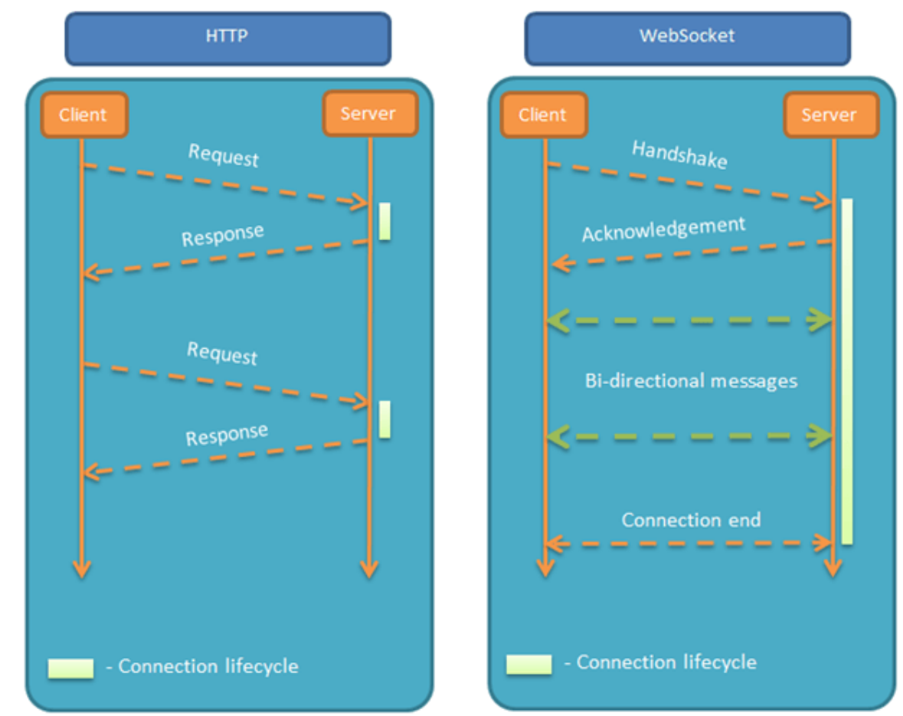

参考文章：
https://juejin.cn/post/7020964728386093093
https://www.cnblogs.com/nnngu/p/9347635.html

# 对比http协议

**http协议：非持久化,单向通信协议**
客户端主动向服务端发起请求，服务端向客户端返回响应。服务端不能主动向客户端发送数据。
HTTP1.0 中，一个HTTP的生命周期就是一个 Request和 一个 Response
HTTP1.1有一个 keep-alive，这使得在一个 HTTP 连接中，可以发送多个 Request，接收多个 Response。但是一个 Request 依然只能有一个 对应的Response，而且这个 Response 也是被动的，不能主动发起。

**WebSocket协议：持久化,双向通信协议**
客户端发起连接后，就会⼀直保持连接，期间客户端和服务端都可以向对⽅发送数据，直到连接关闭。



相同点： 都是一样基于TCP的，都是可靠性传输协议。都是应用层协议。

联系： WebSocket在建立握手时，数据是通过HTTP传输的。但是建立之后，在真正传输时候是不需要HTTP协议的。

**websocket协议特点**：
* 建立在 TCP 协议之上，服务器端的实现比较容易。
* 与 HTTP 协议有着良好的兼容性。默认端口也是80和443，并且握手阶段采用 HTTP 协议，因此握手时不容易屏蔽，能通过各种 HTTP 代理服务器。
* 数据格式比较轻量，性能开销小，通信高效。
* 可以发送文本，也可以发送二进制数据。
* 没有同源限制，客户端可以与任意服务器通信。
* 协议标识符是ws（如果加密，则为wss），服务器网址就是 URL。

# WebSocket握手流程

>WebSocket 协议握手是依靠 HTTP 协议的，依靠于 HTTP 响应101进行协议升级转换。

典型的 WebSocket 握手流程：

**客户端发送握手请求**
```
GET /chat HTTP/1.1
Host: server.example.com
Upgrade: websocket
Connection: Upgrade
Sec-WebSocket-Key: x3JJHMbDL1EzLkh9GBhXDw==
Sec-WebSocket-Protocol: chat, superchat
Sec-WebSocket-Version: 13
Origin: http://example.com
```

各部分分别说明一下：

告诉Apache 、Nginx等服务器，这次发起的请求要用 WebSocket 协议
```
Upgrade: websocket
Connection: Upgrade
```

Sec-WebSocket-Key 是一个由浏览器随机生成的Base64 encode 的值，用于验证是不是真的是 WebSocket 助理
Sec_WebSocket-Protocol 是一个用户定义的字符串，用来区分同 URL 下，不同的服务所需要的协议
Sec-WebSocket-Version 是告诉服务器所使用的 WebSocket Draft （协议版本）
```
Sec-WebSocket-Key: x3JJHMbDL1EzLkh9GBhXDw==
Sec-WebSocket-Protocol: chat, superchat
Sec-WebSocket-Version: 13
```

***
**服务器响应，表示已经接受到请求，成功建立 WebSocket连接**

```
HTTP/1.1 101 Switching Protocols
Upgrade: websocket
Connection: Upgrade
Sec-WebSocket-Accept: HSmrc0sMlYUkAGmm5OPpG2HaGWk= //经过服务器确认，并且加密过后的 Sec-WebSocket-Key
Sec-WebSocket-Protocol: chat //表示最终使用的协议。
```

# 持久通信

由于HTTP协议单向通信的特点，服务端不能主动联系客户端，只能有客户端发起，这注定了如果服务器有连续的状态变化，客户端要获知就非常麻烦，只能使用"轮询"。常见的有ajax轮询和long pool长轮询。

**ajax轮询**：浏览器隔个几秒就发送一次请求，询问服务器是否有新信息
```
客户端：有没有新信息(Request)
服务端：没有（Response）
客户端：有没有新信息(Request)
服务端：没有（Response）
...
客户端：有没有新信息(Request)
服务端：没有（Response）—- loop
```

**long poll长轮询** 
采取阻塞模型（一直打电话，没收到就不挂电话），客户端发起请求后，如果没消息，服务端就一直不返回 Response 给客户端。直到有消息才返回，返回完之后，客户端再次建立连接，周而复始。
```
客户端：有没有新信息，没有的话就等有了才返回给我吧（Request）
服务端：终于有新消息了，这就发给你（Response）
客户端：有没有新信息，没有的话就等有了才返回给我吧（Request） -loop
```


本质上，这两种轮询的方式都是在不断地建立HTTP连接，然后等待服务端处理，非常消耗资源。
ajax轮询 需要服务器有很快的处理速度和资源。long poll 需要有很高的并发，也就是说同时接待客户的能力。

所以 ajax轮询 和 long poll 都有可能发生这种情况：
```
客户端：有新信息么？
服务端：正忙，请稍后再试（503 Server Unavailable）
客户端：有新信息么？
服务端：正忙，请稍后再试（503 Server Unavailable）
```

***
**WebSocket协议应运而生**

http协议本身是没有持久通信能力的，轮询的方式开销又比较大，但是实际的应用中，很需要这种能力【在应用场景那一节可以看到】

所以，为了解决这些问题，WebSocket协议由此而生。

当服务器完成协议升级后（HTTP->Websocket），服务端就可以主动推送信息给客户端，只需要经过一次 HTTP 请求，就可以做到源源不断的信息传送，从而实现持久通信（全双工）

```
客户端：我要建立Websocket协议，需要的服务：chat，Websocket协议版本：17（HTTP Request）
服务端：ok，确认，已升级为Websocket协议（101 HTTP Protocols Switched）
客户端：麻烦你有信息的时候推送给我噢。。
服务端：ok，有的时候会告诉你的。
服务端：balabalabalabala
服务端：balabalabalabala
```

# WebSocket应用场景

**主要的应用场景**
>如果需要使用通过网络传输的任何实时更新或连续数据流，则可以使用WebSocket

即时聊天通信，多玩家游戏，在线协同编辑/编辑，实时数据流的拉取与推送，体育/游戏实况，实时地图位置

`即时Web应用程序`：使用一个Web套接字在客户端显示数据，这些数据由后端服务器连续发送。在WebSocket中，数据被连续推送/传输到已经打开的同一连接中，这就是为什么WebSocket更快并提高了应用程序性能的原因。例如在交易网站或比特币交易中，它用于显示价格波动，数据被后端服务器使用Web套接字通道连续推送到客户端。

`游戏应用程序`：在游戏应用程序中，服务器会持续接收数据，而不会刷新用户界面。屏幕上的用户界面会自动刷新，而且不需要建立新的连接

`聊天应用程序`：聊天应用程序仅使用WebSocket建立一次连接，便能在订阅户之间交换，发布和广播消息。它重复使用相同的WebSocket连接，用于发送和接收消息以及一对一的消息传输。

**不能使用WebSocket的场景**
如果要获取旧数据，或者只想获取一次/少次数据给应用程序使用，则应该使用HTTP协议

# 断线重连-心跳机制

**判断在线离线**：两次请求的时间间隔小于指定时间就是在线，否则就是离线

**解决断线问题的两种方案**
方案一：修改nginx配置信息
方案二：websocket客户端定时的给服务端发送心跳包，证明客户端在线的，如果超过一定的时间没有发送则就是离线了。【另一种是服务端主动发送下行心跳包】

# 客户端API

https://www.ruanyifeng.com/blog/2017/05/websocket.html
https://www.runoob.com/html/html5-websocket.html


