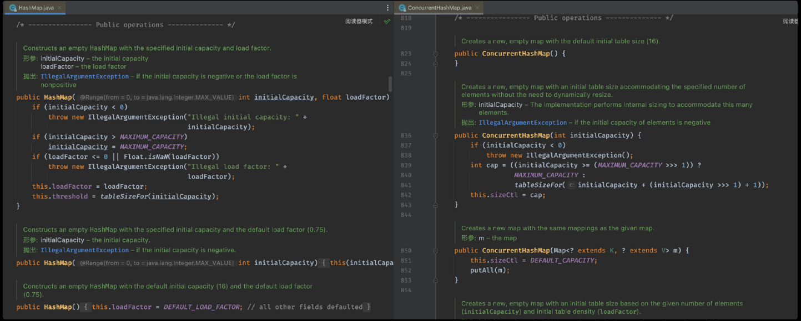
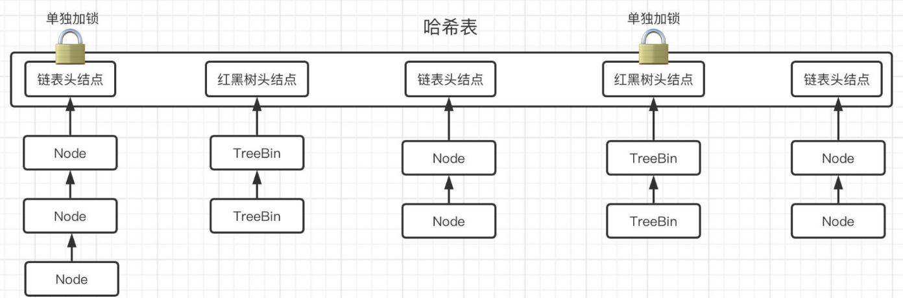

重点在于探究并发容器是如何利用锁机制和算法实现各种丰富功能的，忽略一些常规功能的实现细节（比如链表如何插入元素删除元素），而更关注并发容器应对并发场景算法上的实现（比如在多线程环境下的插入操作是按照什么规则进行的）

在单线程模式下，集合类提供的容器非常方便，然而在多线程环境下，这些数据结构还能正常工作吗？

# 传统容器线程安全吗

100个线程同时向ArrayList中添加元素：
```java
public class Main {
    public static void main(String[] args) {
        List<String> list = new ArrayList<>();
        Runnable r = () -> {
            for (int i = 0; i < 100; i++)
                list.add("lbwnb");
        };
        for (int i = 0; i < 100; i++)
            new Thread(r).start();
      	TimeUnit.SECONDS.sleep(1);
        System.out.println(list.size());
    }
}
```

报错：
```
Exception in thread "Thread-0" java.lang.ArrayIndexOutOfBoundsException: 73
	at java.util.ArrayList.add(ArrayList.java:465)
	at com.test.Main.lambda$main$0(Main.java:13)
	at java.lang.Thread.run(Thread.java:750)
Exception in thread "Thread-19" java.lang.ArrayIndexOutOfBoundsException: 1851
	at java.util.ArrayList.add(ArrayList.java:465)
	at com.test.Main.lambda$main$0(Main.java:13)
	at java.lang.Thread.run(Thread.java:750)
9773
```

从栈追踪信息可以看出，是add方法出现了问题：
```java
public boolean add(E e) {
    ensureCapacityInternal(size + 1);  // Increments modCount!!
    elementData[size++] = e;   //这一句出现了数组越界
    return true;
}
```

同一时间多个线程疯狂向数组中添加元素，那么这个时候有可能在`ensureCapacityInternal`（确认容量足够）执行之后，`elementData[size++] = e;`执行之前，其他线程插入了元素，导致size的值超出了数组容量。

***

常用的HashMap
```java
public static void main(String[] args) throws InterruptedException {
    Map<Integer, String> map = new HashMap<>();
    for (int i = 0; i < 100; i++) {
        int finalI = i;
        new Thread(() -> {
            for (int j = 0; j < 100; j++)
                map.put(finalI * 1000 + j, "lbwnb");
        }).start();
    }
    TimeUnit.SECONDS.sleep(2);
    System.out.println(map.size());
}
```

经过测试发现，虽然没有报错，但是最后的结果并不是期望的那样
实际上它还有可能导致Entry对象出现环状数据结构，引起死循环。

所以，在多线程环境下，要安全地使用集合类，不是一件简单的事

# 并发容器介绍

解决并发情况下的容器问题，首先想到的是给方法前面加个`synchronzed`关键字，或者使用Vector/Hashtable来解决，但是它们完全依靠锁来解决问题，效率实在是太低了，现在已经很少使用它们了。

JUC提供了专用于并发场景下的容器

## CopyOnWriteArrayList

在多线程环境下没办法安全使用的ArrayList，JUC提供了多线程专用的`CopyOnWriteArrayList`集合类：

```java
public static void main(String[] args) throws InterruptedException {
    List<String> list = new CopyOnWriteArrayList<>();  //这里使用CopyOnWriteArrayList来保证线程安全
    Runnable r = () -> {
        for (int i = 0; i < 100; i++)
            list.add("lbwnb");
    };
    for (int i = 0; i < 100; i++)
        new Thread(r).start();
    TimeUnit.SECONDS.sleep(1);
    System.out.println(list.size());
}
```

它的`add()`操作：
添加操作是直接上锁，并且会先拷贝一份当前存放元素的数组，然后对数组进行修改，再将此数组替换（CopyOnWrite）
```java
public boolean add(E e) {
    final ReentrantLock lock = this.lock;
    lock.lock();   //直接加锁，保证同一时间只有一个线程进行添加操作
    try {
        Object[] elements = getArray();  //获取当前存储元素的数组
        int len = elements.length;
        Object[] newElements = Arrays.copyOf(elements, len + 1);   //直接复制一份数组
        newElements[len] = e;   //修改复制出来的数组
        setArray(newElements);   //将元素数组设定为复制出来的数组
        return true;
    } finally {
        lock.unlock();
    }
}
```

`get()`读操作：
```java
public E get(int index) {
    return get(getArray(), index);
}
```

综上，`CopyOnWriteArrayList`对于读操作不加锁，而对于写操作是加锁的。这样就可以保证不丢失读性能的情况下，写操作不会出现问题。

## ConcurrentHashMap

在多线程环境下没办法安全使用的HashMap，JUC提供了多线程专用的`ConcurrentHashMap`集合类：

```java
public static void main(String[] args) throws InterruptedException {
    Map<Integer, String> map = new ConcurrentHashMap<>();
    for (int i = 0; i < 100; i++) {
        int finalI = i;
        new Thread(() -> {
            for (int j = 0; j < 100; j++)
                map.put(finalI * 100 + j, "lbwnb");
        }).start();
    }
    TimeUnit.SECONDS.sleep(1);
    System.out.println(map.size());
}
```

在JDK7之前，ConcurrentHashMap将所有数据分为一段一段地存储，先分很多段出来，每一段都给一把锁，当一个线程占锁访问时，只会占用其中一把锁，也就是仅仅锁了一小段数据，而其他段的数据依然可以被其他线程正常访问。

JDK8之后，ConcurrentHashMap采用了CAS算法配合锁机制实现

回顾一下JDK8下的HashMap的结构：
HashMap就是利用了哈希表，哈希表的本质其实就是一个用于存放后续节点的头结点的数组，数组里面的每一个元素都是一个头结点（也可以说就是一个链表），当要新插入一个数据时，会先计算该数据的哈希值，找到数组下标，然后创建一个新的节点，添加到对应的链表后面。当链表的长度达到8时，会自动将链表转换为红黑树，这样能使得原有的查询效率大幅度降低！当使用红黑树之后，就可以利用二分搜索的思想，快速地去寻找我们想要的结果，而不是像链表一样挨个去看。

由于ConcurrentHashMap的源码比较复杂，所以先从最简单的构造方法开始下手：



它的构造方法和HashMap的构造方法有很大的出入，但是大体的结构和HashMap是差不多的，也是维护了一个哈希表，并且哈希表中存放的是链表或是红黑树

`put()`操作是如何实现的：

```java
public V put(K key, V value) {
    return putVal(key, value, false);
}

//有点小乱，如果看着太乱，可以在IDEA中折叠一下代码块，不然有点难受
final V putVal(K key, V value, boolean onlyIfAbsent) {
    if (key == null || value == null) throw new NullPointerException(); //键值不能为空，基操
    int hash = spread(key.hashCode());    //计算键的hash值，用于确定在哈希表中的位置
    int binCount = 0;   //一会用来记录链表长度的，忽略
    for (Node<K,V>[] tab = table;;) {    //无限循环，而且还是并发包中的类，盲猜一波CAS自旋锁
        Node<K,V> f; int n, i, fh;
        if (tab == null || (n = tab.length) == 0)
            tab = initTable();    //如果数组（哈希表）为空肯定是要进行初始化的，然后再重新进下一轮循环
        else if ((f = tabAt(tab, i = (n - 1) & hash)) == null) {   //如果哈希表该位置为null，直接CAS插入结点作为头结即可（注意这里会将f设置当前哈希表位置上的头结点）
            if (casTabAt(tab, i, null,
                         new Node<K,V>(hash, key, value, null)))  
                break;                   // 如果CAS成功，直接break结束put方法，失败那就继续下一轮循环
        } else if ((fh = f.hash) == MOVED)   //头结点哈希值为-1，这里只需要知道是因为正在扩容即可
            tab = helpTransfer(tab, f);   //帮助进行迁移，完事之后再来下一次循环
        else {     //特殊情况都完了，这里就该是正常情况了，
            V oldVal = null;
            synchronized (f) {   //在前面的循环中f肯定是被设定为了哈希表某个位置上的头结点，这里直接把它作为锁加锁了，防止同一时间其他线程也在操作哈希表中这个位置上的链表或是红黑树
                if (tabAt(tab, i) == f) {
                    if (fh >= 0) {    //头结点的哈希值大于等于0说明是链表，下面就是针对链表的一些列操作
                        ...实现细节略
                    } else if (f instanceof TreeBin) {   //肯定不大于0，肯定也不是-1，还判断是不是TreeBin，所以不用猜了，肯定是红黑树，下面就是针对红黑树的情况进行操作
                      	//在ConcurrentHashMap并不是直接存储的TreeNode，而是TreeBin
                        ...实现细节略
                    }
                }
            }
          	//根据链表长度决定是否要进化为红黑树
            if (binCount != 0) {
                if (binCount >= TREEIFY_THRESHOLD)
                    treeifyBin(tab, i);   //注意这里只是可能会进化为红黑树，如果当前哈希表的长度小于64，它会优先考虑对哈希表进行扩容
                if (oldVal != null)
                    return oldVal;
                break;
            }
        }
    }
    addCount(1L, binCount);
    return null;
}
```

总结一下就是：



`get()`操作：

```java
public V get(Object key) {
    Node<K,V>[] tab; Node<K,V> e, p; int n, eh; K ek;
    int h = spread(key.hashCode());   //计算哈希值
    if ((tab = table) != null && (n = tab.length) > 0 &&
        (e = tabAt(tab, (n - 1) & h)) != null) {
      	// 如果头结点就是我们要找的，那直接返回值就行了
        if ((eh = e.hash) == h) {
            if ((ek = e.key) == key || (ek != null && key.equals(ek)))
                return e.val;
        }
      	//要么是正在扩容，要么就是红黑树，负数只有这两种情况
        else if (eh < 0)
            return (p = e.find(h, key)) != null ? p.val : null;
      	//确认无误，肯定在列表里，开找
        while ((e = e.next) != null) {
            if (e.hash == h &&
                ((ek = e.key) == key || (ek != null && key.equals(ek))))
                return e.val;
        }
    }
  	//没找到只能null了
    return null;
}
```

综上，ConcurrentHashMap的put操作，实际上是对哈希表上的所有头结点元素分别加锁，理论上来说哈希表的长度很大程度上决定了ConcurrentHashMap在同一时间能够处理的线程数量，这也是为什么`treeifyBin()`会优先考虑为哈希表进行扩容的原因。显然，这种加锁方式比JDK7的分段锁机制性能更好。

这里只是简单地介绍了一下它的并发运行机制，ConcurrentHashMap真正的难点在于扩容和迁移操作

# 阻塞队列

除了我们常用的容器类之外，JUC还提供了各种各样的阻塞队列，用于不同的工作场景。

阻塞队列本身也是队列，但是它是适用于多线程环境下的，基于ReentrantLock实现的，它的接口定义如下：

```java
public interface BlockingQueue<E> extends Queue<E> {
   	boolean add(E e);

    //入队，如果队列已满，返回false否则返回true（非阻塞）
    boolean offer(E e);

    //入队，如果队列已满，阻塞线程直到能入队为止
    void put(E e) throws InterruptedException;

    //入队，如果队列已满，阻塞线程直到能入队或超时、中断为止，入队成功返回true否则false
    boolean offer(E e, long timeout, TimeUnit unit)
        throws InterruptedException;

    //出队，如果队列为空，阻塞线程直到能出队为止
    E take() throws InterruptedException;

    //出队，如果队列为空，阻塞线程直到能出队超时、中断为止，出队成功正常返回，否则返回null
    E poll(long timeout, TimeUnit unit)
        throws InterruptedException;

    //返回此队列理想情况下（在没有内存或资源限制的情况下）可以不阻塞地入队的数量，如果没有限制，则返回 Integer.MAX_VALUE
    int remainingCapacity();

    boolean remove(Object o);

    public boolean contains(Object o);

  	//一次性从BlockingQueue中获取所有可用的数据对象（还可以指定获取数据的个数）
    int drainTo(Collection<? super E> c);

    int drainTo(Collection<? super E> c, int maxElements);
```

比如现在有一个容量为3的阻塞队列，这个时候一个线程`put`向其添加了三个元素，第二个线程接着`put`向其添加三个元素，那么这个时候由于容量已满，会直接被阻塞，而这时第三个线程从队列中取走2个元素，线程二停止阻塞，先丢两个进去，还有一个还是进不去，所以说继续阻塞。


利用阻塞队列，我们可以轻松地实现消费者和生产者模式，还记得我们在JavaSE中的实战吗？

> 所谓的生产者消费者模型，是通过一个容器来解决生产者和消费者的强耦合问题。通俗的讲，就是生产者在不断的生产，消费者也在不断的消费，可是消费者消费的产品是生产者生产的，这就必然存在一个中间容器，我们可以把这个容器想象成是一个货架，当货架空的时候，生产者要生产产品，此时消费者在等待生产者往货架上生产产品，而当货架有货物的时候，消费者可以从货架上拿走商品，生产者此时等待货架出现空位，进而补货，这样不断的循环。

通过多线程编程，来模拟一个餐厅的2个厨师和3个顾客，假设厨师炒出一个菜的时间为3秒，顾客吃掉菜品的时间为4秒，窗口上只能放一个菜。

我们来看看，使用阻塞队列如何实现，这里我们就使用`ArrayBlockingQueue`实现类：

```java
public class Main {
    public static void main(String[] args) throws InterruptedException {
        BlockingQueue<Object> queue = new ArrayBlockingQueue<>(1);
        Runnable supplier = () -> {
            while (true){
                try {
                    String name = Thread.currentThread().getName();
                    System.err.println(time()+"生产者 "+name+" 正在准备餐品...");
                    TimeUnit.SECONDS.sleep(3);
                    System.err.println(time()+"生产者 "+name+" 已出餐！");
                    queue.put(new Object());
                } catch (InterruptedException e) {
                    e.printStackTrace();
                    break;
                }
            }
        };
        Runnable consumer = () -> {
            while (true){
                try {
                    String name = Thread.currentThread().getName();
                    System.out.println(time()+"消费者 "+name+" 正在等待出餐...");
                    queue.take();
                    System.out.println(time()+"消费者 "+name+" 取到了餐品。");
                    TimeUnit.SECONDS.sleep(4);
                    System.out.println(time()+"消费者 "+name+" 已经将饭菜吃完了！");
                } catch (InterruptedException e) {
                    e.printStackTrace();
                    break;
                }
            }
        };
        for (int i = 0; i < 2; i++) new Thread(supplier, "Supplier-"+i).start();
        for (int i = 0; i < 3; i++) new Thread(consumer, "Consumer-"+i).start();
    }

    private static String time(){
        SimpleDateFormat format = new SimpleDateFormat("HH:mm:ss");
        return "["+format.format(new Date()) + "] ";
    }
}
```

可以看到，阻塞队列在多线程环境下的作用是非常明显的，算上ArrayBlockingQueue，一共有三种常用的阻塞队列：

* ArrayBlockingQueue：有界带缓冲阻塞队列（就是队列是有容量限制的，装满了肯定是不能再装的，只能阻塞，数组实现）
* SynchronousQueue：无缓冲阻塞队列（相当于没有容量的ArrayBlockingQueue，因此只有阻塞的情况）
* LinkedBlockingQueue：无界带缓冲阻塞队列（没有容量限制，也可以限制容量，也会阻塞，链表实现）

这里我们以ArrayBlockingQueue为例进行源码解读，我们先来看看构造方法：

```java
final ReentrantLock lock;

private final Condition notEmpty;

private final Condition notFull;

public ArrayBlockingQueue(int capacity, boolean fair) {
    if (capacity <= 0)
        throw new IllegalArgumentException();
    this.items = new Object[capacity];
    lock = new ReentrantLock(fair);   //底层采用锁机制保证线程安全性，这里我们可以选择使用公平锁或是非公平锁
    notEmpty = lock.newCondition();   //这里创建了两个Condition（都属于lock）一会用于入队和出队的线程阻塞控制
    notFull =  lock.newCondition();
}
```

接着我们来看`put`和`offer`方法是如何实现的：

```java
public boolean offer(E e) {
    checkNotNull(e);
    final ReentrantLock lock = this.lock;    //可以看到这里也是使用了类里面的ReentrantLock进行加锁操作
    lock.lock();    //保证同一时间只有一个线程进入
    try {
        if (count == items.length)   //直接看看队列是否已满，如果没满则直接入队，如果已满则返回false
            return false;
        else {
            enqueue(e);
            return true;
        }
    } finally {
        lock.unlock();
    }
}

public void put(E e) throws InterruptedException {
    checkNotNull(e);
    final ReentrantLock lock = this.lock;    //同样的，需要进行加锁操作
    lock.lockInterruptibly();    //注意这里是可以响应中断的
    try {
        while (count == items.length)
            notFull.await();    //可以看到当队列已满时会直接挂起当前线程，在其他线程出队操作时会被唤醒
        enqueue(e);   //直到队列有空位才将线程入队
    } finally {
        lock.unlock();
    }
}
```

```java
private E dequeue() {
    // assert lock.getHoldCount() == 1;
    // assert items[takeIndex] != null;
    final Object[] items = this.items;
    @SuppressWarnings("unchecked")
    E x = (E) items[takeIndex];
    items[takeIndex] = null;
    if (++takeIndex == items.length)
        takeIndex = 0;
    count--;
    if (itrs != null)
        itrs.elementDequeued();
    notFull.signal();    //出队操作会调用notFull的signal方法唤醒被挂起处于等待状态的线程
    return x;
}
```

接着我们来看出队操作：

```java
public E poll() {
    final ReentrantLock lock = this.lock;
    lock.lock();    //出队同样进行加锁操作，保证同一时间只能有一个线程执行
    try {
        return (count == 0) ? null : dequeue();   //如果队列不为空则出队，否则返回null
    } finally {
        lock.unlock();
    }
}

public E take() throws InterruptedException {
    final ReentrantLock lock = this.lock;
    lock.lockInterruptibly();    //可以响应中断进行加锁
    try {
        while (count == 0)
            notEmpty.await();    //和入队相反，也是一直等直到队列中有元素之后才可以出队，在入队时会唤醒此线程
        return dequeue();
    } finally {
        lock.unlock();
    }
}
```

```java
private void enqueue(E x) {
    // assert lock.getHoldCount() == 1;
    // assert items[putIndex] == null;
    final Object[] items = this.items;
    items[putIndex] = x;
    if (++putIndex == items.length)
        putIndex = 0;
    count++;
    notEmpty.signal();    //对notEmpty的signal唤醒操作
}
```

可见，如果各位对锁的使用非常熟悉的话，那么在阅读这些源码的时候，就会非常轻松了。

接着我们来看一个比较特殊的队列SynchronousQueue，它没有任何容量，也就是说正常情况下出队必须和入队操作成对出现，我们先来看它的内部，可以看到内部有一个抽象类Transferer，它定义了一个`transfer`方法：

```java
abstract static class Transferer<E> {
    /**
     * 可以是put也可以是take操作
     *
     * @param e 如果不是空，即作为生产者，那么表示会将传入参数元素e交给消费者
     *          如果为空，即作为消费者，那么表示会从生产者那里得到一个元素e并返回
     * @param 是否可以超时
     * @param 超时时间
     * @return 不为空就是从生产者那里返回的，为空表示要么被中断要么超时。
     */
    abstract E transfer(E e, boolean timed, long nanos);
}
```

乍一看，有点迷惑，难不成还要靠这玩意去实现put和take操作吗？实际上它是直接以生产者消费者模式进行的，由于不需要依靠任何容器结构来暂时存放数据，所以我们可以直接通过`transfer`方法来对生产者和消费者之间的数据进行传递。

比如一个线程put一个新的元素进入，这时如果没有其他线程调用take方法获取元素，那么会持续被阻塞，直到有线程取出元素，而`transfer`正是需要等生产者消费者双方都到齐了才能进行交接工作，单独只有其中一方都需要进行等待。

```java
public void put(E e) throws InterruptedException {
    if (e == null) throw new NullPointerException();  //判空
    if (transferer.transfer(e, false, 0) == null) {   //直接使用transfer方法进行数据传递
        Thread.interrupted();    //为空表示要么被中断要么超时
        throw new InterruptedException();
    }
}
```

它在公平和非公平模式下，有两个实现，这里我们来看公平模式下的SynchronousQueue是如何实现的：

```java
static final class TransferQueue<E> extends Transferer<E> {
     //头结点（头结点仅作为头结点，后续节点才是真正等待的线程节点）
     transient volatile QNode head;
     //尾结点
     transient volatile QNode tail;

    /** 节点有生产者和消费者角色之分 */
    static final class QNode {
        volatile QNode next;          // 后继节点
        volatile Object item;         // 存储的元素
        volatile Thread waiter;       // 处于等待的线程，和之前的AQS一样的思路，每个线程等待的时候都会被封装为节点
        final boolean isData;         // 是生产者节点还是消费者节点
```

公平模式下，Transferer的实现是TransferQueue，是以先进先出的规则的进行的，内部有一个QNode类来保存等待的线程。

好了，我们直接上`transfer()`方法的实现（这里再次提醒各位，多线程环境下的源码分析和单线程的分析不同，我们需要时刻关注当前代码块的加锁状态，如果没有加锁，一定要具有多线程可能会同时运行的意识，这个意识在以后你自己处理多线程问题伴随着你，才能保证你的思路在多线程环境下是正确的）：

```java
E transfer(E e, boolean timed, long nanos) {   //注意这里面没加锁，肯定会多个线程之间竞争
    QNode s = null;
    boolean isData = (e != null);   //e为空表示消费者，不为空表示生产者

    for (;;) {
        QNode t = tail;
        QNode h = head;
        if (t == null || h == null)         // 头结点尾结点任意为空（但是在构造的时候就已经不是空了）
            continue;                       // 自旋

        if (h == t || t.isData == isData) { // 头结点等于尾结点表示队列中只有一个头结点，肯定是空，或者尾结点角色和当前节点一样，这两种情况下，都需要进行入队操作
            QNode tn = t.next;
            if (t != tail)                  // 如果这段时间内t被其他线程修改了，如果是就进下一轮循环重新来
                continue;
            if (tn != null) {               // 继续校验是否为队尾，如果tn不为null，那肯定是其他线程改了队尾，可以进下一轮循环重新来了
                advanceTail(t, tn);					// CAS将新的队尾节点设置为tn，成不成功都无所谓，反正这一轮肯定没戏了
                continue;
            }
            if (timed && nanos <= 0)        // 超时返回null
                return null;
            if (s == null)
                s = new QNode(e, isData);   //构造当前结点，准备加入等待队列
            if (!t.casNext(null, s))        // CAS添加当前节点为尾结点的下一个，如果失败肯定其他线程又抢先做了，直接进下一轮循环重新来
                continue;

            advanceTail(t, s);              // 上面的操作基本OK了，那么新的队尾元素就修改为s
            Object x = awaitFulfill(s, e, timed, nanos);   //开始等待s所对应的消费者或是生产者进行交接，比如s现在是生产者，那么它就需要等到一个消费者的到来才会继续（这个方法会先进行自旋等待匹配，如果自旋一定次数后还是没有匹配成功，那么就挂起）
            if (x == s) {                   // 如果返回s本身说明等待状态下被取消
                clean(t, s);
                return null;
            }

            if (!s.isOffList()) {           // 如果s操作完成之后没有离开队列，那么这里将其手动丢弃
                advanceHead(t, s);          // 将s设定为新的首节点(注意头节点仅作为头结点，并非处于等待的线程节点)
                if (x != null)              // 删除s内的其他信息
                    s.item = s;
                s.waiter = null;
            }
            return (x != null) ? (E)x : e;   //假如当前是消费者，直接返回x即可，x就是从生产者那里拿来的元素

        } else {                            // 这种情况下就是与队列中结点类型匹配的情况了（注意队列要么为空要么只会存在一种类型的节点，因为一旦出现不同类型的节点马上会被交接掉）
            QNode m = h.next;               // 获取头结点的下一个接口，准备进行交接工作
            if (t != tail || m == null || h != head)
                continue;                   // 判断其他线程是否先修改，如果修改过那么开下一轮

            Object x = m.item;
            if (isData == (x != null) ||    // 判断节点类型，如果是相同的操作，那肯定也是有问题的
                x == m ||                   // 或是当前操作被取消
                !m.casItem(x, e)) {         // 上面都不是？那么最后再进行CAS替换m中的元素，成功表示交接成功，失败就老老实实重开吧
                advanceHead(h, m);          // dequeue and retry
                continue;
            }

            advanceHead(h, m);              // 成功交接，新的头结点可以改为m了，原有的头结点直接不要了
            LockSupport.unpark(m.waiter);   // m中的等待交接的线程可以继续了，已经交接完成
            return (x != null) ? (E)x : e;  // 同上，该返回什么就返回什么
        }
    }
}
```

所以，总结为以下流程：


对于非公平模式下的SynchronousQueue，则是采用的栈结构来存储等待节点，但是思路也是与这里的一致，需要等待并进行匹配操作，各位如果感兴趣可以继续了解一下非公平模式下的SynchronousQueue实现。

在JDK7的时候，基于SynchronousQueue产生了一个更强大的TransferQueue，它保留了SynchronousQueue的匹配交接机制，并且与等待队列进行融合。

我们知道，SynchronousQueue并没有使用锁，而是采用CAS操作保证生产者与消费者的协调，但是它没有容量，而LinkedBlockingQueue虽然是有容量且无界的，但是内部基本都是基于锁实现的，性能并不是很好，这时，我们就可以将它们各自的优点单独拿出来，揉在一起，就成了性能更高的LinkedTransferQueue

```java
public static void main(String[] args) throws InterruptedException {
    LinkedTransferQueue<String> queue = new LinkedTransferQueue<>();
    queue.put("1");  //插入时，会先检查是否有其他线程等待获取，如果是，直接进行交接，否则插入到存储队列中
   	queue.put("2");  //不会像SynchronousQueue那样必须等一个匹配的才可以
    queue.forEach(System.out::println);   //直接打印所有的元素，这在SynchronousQueue下只能是空，因为单独的入队或出队操作都会被阻塞
}
```

相比 `SynchronousQueue` ，它多了一个可以存储的队列，我们依然可以像阻塞队列那样获取队列中所有元素的值，简单来说，`LinkedTransferQueue`其实就是一个多了存储队列的`SynchronousQueue`。

接着我们来了解一些其他的队列：

* PriorityBlockingQueue - 是一个支持优先级的阻塞队列，元素的获取顺序按优先级决定。
* DelayQueue - 它能够实现延迟获取元素，同样支持优先级。

我们先来看优先级阻塞队列：

```java
public static void main(String[] args) throws InterruptedException {
    PriorityBlockingQueue<Integer> queue =
            new PriorityBlockingQueue<>(10, Integer::compare);   //可以指定初始容量（可扩容）和优先级比较规则，这里我们使用升序
    queue.add(3);
    queue.add(1);
    queue.add(2);
    System.out.println(queue);    //注意保存顺序并不会按照优先级排列，所以可以看到结果并不是排序后的结果
    System.out.println(queue.poll());   //但是出队顺序一定是按照优先级进行的
    System.out.println(queue.poll());
    System.out.println(queue.poll());
}
```

我们的重点是DelayQueue，它能实现延时出队，也就是说当一个元素插入后，如果没有超过一定时间，那么是无法让此元素出队的。

```java
public class DelayQueue<E extends Delayed> extends AbstractQueue<E>
    implements BlockingQueue<E> {
```

可以看到此类只接受Delayed的实现类作为元素：

```java
public interface Delayed extends Comparable<Delayed> {  //注意这里继承了Comparable，它支持优先级

    //获取剩余等待时间，正数表示还需要进行等待，0或负数表示等待结束
    long getDelay(TimeUnit unit);
}
```

这里我们手动实现一个：

```java
private static class Test implements Delayed {
    private final long time;   //延迟时间，这里以毫秒为单位
    private final int priority;
    private final long startTime;
    private final String data;

    private Test(long time, int priority, String data) {
        this.time = TimeUnit.SECONDS.toMillis(time);   //秒转换为毫秒
        this.priority = priority;
        this.startTime = System.currentTimeMillis();   //这里我们以毫秒为单位
        this.data = data;
    }

    @Override
    public long getDelay(TimeUnit unit) {
        long leftTime = time - (System.currentTimeMillis() - startTime); //计算剩余时间 = 设定时间 - 已度过时间(= 当前时间 - 开始时间)
        return unit.convert(leftTime, TimeUnit.MILLISECONDS);   //注意进行单位转换，单位由队列指定（默认是纳秒单位）
    }

    @Override
    public int compareTo(Delayed o) {
        if(o instanceof Test)
            return priority - ((Test) o).priority;   //优先级越小越优先
        return 0;
    }

    @Override
    public String toString() {
        return data;
    }
}
```

接着我们在主方法中尝试使用：

```java
public static void main(String[] args) throws InterruptedException {
    DelayQueue<Test> queue = new DelayQueue<>();
    queue.add(new Test(1, 2, "2号"));   //1秒钟延时
    queue.add(new Test(3, 1, "1号"));   //1秒钟延时，优先级最高

    System.out.println(queue.take());    //注意出队顺序是依照优先级来的，即使一个元素已经可以出队了，依然需要等待优先级更高的元素到期
    System.out.println(queue.take());
}
```

我们来研究一下DelayQueue是如何实现的，首先来看`add()`方法：

```java
public boolean add(E e) {
    return offer(e);
}

public boolean offer(E e) {
    final ReentrantLock lock = this.lock;
    lock.lock();
    try {
        q.offer(e);   //注意这里是向内部维护的一个优先级队列添加元素，并不是DelayQueue本身存储元素
        if (q.peek() == e) {   //如果入队后队首就是当前元素，那么直接进行一次唤醒操作（因为有可能之前就有其他线程等着take了）
            leader = null;
            available.signal();
        }
        return true;
    } finally {
        lock.unlock();
    }
}

public void put(E e) {
    offer(e);
}
```

可以看到无论是哪种入队操作，都会加锁进行，属于常规操作。我们接着来看`take()`方法：

```java
public E take() throws InterruptedException {
    final ReentrantLock lock = this.lock;   //出队也要先加锁，基操
    lock.lockInterruptibly();
    try {
        for (;;) {    //无限循环，常规操作
            E first = q.peek();    //获取队首元素
            if (first == null)     //如果为空那肯定队列为空，先等着吧，等有元素进来
                available.await();
            else {
                long delay = first.getDelay(NANOSECONDS);    //获取延迟，这里传入的时间单位是纳秒
                if (delay <= 0)
                    return q.poll();     //如果获取到延迟时间已经小于0了，那说明ok，可以直接出队返回
                first = null;
                if (leader != null)   //这里用leader来减少不必要的等待时间，如果不是null那说明有线程在等待，为null说明没有线程等待
                    available.await();   //如果其他线程已经在等元素了，那么当前线程直接进永久等待状态
                else {
                    Thread thisThread = Thread.currentThread();
                    leader = thisThread;    //没有线程等待就将leader设定为当前线程
                    try {
                        available.awaitNanos(delay);     //获取到的延迟大于0，那么就需要等待延迟时间，再开始下一次获取
                    } finally {
                        if (leader == thisThread)
                            leader = null;
                    }
                }
            }
        }
    } finally {
        if (leader == null && q.peek() != null)
            available.signal();   //当前take结束之后唤醒一个其他永久等待状态下的线程
        lock.unlock();   //解锁，完事
    }
}
```

到此，有关并发容器的讲解就到这里。

下一章我们会继续讲解线程池以及并发工具类。