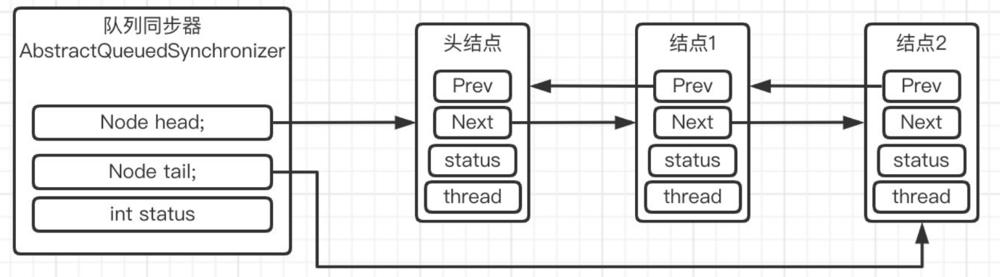
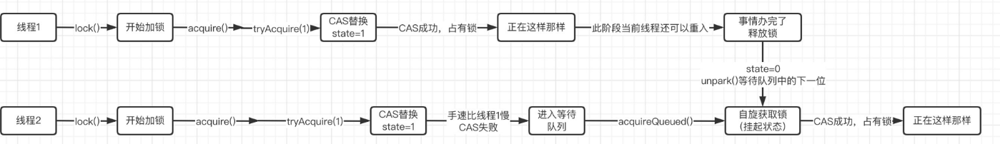
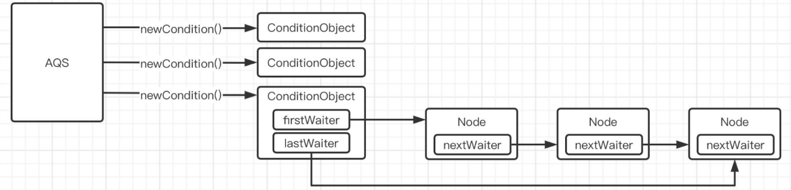
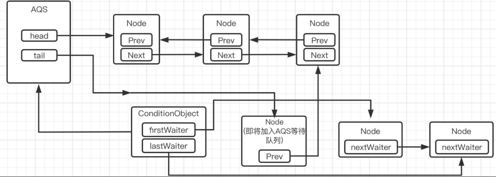
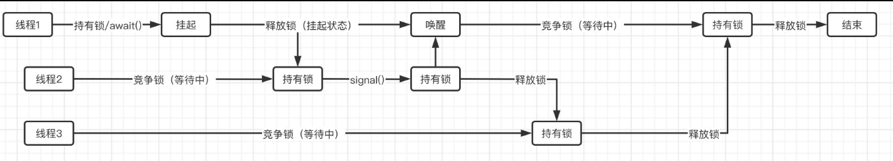

在JDK5之前，只能选择`synchronized`关键字来实现锁，而JDK5之后，由于`volatile`关键字得到了升级，所以并发框架包便出现了，相比传统的`synchronized`关键字，在锁的实现上有了更多的选择。

# Lock接口

并发包中新增了Lock接口（以及相关实现类）用来实现锁功能，Lock接口提供了与synchronized关键字类似的同步功能，但需要在使用时手动获取锁和释放锁。

并发包中的锁和传统的`synchronized`锁不太一样
并发包中的锁可以认为是一把真正意义上的锁，每个锁都是一个对应的锁对象，只需要向锁对象获取锁或是释放锁即可

Lock接口：
```java
public interface Lock {
    //获取锁，拿不到锁会阻塞，等待其他线程释放锁，获取到锁后返回
    void lock();
    //同上，但是等待过程中会响应中断
    void lockInterruptibly() throws InterruptedException;
    //尝试获取锁，但是不会阻塞，如果能获取到会返回true，不能返回false
    boolean tryLock();
    //尝试获取锁，但是可以限定超时时间，如果超出时间还没拿到锁返回false，否则返回true，可以响应中断
    boolean tryLock(long time, TimeUnit unit) throws InterruptedException;
    //释放锁
    void unlock();
    //暂时可以理解为替代传统的Object的wait()、notify()等操作的工具
    Condition newCondition();
}
```

***
例：**使用Lock类来进行加锁和释放锁操作**
和使用`synchronized`相比，这里是真正在操作一个"锁"对象。当需要加锁时，调用`lock()`方法；需要释放锁时，调用`unlock()`方法。程序运行的最终结果和使用`synchronized`锁是一样的。

```java
public class Main {
    private static int i = 0;
    public static void main(String[] args) throws InterruptedException {
        //可重入锁ReentrantLock类是Lock类的一个实现
        Lock testLock = new ReentrantLock();   
        Runnable action = () -> {
            for (int j = 0; j < 100000; j++) {   //以自增操作为例
                testLock.lock();    //加锁，加锁成功后其他线程如果也要获取锁，会阻塞，等待当前线程释放
                i++;
                testLock.unlock();  //解锁，释放锁之后其他线程就可以获取这把锁了（注意在这之前一定得加锁，不然报错）
            }
        };
        new Thread(action).start();
        new Thread(action).start();
        Thread.sleep(1000);   //等上面两个线程跑完
        System.out.println(i);
    }
}
```

# Condition接口

如果想像传统的加锁那样，调用对象的`wait()`和`notify()`方法，则需要使用到Condition接口

Condition接口：
```java
public interface Condition {
  	//与调用锁对象的wait方法一样，会进入到等待状态，但是这里需要调用Condition的signal或signalAll方法进行唤醒（感觉就是和普通对象的wait和notify是对应的）同时，等待状态下是可以响应中断的
        void await() throws InterruptedException;
  	//同上，但不响应中断（看名字都能猜到）
  	void awaitUninterruptibly();
  	//等待指定时间，如果在指定时间（纳秒）内被唤醒，会返回剩余时间，如果超时，会返回0或负数，可以响应中断
  	long awaitNanos(long nanosTimeout) throws InterruptedException;
  	//等待指定时间（可以指定时间单位），如果等待时间内被唤醒，返回true，否则返回false，可以响应中断
  	boolean await(long time, TimeUnit unit) throws InterruptedException;
  	//可以指定一个明确的时间点，如果在时间点之前被唤醒，返回true，否则返回false，可以响应中断
  	boolean awaitUntil(Date deadline) throws InterruptedException;
  	//唤醒一个处于等待状态的线程，注意还得获得锁才能接着运行
  	void signal();
  	//同上，但是是唤醒所有等待线程
  	void signalAll();
}
```

***
**例**
可以发现，Condition对象使用方法和传统的对象使用差别不是很大。

```java
public static void main(String[] args) throws InterruptedException {
    Lock testLock = new ReentrantLock();
    Condition condition = testLock.newCondition();
    new Thread(() -> {
        testLock.lock();   //和synchronized一样，必须持有锁的情况下才能使用await
        System.out.println("线程1进入等待状态！");
        try {
            condition.await();   //进入等待状态
        } catch (InterruptedException e) {
            e.printStackTrace();
        }
        System.out.println("线程1等待结束！");
        testLock.unlock();
    }).start();
    Thread.sleep(100); //防止线程2先跑
    new Thread(() -> {
        testLock.lock();
        System.out.println("线程2开始唤醒其他等待线程");
        condition.signal();   //唤醒线程1，但是此时线程1还必须要拿到锁才能继续运行
        System.out.println("线程2结束");
        testLock.unlock();   //这里释放锁之后，线程1就可以拿到锁继续运行了
    }).start();
}
```

如果是按照下面代码块那样写
调用`newCondition()`后，会生成一个新的Condition对象，并且同一把锁内是可以存在多个Condition对象的（实际上原始的锁机制等待队列只能有一个，而这里可以创建很多个Condition来实现多等待队列）
因此下面这段代码，实际上使用的是不同的Condition对象，而只有对同一个Condition对象进行等待和唤醒操作才会有效，不同的Condition对象是分开计算的。

```java
public static void main(String[] args) throws InterruptedException {
    Lock testLock = new ReentrantLock();
    new Thread(() -> {
        testLock.lock();
        System.out.println("线程1进入等待状态！");
        try {
            testLock.newCondition().await();
        } catch (InterruptedException e) {
            e.printStackTrace();
        }
        System.out.println("线程1等待结束！");
        testLock.unlock();
    }).start();
    Thread.sleep(100);
    new Thread(() -> {
        testLock.lock();
        System.out.println("线程2开始唤醒其他等待线程");
        testLock.newCondition().signal();
        System.out.println("线程2结束");
        testLock.unlock();
    }).start();
}
```

# 时间工具类

位于`java.util.concurrent`包下：
时间单位有很多的，比如`DAY`、`SECONDS`、`MINUTES`等，可以直接将其作为时间单位
```java
public enum TimeUnit {
    /**
     * Time unit representing one thousandth of a microsecond
     */
    NANOSECONDS {
        public long toNanos(long d)   { return d; }
        public long toMicros(long d)  { return d/(C1/C0); }
        public long toMillis(long d)  { return d/(C2/C0); }
        public long toSeconds(long d) { return d/(C3/C0); }
        public long toMinutes(long d) { return d/(C4/C0); }
        public long toHours(long d)   { return d/(C5/C0); }
        public long toDays(long d)    { return d/(C6/C0); }
        public long convert(long d, TimeUnit u) { return u.toNanos(d); }
        int excessNanos(long d, long m) { return (int)(d - (m*C2)); }
    },
  	//....
```

***

让一个线程等待3秒钟，可以像下面这样编写：

```java
public static void main(String[] args) throws InterruptedException {
    Lock testLock = new ReentrantLock();
    new Thread(() -> {
        testLock.lock();
        try {
            System.out.println("等待是否未超时："+testLock.newCondition().await(3, TimeUnit.SECONDS));
        } catch (InterruptedException e) {
            e.printStackTrace();
        }
        testLock.unlock();
    }).start();
}
```

Lock类的tryLock方法也是支持使用时间单位的，可以自行进行测试。

TimeUnit除了可以作为时间单位表示以外，还可以在不同单位之间相互转换：
```java
public static void main(String[] args) throws InterruptedException {
    System.out.println("60秒 = "+TimeUnit.SECONDS.toMinutes(60) +"分钟");
    System.out.println("365天 = "+TimeUnit.DAYS.toSeconds(365) +" 秒");
}
```

也可以更加便捷地使用对象的`wait()`方法：

```java
public static void main(String[] args) throws InterruptedException {
    synchronized (Main.class) {
        System.out.println("开始等待");
        TimeUnit.SECONDS.timedWait(Main.class, 3);   //直接等待3秒
        System.out.println("等待结束");
    }
}
```

直接使用它来进行休眠操作：

```java
public static void main(String[] args) throws InterruptedException {
    TimeUnit.SECONDS.sleep(1);  //休眠1秒钟
}
```

# 可重入锁

## 基本操作

ReentrantLock是锁接口的一个具体实现类，叫做可重入锁。简单来说，就是同一个线程，可以反复进行加锁操作：


主线程连续进行了两次加锁操作（此操作是不会被阻塞的），在当前线程持有锁的情况下继续加锁不会被阻塞，并且，加锁几次，就必须要解锁几次，否则此线程依旧持有锁。
```java
public static void main(String[] args) throws InterruptedException {
    ReentrantLock lock = new ReentrantLock();
    lock.lock();
    lock.lock();   //连续加锁2次
    new Thread(() -> {
        System.out.println("线程2想要获取锁");
        lock.lock();
        System.out.println("线程2成功获取到锁");
    }).start();
    lock.unlock();
    System.out.println("线程1释放了一次锁");
    TimeUnit.SECONDS.sleep(1);
    lock.unlock();
    System.out.println("线程1再次释放了一次锁");  //释放两次后其他线程才能加锁
}
```

使用`getHoldCount()`方法查看当前线程的加锁次数：
```java
public static void main(String[] args) throws InterruptedException {
    ReentrantLock lock = new ReentrantLock();
    lock.lock();
    lock.lock();
    System.out.println("当前加锁次数："+lock.getHoldCount()+"，是否被锁："+lock.isLocked());
    TimeUnit.SECONDS.sleep(1);
    lock.unlock();
    System.out.println("当前加锁次数："+lock.getHoldCount()+"，是否被锁："+lock.isLocked());
    TimeUnit.SECONDS.sleep(1);
    lock.unlock();
    System.out.println("当前加锁次数："+lock.getHoldCount()+"，是否被锁："+lock.isLocked());
}
```

如果存在线程持有当前的锁，那么其他线程在获取锁时，会暂时进入到等待队列，可以通过`getQueueLength()`方法获取等待队列中线程数量的预估值：

```java
public static void main(String[] args) throws InterruptedException {
    ReentrantLock lock = new ReentrantLock();
    lock.lock();
    Thread t1 = new Thread(lock::lock), t2 = new Thread(lock::lock);;
    t1.start();
    t2.start();
    TimeUnit.SECONDS.sleep(1);
    System.out.println("当前等待锁释放的线程数："+lock.getQueueLength());
    System.out.println("线程1是否在等待队列中："+lock.hasQueuedThread(t1));
    System.out.println("线程2是否在等待队列中："+lock.hasQueuedThread(t2));
    System.out.println("当前线程是否在等待队列中："+lock.hasQueuedThread(Thread.currentThread()));
}
```

通过`hasQueuedThread()`方法来判断某个线程是否正在等待获取锁状态。

***
同样的，Condition也可以进行判断：
通过使用`getWaitQueueLength()`方法能够查看同一个Condition目前有多少线程处于等待状态。

```java
public static void main(String[] args) throws InterruptedException {
    ReentrantLock lock = new ReentrantLock();
    Condition condition = lock.newCondition();
    new Thread(() -> {
       lock.lock();
        try {
            condition.await();
        } catch (InterruptedException e) {
            e.printStackTrace();
        }
        lock.unlock();
    }).start();
    TimeUnit.SECONDS.sleep(1);
    lock.lock();
    System.out.println("当前Condition的等待线程数："+lock.getWaitQueueLength(condition));
    condition.signal();
    System.out.println("当前Condition的等待线程数："+lock.getWaitQueueLength(condition));
    lock.unlock();
}
```

## 公平锁与非公平锁

如果线程之间争抢同一把锁，会暂时进入到等待队列中，那么多个线程获得锁的顺序是不是一定是根据线程调用`lock()`方法时间来定的呢

`ReentrantLock`的构造方法中，是这样写的：
```java
public ReentrantLock() {
    sync = new NonfairSync();   //看名字貌似是非公平的
}
```

其实锁分为公平锁和非公平锁，默认创建出来的ReentrantLock是非公平锁

* 公平锁：多个线程按照申请锁的顺序去获得锁，线程会直接进入队列去排队，永远都是队列的第一位才能得到锁。
* 非公平锁：多个线程去获取锁的时候，会直接去尝试获取，获取不到，再去进入等待队列，如果能获取到，就直接获取到锁。

简单来说，公平锁不让插队，都老老实实排着；非公平锁让插队，但是排队的人让不让你插队就是另一回事了。

# 读写锁

## 基本操作

读写锁并不是专门用作读写操作的锁，它和可重入锁不同的地方在于，可重入锁是一种排他锁，当一个线程得到锁之后，另一个线程必须等待其释放锁，否则一律不允许获取到锁。
而读写锁在同一时间，是可以让多个线程获取到锁的，它其实就是针对于读写场景而出现的。

读写锁维护了一个读锁和一个写锁，这两个锁的机制是不同的。

* 读锁：在没有任何线程占用写锁的情况下，同一时间可以有多个线程加读锁。
* 写锁：在没有任何线程占用读锁的情况下，同一时间只能有一个线程加写锁。

读写锁也有一个专门的接口ReadWriteLock：
```java
public interface ReadWriteLock {
    //获取读锁
    Lock readLock();

    //获取写锁
    Lock writeLock();
}
```

此接口有一个实现类ReentrantReadWriteLock（实现的是ReadWriteLock接口，不是Lock接口，它本身并不是锁）
操作ReentrantReadWriteLock时，不能直接上锁，而是需要获取读锁或是写锁，再进行锁操作：

```java
public static void main(String[] args) throws InterruptedException {
    ReentrantReadWriteLock lock = new ReentrantReadWriteLock();
    lock.readLock().lock();
    new Thread(lock.readLock()::lock).start();
}
```

多个线程同时对读锁加锁。

```java
public static void main(String[] args) throws InterruptedException {
    ReentrantReadWriteLock lock = new ReentrantReadWriteLock();
    lock.readLock().lock();
    new Thread(lock.writeLock()::lock).start();
}
```

有读锁状态下无法加写锁，反之亦然：

```java
public static void main(String[] args) throws InterruptedException {
    ReentrantReadWriteLock lock = new ReentrantReadWriteLock();
    lock.writeLock().lock();
    new Thread(lock.readLock()::lock).start();
}
```

并且，ReentrantReadWriteLock不仅具有读写锁的功能，还保留了可重入锁和公平/非公平机制，比如同一个线程可以重复为写锁加锁，并且必须全部解锁才真正释放锁：

```java
public static void main(String[] args) throws InterruptedException {
    ReentrantReadWriteLock lock = new ReentrantReadWriteLock();
    lock.writeLock().lock();
    lock.writeLock().lock();
    new Thread(() -> {
        lock.writeLock().lock();
        System.out.println("成功获取到写锁！");
    }).start();
    System.out.println("释放第一层锁！");
    lock.writeLock().unlock();
    TimeUnit.SECONDS.sleep(1);
    System.out.println("释放第二层锁！");
    lock.writeLock().unlock();
}
```

## 锁降级和锁升级

**锁降级**指的是写锁降级为读锁。
当一个线程持有写锁的情况下，虽然其他线程不能加读锁，但是线程自己是可以加读锁的：

```java
public static void main(String[] args) throws InterruptedException {
    ReentrantReadWriteLock lock = new ReentrantReadWriteLock();
    lock.writeLock().lock();
    lock.readLock().lock();
    System.out.println("成功加读锁！");
}
```

在同时加了写锁和读锁的情况下，一旦写锁被释放，那么当前线程就只剩下读锁了，因为读锁可以被多个线程共享，所以这时其他线程都可以添加读锁。这种操作，就被称之为"锁降级"（注意不是先释放写锁再加读锁，而是持有写锁的情况下申请读锁再释放写锁）
```java
public static void main(String[] args) throws InterruptedException {
    ReentrantReadWriteLock lock = new ReentrantReadWriteLock();
    lock.writeLock().lock();
    lock.readLock().lock();
    new Thread(() -> {
        System.out.println("开始加读锁！");
        lock.readLock().lock();
        System.out.println("读锁添加成功！");
    }).start();
    TimeUnit.SECONDS.sleep(1);
    lock.writeLock().unlock();    //如果释放写锁，会怎么样？
}
```

***
**锁升级**

在仅持有读锁的情况下去申请写锁，属于"锁升级"，ReentrantReadWriteLock是不支持的：

```java
public static void main(String[] args) throws InterruptedException {
    ReentrantReadWriteLock lock = new ReentrantReadWriteLock();
    lock.readLock().lock();
    lock.writeLock().lock();
    System.out.println("所升级成功！");
}
```

可以看到线程直接卡在加写锁的那一句。

# 队列同步器AQS

前面了解了可重入锁和读写锁，现在来探究它们的底层实现原理【多重套娃】

执行ReentrantLock的`lock()`方法，它的内部实际上啥都没做，而是交给了Sync对象处理
```java
public void lock() {
    sync.lock();
}
```

其他的很多方法都是依靠Sync对象处理
```java
public void unlock() {
    sync.release(1);
}
```

实际上，公平锁和非公平锁都是继承自Sync，而Sync是继承自AbstractQueuedSynchronizer，简称队列同步器：

```java
abstract static class Sync extends AbstractQueuedSynchronizer {
   //...
}

static final class NonfairSync extends Sync {}
static final class FairSync extends Sync {}
```

所以，要了解它们的底层原理，还得看队列同步器

## 底层实现

AbstractQueuedSynchronizer（AQS）是实现锁机制的基础，它的内部封装了包括锁的获取、释放、以及等待队列。

### 等待队列

一个锁（排他锁为例）的基本功能就是获取锁、释放锁、当锁被占用时，其他线程来争抢会进入等待队列。
AQS已经将这些基本的功能封装完成了，其中等待队列是核心内容，等待队列是由双向链表数据结构实现的，每个等待状态下的线程都可以被封装进结点中并放入双向链表中，双向链表是以队列的形式进行操作的，像这样：



AQS中有一个`head`字段和一个`tail`字段分别记录双向链表的头结点和尾结点，而之后的一系列操作都是围绕此队列来进行的。

结点：
```java
//每个处于等待状态的线程都可以是一个节点，并且每个节点是有很多状态的
static final class Node {
  	//每个节点都可以被分为独占模式节点或是共享模式节点，分别适用于独占锁和共享锁
    static final Node SHARED = new Node();
    static final Node EXCLUSIVE = null;

  	//等待状态，这里都定义好了
   	//唯一一个大于0的状态，表示已失效，可能是由于超时或中断，此节点被取消。
    static final int CANCELLED =  1;
  	//此节点后面的节点被挂起（进入等待状态）
    static final int SIGNAL    = -1;	
  	//在条件队列中的节点才是这个状态
    static final int CONDITION = -2;
  	//传播，一般用于共享锁
    static final int PROPAGATE = -3;

    volatile int waitStatus;    //等待状态值
    volatile Node prev;   //双向链表基操
    volatile Node next;
    volatile Thread thread;   //每一个线程都可以被封装进一个节点进入到等待队列
  
    Node nextWaiter;   //在等待队列中表示模式，条件队列中作为下一个结点的指针

    final boolean isShared() {
        return nextWaiter == SHARED;
    }

    final Node predecessor() throws NullPointerException {
        Node p = prev;
        if (p == null)
            throw new NullPointerException();
        else
            return p;
    }

    Node() {
    }

    Node(Thread thread, Node mode) {
        this.nextWaiter = mode;
        this.thread = thread;
    }

    Node(Thread thread, int waitStatus) {
        this.waitStatus = waitStatus;
        this.thread = thread;
    }
}
```

在一开始的时候，`head`和`tail`都是`null`，`state`为默认值`0`：

```java
private transient volatile Node head;

private transient volatile Node tail;

private volatile int state;
```

不用担心双向链表不会进行初始化，初始化是在实际使用时才开始的

### Unsafe类

接着来看其他的初始化内容：
```java
//直接使用Unsafe类进行操作
private static final Unsafe unsafe = Unsafe.getUnsafe();
//记录类中属性的在内存中的偏移地址，方便Unsafe类直接操作内存进行赋值等（直接修改对应地址的内存）
private static final long stateOffset;   //这里对应的就是AQS类中的state成员字段
private static final long headOffset;    //这里对应的就是AQS类中的head头结点成员字段
private static final long tailOffset;
private static final long waitStatusOffset;
private static final long nextOffset;

static {   //静态代码块，在类加载的时候就会自动获取偏移地址
    try {
        stateOffset = unsafe.objectFieldOffset
            (AbstractQueuedSynchronizer.class.getDeclaredField("state"));
        headOffset = unsafe.objectFieldOffset
            (AbstractQueuedSynchronizer.class.getDeclaredField("head"));
        tailOffset = unsafe.objectFieldOffset
            (AbstractQueuedSynchronizer.class.getDeclaredField("tail"));
        waitStatusOffset = unsafe.objectFieldOffset
            (Node.class.getDeclaredField("waitStatus"));
        nextOffset = unsafe.objectFieldOffset
            (Node.class.getDeclaredField("next"));

    } catch (Exception ex) { throw new Error(ex); }
}

//通过CAS操作来修改头结点
private final boolean compareAndSetHead(Node update) {
  	//调用的是Unsafe类的compareAndSwapObject方法，通过CAS算法比较对象并替换
    return unsafe.compareAndSwapObject(this, headOffset, null, update);
}

//同上，省略部分代码
private final boolean compareAndSetTail(Node expect, Node update) {

private static final boolean compareAndSetWaitStatus(Node node, int expect, int update) {

private static final boolean compareAndSetNext(Node node, Node expect, Node update) {
```

可以发现，队列同步器由于要使用到CAS算法，所以，直接使用了Unsafe工具类，Unsafe类中提供了CAS操作的方法（Java无法实现，底层由C++实现）所有对AQS类中成员字段的修改，都有对应的CAS操作封装。

***
接着来看这个UnSafe类是如何进行使用的

它提供了一些可重写的方法（根据不同的锁类型和机制，可以自由定制规则，并且为独占式和非独占式锁都提供了对应的方法），以及一些已经写好的模板方法（模板方法会调用这些可重写的方法），使用此类只需要将可重写的方法进行重写，并调用提供的模板方法，从而实现锁功能

可重写方法：
```java
//独占式获取同步状态，查看同步状态是否和参数一致，如果返没有问题，那么会使用CAS操作设置同步状态并返回true
protected boolean tryAcquire(int arg) {
    throw new UnsupportedOperationException();
}

//独占式释放同步状态
protected boolean tryRelease(int arg) {
    throw new UnsupportedOperationException();
}

//共享式获取同步状态，返回值大于0表示成功，否则失败
protected int tryAcquireShared(int arg) {
    throw new UnsupportedOperationException();
}

//共享式释放同步状态
protected boolean tryReleaseShared(int arg) {
    throw new UnsupportedOperationException();
}

//是否在独占模式下被当前线程占用（锁是否被当前线程持有）
protected boolean isHeldExclusively() {
    throw new UnsupportedOperationException();
}
```

可以看到，这些需要重写的方法默认是直接抛出`UnsupportedOperationException`，也就是说根据不同的锁类型，需要去实现对应的方法

### 加锁操作

>以ReentrantLock（此类是全局独占式的）中的公平锁的加锁操作为例

#### 公平锁lock方法

加锁操作直接调用了AQS提供的模板方法`acquire()`
```java
static final class FairSync extends Sync {
    private static final long serialVersionUID = -3000897897090466540L;

  	//加锁操作调用了模板方法acquire
  	//为了防止各位绕晕，请时刻记住，lock方法一定是在某个线程下为了加锁而调用的，并且同一时间可能会有其他线程也在调用此方法
    final void lock() {
        acquire(1);
    }

    ...
}
```

模板方法`acquire()`在AQS类中的实现细节：

```java
@ReservedStackAccess //这个是JEP 270添加的新注解，它会保护被注解的方法，通过添加一些额外的空间，防止在多线程运行的时候出现栈溢出，下同
public final void acquire(int arg) {
    if (!tryAcquire(arg) &&
        acquireQueued(addWaiter(Node.EXCLUSIVE), arg))   //节点为独占模式Node.EXCLUSIVE
        selfInterrupt();
}
```

首先会调用`tryAcquire()`方法（这里是由FairSync类实现的），如果尝试加独占锁失败（返回false了）说明可能这个时候有其他线程持有了此独占锁，所以当前线程得先等着，那么会调用`addWaiter()`方法将线程加入等待队列中：

```java
private Node addWaiter(Node mode) {
    Node node = new Node(Thread.currentThread(), mode);
    // 先尝试使用CAS直接入队，如果这个时候其他线程也在入队（就是不止一个线程在同一时间争抢这把锁）就进入enq()
    Node pred = tail;
    if (pred != null) {
        node.prev = pred;
        if (compareAndSetTail(pred, node)) {
            pred.next = node;
            return node;
        }
    }
  	//此方法是CAS快速入队失败时调用
    enq(node);
    return node;
}

private Node enq(final Node node) {
  	//自旋形式入队，可以看到这里是一个无限循环
    for (;;) {
        Node t = tail;
        if (t == null) {  //这种情况只能说明头结点和尾结点都还没初始化
            if (compareAndSetHead(new Node()))   //初始化头结点和尾结点
                tail = head;
        } else {
            node.prev = t;
            if (compareAndSetTail(t, node)) {
                t.next = node;
                return t;   //只有CAS成功的情况下，才算入队成功，如果CAS失败，那说明其他线程同一时间也在入队，并且手速还比当前线程快，刚好走到CAS操作的时候，其他线程就先入队了，那么这个时候node.prev就不是我们预期的节点了，而是另一个线程新入队的节点，所以说得进下一次循环再来一次CAS，这种形式就是自旋
            }
        }
    }
}
```

`addWaiter()`方法会将节点加入等待队列，接着会返回已经加入的节点，`acquireQueued()`在得到返回的节点时，也会进入自旋状态，等待唤醒（也就是开始进入到拿锁的环节了）：

```java
@ReservedStackAccess
final boolean acquireQueued(final Node node, int arg) {
    boolean failed = true;
    try {
        boolean interrupted = false;
        for (;;) {
            final Node p = node.predecessor();
            if (p == head && tryAcquire(arg)) {   //可以看到当此节点位于队首(node.prev == head)时，会再次调用tryAcquire方法获取锁，如果获取成功，会返回此过程中是否被中断的值
                setHead(node);    //新的头结点设置为当前结点
                p.next = null; // 原有的头结点没有存在的意义了
                failed = false;   //没有失败
                return interrupted;   //直接返回等待过程中是否被中断
            }	
          	//依然没获取成功，
            if (shouldParkAfterFailedAcquire(p, node) &&   //将当前节点的前驱节点等待状态设置为SIGNAL，如果失败将直接开启下一轮循环，直到成功为止，如果成功接着往下
                parkAndCheckInterrupt())   //挂起线程进入等待状态，等待被唤醒，如果在等待状态下被中断，那么会返回true，直接将中断标志设为true，否则就是正常唤醒，继续自旋
                interrupted = true;
        }
    } finally {
        if (failed)
            cancelAcquire(node);
    }
}

private final boolean parkAndCheckInterrupt() {
    LockSupport.park(this);   //通过unsafe类操作底层挂起线程（会直接进入阻塞状态）
    return Thread.interrupted();
}
```

```java
private static boolean shouldParkAfterFailedAcquire(Node pred, Node node) {
    int ws = pred.waitStatus;
    if (ws == Node.SIGNAL)
        return true;   //已经是SIGNAL，直接true
    if (ws > 0) {   //不能是已经取消的节点，必须找到一个没被取消的
        do {
            node.prev = pred = pred.prev;
        } while (pred.waitStatus > 0);
        pred.next = node;   //直接抛弃被取消的节点
    } else {
        //不是SIGNAL，先CAS设置为SIGNAL（这里没有返回true因为CAS不一定成功，需要下一轮再判断一次）
        compareAndSetWaitStatus(pred, ws, Node.SIGNAL);
    }
    return false;   //返回false，马上开启下一轮循环
}
```

所以，`acquire()`中的if条件如果为true，那么只有一种情况，就是等待过程中被中断了，其他任何情况下都是成功获取到独占锁，所以当等待过程被中断时，会调用`selfInterrupt()`方法：

```java
static void selfInterrupt() {
    Thread.currentThread().interrupt();
}
```

这里就是直接向当前线程发送中断信号了。

#### 公平锁的tryAcquire方法

```java
static final class FairSync extends Sync {
  	//可重入独占锁的公平实现
    @ReservedStackAccess
    protected final boolean tryAcquire(int acquires) {
        final Thread current = Thread.currentThread();   //先获取当前线程的Thread对象
        int c = getState();     //获取当前AQS对象状态（独占模式下0为未占用，大于0表示已占用）
        if (c == 0) {       //如果是0，那就表示没有占用，现在我们的线程就要来尝试占用它
            if (!hasQueuedPredecessors() &&    //等待队列是否不为空且当前线程没有拿到锁，其实就是看看当前线程有没有必要进行排队，如果没必要排队，就说明可以直接获取锁
                compareAndSetState(0, acquires)) {   //CAS设置状态，如果成功则说明成功拿到了这把锁，失败则说明可能这个时候其他线程在争抢，并且还比你先抢到
                setExclusiveOwnerThread(current);    //成功拿到锁，会将独占模式所有者线程设定为当前线程（这个方法是父类AbstractOwnableSynchronizer中的，就表示当前这把锁已经是这个线程的了）
                return true;   //占用锁成功，返回true
            }
        }
        else if (current == getExclusiveOwnerThread()) {   //如果不是0，那就表示被线程占用了，这个时候看看是不是自己占用的，如果是，由于是可重入锁，可以继续加锁
            int nextc = c + acquires;    //多次加锁会将状态值进行增加，状态值就是加锁次数
            if (nextc < 0)   //加到int值溢出了？
                throw new Error("Maximum lock count exceeded");
            setState(nextc);   //设置为新的加锁次数
            return true;
        }
        return false;   //其他任何情况都是加锁失败
    }
}
```

### 解锁操作

公平锁的`unlock()`方法是在AQS中实现的：

```java
public void unlock() {
    sync.release(1);    //直接调用了AQS中的release方法，参数为1表示解锁一次state值-1
}
```

```java
@ReservedStackAccess
public final boolean release(int arg) {
    if (tryRelease(arg)) {   //和tryAcquire一样，也得子类去重写，释放锁操作
        Node h = head;    //释放锁成功后，获取新的头结点
        if (h != null && h.waitStatus != 0)   //如果新的头结点不为空并且不是刚刚建立的结点（初始状态下status为默认值0，而上面在进行了shouldParkAfterFailedAcquire之后，会被设定为SIGNAL状态，值为-1）
            unparkSuccessor(h);   //唤醒头节点下一个节点中的线程
        return true;
    }
    return false;
}
```

```java
private void unparkSuccessor(Node node) {
    // 将等待状态waitStatus设置为初始值0
    int ws = node.waitStatus;
    if (ws < 0)
        compareAndSetWaitStatus(node, ws, 0);

    //获取下一个结点
    Node s = node.next;
    if (s == null || s.waitStatus > 0) {   //如果下一个结点为空或是等待状态是已取消，那肯定是不能通知unpark的，这时就要遍历所有节点再另外找一个符合unpark要求的节点了
        s = null;
        for (Node t = tail; t != null && t != node; t = t.prev)   //这里是从队尾向前，因为enq()方法中的t.next = node是在CAS之后进行的，而 node.prev = t 是CAS之前进行的，所以从后往前一定能够保证遍历所有节点
            if (t.waitStatus <= 0)
                s = t;
    }
    if (s != null)   //要是找到了，就直接unpark，要是还是没找到，那就算了
        LockSupport.unpark(s.thread);
}
```

`tryRelease()`方法是怎么实现的，具体实现在Sync中：

```java
@ReservedStackAccess
protected final boolean tryRelease(int releases) {
    int c = getState() - releases;   //先计算本次解锁之后的状态值
    if (Thread.currentThread() != getExclusiveOwnerThread())   //因为是独占锁，那肯定这把锁得是当前线程持有才行
        throw new IllegalMonitorStateException();   //否则直接抛异常
    boolean free = false;
    if (c == 0) {  //如果解锁之后的值为0，表示已经完全释放此锁
        free = true;
        setExclusiveOwnerThread(null);  //将独占锁持有线程设置为null
    }
    setState(c);   //状态值设定为c
    return free;  //如果不是0表示此锁还没完全释放，返回false，是0就返回true
}
```

***

综上，完整的流程图：



只探究了公平锁，有关非公平锁和读写锁自己去看

## 公平锁一定公平吗？

并发的情况下，公平锁一定公平吗？
先说结论：**公平锁，只有在等待队列存在节点时，才是真正公平的**

***

回顾一下`tryAcquire()`方法的实现：
```java
@ReservedStackAccess
protected final boolean tryAcquire(int acquires) {
    final Thread current = Thread.currentThread();
    int c = getState();
    if (c == 0) {
        if (!hasQueuedPredecessors() &&   //注意这里，公平锁的机制是，一开始会查看是否有节点处于等待
            compareAndSetState(0, acquires)) {   //如果前面的方法执行后发现没有等待节点，就直接进入占锁环节了
            setExclusiveOwnerThread(current);
            return true;
        }
    }
    else if (current == getExclusiveOwnerThread()) {
        int nextc = c + acquires;
        if (nextc < 0)
            throw new Error("Maximum lock count exceeded");
        setState(nextc);
        return true;
    }
    return false;
}
```

所以`hasQueuedPredecessors()`这个环节容不得半点闪失，否则会直接破坏掉公平性，假如现在出现了这样的情况：

线程1已经持有锁了，这时线程2来争抢这把锁，走到`hasQueuedPredecessors()`，判断出为 `false`，线程2继续运行，然后线程2肯定获取锁失败（因为锁这时是被线程1占有的），因此就进入到等待队列中：

```java
private Node enq(final Node node) {
    for (;;) {
        Node t = tail;
        if (t == null) { // 线程2进来之后，肯定是要先走这里的，因为head和tail都是null
            if (compareAndSetHead(new Node()))
                tail = head;   //这里就将tail直接等于head了，注意这里完了之后还没完，这里只是初始化过程
        } else {
            node.prev = t;
            if (compareAndSetTail(t, node)) {
                t.next = node;
                return t;
            }
        }
    }
}

private Node addWaiter(Node mode) {
    Node node = new Node(Thread.currentThread(), mode);
    Node pred = tail;
    if (pred != null) {   //由于一开始head和tail都是null，所以线程2直接就进enq()了
        node.prev = pred;
        if (compareAndSetTail(pred, node)) {
            pred.next = node;
            return node;
        }
    }
    enq(node);   //请看上面
    return node;
}
```

而这个时候线程3也来抢锁了，按照正常流程走到了`hasQueuedPredecessors()`方法，在此方法中：

```java
public final boolean hasQueuedPredecessors() {
    Node t = tail; // Read fields in reverse initialization order
    Node h = head;
    Node s;
  	//这里直接判断h != t，而此时线程2才刚刚执行完 tail = head，所以直接就返回false了
    return h != t &&
        ((s = h.next) == null || s.thread != Thread.currentThread());
}
```

因此，线程3这时就紧接着准备开始CAS操作了，碰巧这时线程1释放锁了，现在的情况就是，线程3直接开始CAS判断，而线程2还在插入节点状态。
结果可想而知，居然是线程3先拿到了锁，这显然是违背了公平锁的公平机制。

因此公不公平全看`hasQueuedPredecessors()`，而此方法只有在等待队列中存在节点时才能保证不会出现问题。
**所以公平锁，只有在等待队列存在节点时，才是真正公平的**

## Condition实现原理

Condition类实际上就是用于代替传统对象的wait/notify操作的，同样可以实现等待/通知模式，并且同一把锁下可以创建多个Condition对象。

### 条件队列

先从单个Condition对象进行分析：

在AQS中，Condition有一个实现类ConditionObject，而这里也是使用了链表实现条件队列：

```java
public class ConditionObject implements Condition, java.io.Serializable {
    private static final long serialVersionUID = 1173984872572414699L;
    /** 条件队列的头结点 */
    private transient Node firstWaiter;
    /** 条件队列的尾结点 */
    private transient Node lastWaiter;
  
  	//...
```

这里是直接使用了AQS中的Node类，但是使用的是Node类中的nextWaiter字段连接节点，并且Node的status为CONDITION：



当一个线程调用`await()`方法时，会进入等待状态，直到其他线程调用`signal()`方法将其唤醒，而这里的条件队列，正是用于存储这些处于等待状态的线程。

### await方法

此方法的目标：
* 只有已经持有锁的线程才可以使用此方法
* 当调用此方法后，会直接释放锁，无论加了多少次锁
* 只有其他线程调用`signal()`或是被中断时才会唤醒等待中的线程
* 被唤醒后，需要等待其他线程释放锁，拿到锁之后才可以继续执行，并且会恢复到之前的状态（await之前加了几层锁唤醒后依然是几层锁）

上源码：
```java
public final void await() throws InterruptedException {
    if (Thread.interrupted())
        throw new InterruptedException();   //如果在调用await之前就被添加了中断标记，那么会直接抛出中断异常
    Node node = addConditionWaiter();    //为当前线程创建一个新的节点，并将其加入到条件队列中
    int savedState = fullyRelease(node);    //完全释放当前线程持有的锁，并且保存一下state值，因为唤醒之后还得恢复
    int interruptMode = 0;     //用于保存中断状态
    while (!isOnSyncQueue(node)) {   //循环判断是否位于同步队列中，如果等待状态下的线程被其他线程唤醒，那么会正常进入到AQS的等待队列中（之后我们会讲）
        LockSupport.park(this);   //如果依然处于等待状态，那么继续挂起
        if ((interruptMode = checkInterruptWhileWaiting(node)) != 0)   //看看等待的时候是不是被中断了
            break;
    }
  	//出了循环之后，那线程肯定是已经醒了，这时就差拿到锁就可以恢复运行了
    if (acquireQueued(node, savedState) && interruptMode != THROW_IE)  //直接开始acquireQueued尝试拿锁（之前已经讲过了）从这里开始基本就和一个线程去抢锁是一样的了
        interruptMode = REINTERRUPT;
  	//已经拿到锁了，基本可以开始继续运行了，这里再进行一下后期清理工作
    if (node.nextWaiter != null) 
        unlinkCancelledWaiters();  //将等待队列中，不是Node.CONDITION状态的节点移除
    if (interruptMode != 0)   //依然是响应中断
        reportInterruptAfterWait(interruptMode);
  	//OK，接着该干嘛干嘛
}
```

`await()`方法大部分操作在意料之中

### signal方法

此方法的目标：
* 只有持有锁的线程才能唤醒锁所属的Condition等待的线程
* 优先唤醒条件队列中的第一个，如果唤醒过程中出现问题，接着找往下找，直到找到一个可以唤醒的
* 唤醒操作本质上是将条件队列中的结点直接丢进AQS等待队列中，让其参与到锁的竞争中
* 拿到锁之后，线程才能恢复运行



上源码：
```java
public final void signal() {
    if (!isHeldExclusively())    //先看看当前线程是不是持有锁的状态
        throw new IllegalMonitorStateException();   //不是？那你不配唤醒别人
    Node first = firstWaiter;    //获取条件队列的第一个结点
    if (first != null)    //如果队列不为空，获取到了，那么就可以开始唤醒操作
        doSignal(first);
}
```

```java
private void doSignal(Node first) {
    do {
        if ( (firstWaiter = first.nextWaiter) == null)   //如果当前节点在本轮循环没有后继节点了，条件队列就为空了
            lastWaiter = null;   //所以这里相当于是直接清空
        first.nextWaiter = null;   //将给定节点的下一个结点设置为null，因为当前结点马上就会离开条件队列了
    } while (!transferForSignal(first) &&   //接着往下看
             (first = firstWaiter) != null);   //能走到这里只能说明给定节点被设定为了取消状态，那就继续看下一个结点
}
```

```java
final boolean transferForSignal(Node node) {
    /*
     * 如果这里CAS失败，那有可能此节点被设定为了取消状态
     */
    if (!compareAndSetWaitStatus(node, Node.CONDITION, 0))
        return false;

    //CAS成功之后，结点的等待状态就变成了默认值0，接着通过enq方法直接将节点丢进AQS的等待队列中，相当于唤醒并且可以等待获取锁了
  	//这里enq方法返回的是加入之后等待队列队尾的前驱节点，就是原来的tail
    Node p = enq(node);
    int ws = p.waitStatus;   //保存前驱结点的等待状态
  	//如果上一个节点的状态为取消, 或者尝试设置上一个节点的状态为SIGNAL失败（可能是在ws>0判断完之后马上变成了取消状态，导致CAS失败）
    if (ws > 0 || !compareAndSetWaitStatus(p, ws, Node.SIGNAL))
        LockSupport.unpark(node.thread);  //直接唤醒线程
    return true;
}
```

最让人不理解的就是倒数第二行，明明上面都正常进入到AQS等待队列了，应该是可以开始走正常流程了，那么这里为什么还要提前来一次unpark呢？

这里其实是为了进行优化而编写，直接unpark会有两种情况：

- 如果插入结点前，AQS等待队列的队尾节点就已经被取消，则满足wc > 0
- 如果插入node后，AQS内部等待队列的队尾节点已经稳定，满足tail.waitStatus == 0，但在执行ws >
  0之后!compareAndSetWaitStatus(p, ws,
  Node.SIGNAL)之前被取消，则CAS也会失败，满足compareAndSetWaitStatus(p, ws,
  Node.SIGNAL) == false

如果这里被提前unpark，那么在`await()`方法中将可以被直接唤醒，并跳出while循环，直接开始争抢锁，因为前一个等待结点是被取消的状态，没有必要再等它了。

***
**综上，大致流程如下**：



## 自行实现锁类

了解了那么多AQS的功能，现在就可以仿照着这些锁类来实现一个简单的锁：

要求：同一时间只能有一个线程持有锁，不要求可重入（反复加锁无视即可）

```java
public class Main {
    public static void main(String[] args) throws InterruptedException {
        
    }

    /**
     * 自行实现一个最普通的独占锁
     * 要求：同一时间只能有一个线程持有锁，不要求可重入
     */
    private static class MyLock implements Lock {

        /**
         * 设计思路：
         * 1. 锁被占用，那么exclusiveOwnerThread应该被记录，并且state = 1
         * 2. 锁没有被占用，那么exclusiveOwnerThread为null，并且state = 0
         */
        private static class Sync extends AbstractQueuedSynchronizer {
            @Override
            protected boolean tryAcquire(int arg) {
                if(isHeldExclusively()) return true;     //无需可重入功能，如果是当前线程直接返回true
                if(compareAndSetState(0, arg)){    //CAS操作进行状态替换
                    setExclusiveOwnerThread(Thread.currentThread());    //成功后设置当前的所有者线程
                    return true;
                }
                return false;
            }

            @Override
            protected boolean tryRelease(int arg) {
                if(getState() == 0)
                    throw new IllegalMonitorStateException();   //没加锁情况下是不能直接解锁的
                if(isHeldExclusively()){     //只有持有锁的线程才能解锁
                    setExclusiveOwnerThread(null);    //设置所有者线程为null
                    setState(0);    //状态变为0
                    return true;
                }
                return false;
            }

            @Override
            protected boolean isHeldExclusively() {
                return getExclusiveOwnerThread() == Thread.currentThread();
            }

            protected Condition newCondition(){
                return new ConditionObject();    //直接用现成的
            }
        }

        private final Sync sync = new Sync();

        @Override
        public void lock() {
            sync.acquire(1);
        }

        @Override
        public void lockInterruptibly() throws InterruptedException {
            sync.acquireInterruptibly(1);
        }

        @Override
        public boolean tryLock() {
            return sync.tryAcquire(1);
        }

        @Override
        public boolean tryLock(long time, TimeUnit unit) throws InterruptedException {
            return sync.tryAcquireNanos(1, unit.toNanos(time));
        }

        @Override
        public void unlock() {
            sync.release(1);
        }

        @Override
        public Condition newCondition() {
            return sync.newCondition();
        }
    }
}
```


