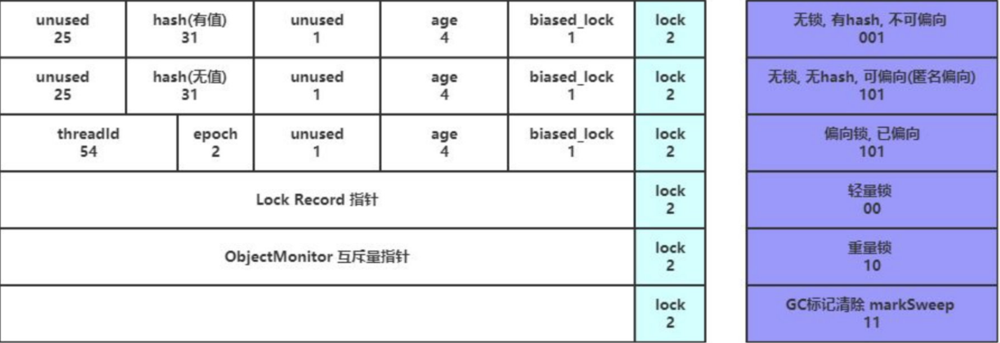

在Java 5的时候，新增了java.util.concurrent（JUC）包，其中包括大量用于多线程编程的工具类，目的是为了更好的支持高并发任务，让开发者进行多线程编程时减少竞争条件和死锁的问题！


# 并发与并行

**顺序执行**：同一时间只能处理一个任务，只有前一个任务完成之后，才能继续下一个任务，依次完成所有任务。

**并发执行**：同一时间只能处理一个任务，但是每个任务可以轮着做（时间片轮转），只要单次处理分配的时间足够的短，在宏观看来，就是三个任务在同时进行。【微观上顺序，宏观上并行】

**并行执行**：同一时间可以做多个任务

# 再谈锁机制

锁等级：未锁定 < 偏向锁 < 轻量级锁 < 重量级锁

## synchronized底层实现

使用`synchronized`，一定是和某个对象相关联的，比如对某一段代码加锁，那么就需要提供一个对象来作为锁本身：

```java
public static void main(String[] args) {
    synchronized (Main.class) {
        //这里使用的是Main类的Class对象作为锁
    }
}
```

它变成字节码之后：


其中最关键的就是`monitorenter`指令了，可以看到之后也有`monitorexit`与之进行匹配（注意这里有2个），`monitorenter`和`monitorexit`分别对应加锁和释放锁。
在执行`monitorenter`之前需要尝试获取锁，每个对象都有一个`monitor`监视器与之对应，而这里正是去获取对象监视器的所有权，一旦`monitor`所有权被某个线程持有，那么其他线程将无法获得（管程模型的一种实现）。

在代码执行完成之后，有两个`monitorexit`在等着我们，按理说`monitorenter`和`monitorexit`不应该一一对应吗，这里为什么要释放锁两次呢？

首先来看第一个，这里在释放锁之后，会马上进入到一个goto指令，跳转到15行，而15行对应的指令就是方法的返回指令，其实正常情况下只会执行第一个`monitorexit`释放锁，在释放锁之后就接着同步代码块后面的内容继续向下执行了。
而第二个，其实是用来处理异常的，它的位置是在12行，如果程序运行发生异常，那么就会执行第二个`monitorexit`，并且会继续向下通过`athrow`指令抛出异常，而不是直接跳转到15行正常运行下去。


实际上`synchronized`使用的锁就是存储在Java对象头中的
对象是存放在堆内存中的，而每个对象内部，都有一部分空间用于存储对象头信息，而对象头信息中，则包含了Mark Word用于存放`hashCode`和对象的锁信息，在不同状态下，它存储的数据结构有一些不同。



## 重量级锁和自旋锁

在JDK6之前，`synchronized`一直被称为重量级锁，`monitor`依赖于底层操作系统的Lock实现，Java的线程是映射到操作系统的原生线程上，切换成本较高。
而在JDK6之后，锁的实现得到了改进。

***
**重量级锁**
每个对象都有一个monitor与之关联，在Java虚拟机（HotSpot）中，monitor是由ObjectMonitor实现的：

```c++
ObjectMonitor() {
    _header       = NULL;
    _count        = 0; //记录个数
    _waiters      = 0,
    _recursions   = 0;
    _object       = NULL;
    _owner        = NULL;
    _WaitSet      = NULL; //处于wait状态的线程，会被加入到_WaitSet
    _WaitSetLock  = 0 ;
    _Responsible  = NULL ;
    _succ         = NULL ;
    _cxq          = NULL ;
    FreeNext      = NULL ;
    _EntryList    = NULL ; //处于等待锁block状态的线程，会被加入到该列表
    _SpinFreq     = 0 ;
    _SpinClock    = 0 ;
    OwnerIsThread = 0 ;
}
```

每个等待锁的线程都会被封装成ObjectWaiter对象，进入到如下机制：


ObjectWaiter首先会进入 Entry Set等着，当线程获取到对象的`monitor`后进入 The Owner 区域并把`monitor`中的`owner`变量设置为当前线程，同时`monitor`中的计数器`count`加1，若线程调用`wait()`方法，将释放当前持有的`monitor`，`owner`变量恢复为`null`，`count`自减1，同时该线程进入 WaitSet集合中等待被唤醒。若当前线程执行完毕也将释放`monitor`并复位变量的值，以便其他线程进入获取对象的`monitor`。

虽然这样的设计思路非常合理，但是在大多数应用上，每一个线程占用同步代码块的时间并不是很长，完全没有必要将竞争中的线程挂起然后又唤醒

***
**自旋锁**
在JDK1.4.2时，引入了自旋锁（JDK6之后默认开启），它不会将处于等待状态的线程挂起，而是通过无限循环的方式，不断检测是否能够获取锁，由于单个线程占用锁的时间非常短，所以说循环次数不会太多，可能很快就能够拿到锁并运行，这就是自旋锁。

当然，仅仅是在等待时间非常短的情况下，自旋锁的表现会很好，但是如果等待时间太长，由于循环是需要处理器继续运算的，所以这样只会浪费处理器资源。
因此自旋锁的等待时间是有限制的，默认情况下为10次，如果失败，那么会进而采用重量级锁机制。

在JDK6之后，自旋锁得到了一次优化，自旋的次数限制不再是固定的，而是自适应变化的。
比如在同一个锁对象上，自旋等待刚刚成功获得过锁，并且持有锁的线程正在运行，那么这次自旋也是有可能成功的，所以会允许自旋更多次。当然，如果某个锁经常都自旋失败，那么有可能会不再采用自旋策略，而是直接使用重量级锁。

## 轻量级锁

> 从JDK 1.6开始，为了减少获得锁和释放锁带来的性能消耗，就引入了轻量级锁。

轻量级锁的目标是，在无竞争情况下，减少重量级锁产生的性能消耗（并不是为了代替重量级锁，实际上就是赌一手同一时间只有一个线程在占用资源），包括系统调用引起的内核态与用户态切换、线程阻塞造成的线程切换等。它不像是重量级锁那样，需要向操作系统申请互斥量。它的运作机制如下：

在即将开始执行同步代码块中的内容时，会首先检查对象的Mark Word，查看锁对象是否被其他线程占用，如果没有任何线程占用，那么会在当前线程所处的栈帧中建立一个名为锁记录（Lock Record）的空间，用于复制并存储对象目前的Mark Word信息（官方称为Displaced Mark Word）。

接着，虚拟机将使用CAS操作将对象的Mark Word更新为轻量级锁状态（数据结构变为指向Lock Record的指针，指向的是当前的栈帧）

> CAS（Compare And Swap）是一种无锁算法，它并不会为对象加锁，而是在执行的时候，看看当前数据的值是不是我们预期的那样，如果是，那就正常进行替换，如果不是，那么就替换失败。
> 比如有两个线程都需要修改变量`i`的值，默认为10，现在一个线程要将其修改为20，另一个要修改为30，如果他们都使用CAS算法，那么并不会加锁访问`i`，而是直接尝试修改`i`的值，但是在修改时，需要确认`i`是不是10，如果是，表示其他线程还没对其进行修改，如果不是，那么说明其他线程已经将其修改，此时不能完成修改任务，修改失败。
>
> 在CPU中，CAS操作使用的是`cmpxchg`指令，能够从最底层硬件层面得到效率的提升。

如果CAS操作失败了的话，那么说明可能这时有线程已经进入这个同步代码块了，这时虚拟机会再次检查对象的Mark Word，是否指向当前线程的栈帧，如果是，说明不是其他线程，而是当前线程已经有了这个对象的锁，直接放心大胆进同步代码块即可。如果不是，那确实是被其他线程占用了。

这时，轻量级锁一开始的想法就是错的（这时有对象在竞争资源，已经赌输了），所以说只能将锁膨胀为重量级锁，按照重量级锁的操作执行（注意锁的膨胀是不可逆的）


所以，轻量级锁 -> 失败 -> 自适应自旋锁 -> 失败 -> 重量级锁

解锁过程同样采用CAS算法，如果对象的MarkWord仍然指向线程的锁记录，那么就用CAS操作把对象的MarkWord和复制到栈帧中的Displaced Mark Word进行交换。如果替换失败，说明其他线程尝试过获取该锁，在释放锁的同时，需要唤醒被挂起的线程。

## 偏向锁

偏向锁相比轻量级锁更纯粹，干脆就把整个同步都消除掉，不需要再进行CAS操作了。它的出现主要是得益于人们发现某些情况下某个锁频繁地被同一个线程获取，这种情况下，可以对轻量级锁进一步优化。

偏向锁实际上就是专门为单个线程而生的，当某个线程第一次获得锁时，如果接下来都没有其他线程获取此锁，那么持有锁的线程将不再需要进行同步操作。

可以从之前的MarkWord结构中看到，偏向锁也会通过CAS操作记录线程的ID，如果一直都是同一个线程获取此锁，那么完全没有必要在进行额外的CAS操作。当然，如果有其他线程来抢了，那么偏向锁会根据当前状态，决定是否要恢复到未锁定或是膨胀为轻量级锁。

如果需要使用偏向锁，可以添加`-XX:+UseBiased`参数来开启。

值得注意的是，如果对象通过调用`hashCode()`方法计算过对象的一致性哈希值，那么它是不支持偏向锁的，会直接进入到轻量级锁状态，因为Hash是需要被保存的，而偏向锁的Mark Word数据结构，无法保存Hash值；如果对象已经是偏向锁状态，再去调用`hashCode()`方法，那么会直接将锁升级为重量级锁，并将哈希值存放在`monitor`（有预留位置保存）中。


## 锁消除和锁粗化

锁消除和锁粗化都是在运行时的一些优化方案

比如某段代码虽然加了锁，但是在运行时根本不可能出现各个线程之间资源争夺的情况，这种情况下，完全不需要任何加锁机制，所以锁会被消除。

锁粗化则是代码中频繁地出现互斥同步操作，比如在一个循环内部加锁，这样明显是非常消耗性能的，所以虚拟机一旦检测到这种操作，会将整个同步范围进行扩展。

# JMM内存模型

这里提到的内存模型和JVM中的内存模型不在同一个层次。
JVM中的内存模型是虚拟机规范对整个内存区域的规划
而Java内存模型（JMM），是在JVM内存模型之上的抽象模型，基于JVM内存模型实现

## Java内存模型

为了解决内存的速度跟不上处理器的处理速度的问题，CPU内部会添加一级或多级高速缓存来提高处理器的数据获取效率。
多核心处理器，每个处理器都有一个自己的高速缓存，那么如何保证每个处理器的高速缓存内容一致是一个重要的问题


为了解决缓存一致性的问题，需要各个处理器访问缓存时都遵循一些协议，在读写时要根据协议来进行操作，这类协议有MSI、MESI（Illinois Protocol）、MOSI、Synapse、Firefly及Dragon Protocol等。

***

Java也采用了类似的模型来实现支持多线程的内存模型：


JMM（Java Memory Model）内存模型规定如下：
>注意：这里提到的变量，指的都是会出现竞争的变量，包括成员变量、静态变量等，而局部变量这种属于线程私有，不包括在内

* 所有的变量全部存储在主内存
* 每条线程有着自己的工作内存，线程对变量的所有操作，必须在工作内存中进行，不能直接操作主内存中的数据。
* 不同线程之间的工作内存相互隔离，如果需要在线程之间传递内容，只能通过主内存完成，无法直接访问对方的工作内存。

也就是说，每一条线程如果要操作主内存中的数据，那么得先拷贝到自己的工作内存中，并对工作内存中数据的副本进行操作，操作完成之后，也需要从工作副本中将结果拷贝回主内存中。
具体的操作就是`Save`（保存）和`Load`（加载）操作。

那么各位肯定会好奇，这个内存模型，结合之前JVM所讲的内容，具体是怎么实现的呢？

* 主内存：对应堆中存放对象的实例的部分。
* 工作内存：对应线程的虚拟机栈的部分区域，虚拟机可能会对这部分内存进行优化，将其放在CPU的寄存器或是高速缓存中。比如在访问数组时，由于数组是一段连续的内存空间，所以可以将一部分连续空间放入到CPU高速缓存中，那么之后如果我们顺序读取这个数组，那么大概率会直接缓存命中。

## 重排序

在编译或执行时，为了优化程序的执行效率，编译器或处理器常常会对指令进行重排序，有以下情况：

1. 编译器重排序：Java编译器通过对Java代码语义的理解，根据优化规则对代码指令进行重排序。
2. 机器指令级别的重排序：现代处理器很高级，能够自主判断和变更机器指令的执行顺序。

虽然单线程下指令重排确实可以起到一定程度的优化作用，但是在多线程下，会出现一些问题：

```java
public class Main {
    private static int a = 0;
    private static int b = 0;
    public static void main(String[] args) {
        new Thread(() -> {
            if(b == 1) {
                if(a == 0) {
                    System.out.println("A");
                }else {
                    System.out.println("B");
                }   
            }
        }).start();
        new Thread(() -> {
            a = 1;
            b = 1;
        }).start();
    }
}
```

上面这段代码，在正常情况下，按照正常思维，是不可能输出`A`的，因为只要b等于1，那么a肯定也是1，因为a是在b之前完成的赋值。
但是，如果进行了重排序，那么就有可能，a和b的赋值发生交换，b先被赋值为1，而恰巧这个时候，线程1开始判定b是不是1了，这时a还没来得及被赋值为1，可能线程1就已经走到打印那里去了，所以，是有可能输出`A`的。

## volatile关键字

先看三个概念：
* 原子性：要么做完，要么就不做，不存在做一半的情况。
* 可见性：多个线程访问同一个变量时，一个线程修改了这个变量的值，其他线程能够立即看得到修改的值。
* 有序性：程序执行的顺序按照代码的先后顺序执行。

`volatile`关键字的三个特性：
* 保证可见性
* 不保证原子性
* 防止指令重排

多线程访问同一个变量，这个变量会被线程拷贝到各个线程自己的工作内存中进行操作，而不是直接对主内存中的变量本体进行操作

下面这个操作看起来是一个有限循环，但是是无限的：
虽然主线程中修改了a的值，但是另一个线程并不知道a的值发生了改变，所以循环中依然是使用旧值在进行判断。因此，普通变量是不具有可见性的。
```java
public class Main {
    private static int a = 0;
    public static void main(String[] args) throws InterruptedException {
        new Thread(() -> {
            while (a == 0);
            System.out.println("线程结束！");
        }).start();

        Thread.sleep(1000);
        System.out.println("正在修改a的值...");
        a = 1;   //很明显，按照我们的逻辑来说，a的值被修改那么另一个线程将不再循环
    }
}
```

通过加锁可以解决这个问题
```java
public class Main {
    private static int a = 0;
    public static void main(String[] args) throws InterruptedException {
        new Thread(() -> {
            while (a == 0) {
                synchronized (Main.class){}
            }
            System.out.println("线程结束！");
        }).start();

        Thread.sleep(1000);
        System.out.println("正在修改a的值...");
        synchronized (Main.class){
            a = 1;
        }
    }
}
```

也可以使用`volatile`关键字来解决，此关键字的第一个作用，就是保证变量的可见性。
>当写一个`volatile`变量时，JMM会把该线程本地内存中的变量强制刷新到主内存中去，并且这个写回操作会导致其他线程中的`volatile`变量缓存无效，这样，另一个线程修改了这个变量时，当前线程会立即得知，并将工作内存中的变量更新为最新的版本。

```java
//结果还真的如预测的那样，当a发生改变时，循环立即结束。
public class Main {
    //添加volatile关键字
    private static volatile int a = 0;
    public static void main(String[] args) throws InterruptedException {
        new Thread(() -> {
            while (a == 0);
            System.out.println("线程结束！");
        }).start();

        Thread.sleep(1000);
        System.out.println("正在修改a的值...");
        a = 1;
    }
}
```

虽然说`volatile`能够保证可见性，但是不能保证原子性
>自增操作的机器指令是被瓜分为了多个步骤完成的，volatile关键字虽然保证了可见性，但是只要手速够快，依然会出现两个线程同时写同一个值的问题
保证原子性的方法除了加锁以外，还有原子类来专门解决。

`volatile`还可以禁止指令重排：若用volatile修饰共享变量，在编译时，会在指令序列中插入`内存屏障`来禁止特定类型的处理器重排序

>  内存屏障（Memory Barrier）又称内存栅栏，是一个CPU指令，它的作用有两个：
>
> 1. 保证特定操作的顺序
> 2. 保证某些变量的内存可见性（volatile的内存可见性，其实就是依靠这个实现的）
>
> 由于编译器和处理器都能执行指令重排的优化，如果在指令间插入一条Memory Barrier则会告诉编译器和CPU，不管什么指令都不能和这条Memory Barrier指令重排序。
>
> 
>
> | 屏障类型   | 指令示例                 | 说明                                                         |
> | ---------- | ------------------------ | ------------------------------------------------------------ |
> | LoadLoad   | Load1;LoadLoad;Load2     | 保证Load1的读取操作在Load2及后续读取操作之前执行             |
> | StoreStore | Store1;StoreStore;Store2 | 在Store2及其后的写操作执行前，保证Store1的写操作已刷新到主内存 |
> | LoadStore  | Load1;LoadStore;Store2   | 在Store2及其后的写操作执行前，保证Load1的读操作已读取结束    |
> | StoreLoad  | Store1;StoreLoad;Load2   | 保证load1的写操作已刷新到主内存之后，load2及其后的读操作才能执行 |

所以`volatile`能够保证，之前的指令一定全部执行，之后的指令一定都没有执行，并且前面语句的结果对后面的语句可见。

## happens-before原则

综上，JMM提出了`happens-before`（先行发生）原则，定义一些禁止编译优化的场景，来向程序员做一些保证，只要是按照原则进行编程，那么就能够保持并发编程的正确性。具体如下：

* **程序次序规则**：同一个线程中，按照程序的顺序，前面的操作happens-before后续的任何操作。
  * 同一个线程内，代码的执行结果是有序的。其实就是，可能会发生指令重排，但是保证代码的执行结果一定是和按照顺序执行得到的一致，程序前面对某一个变量的修改一定对后续操作可见的，不可能会出现前面才把a修改为1，接着读a居然是修改前的结果，这也是程序运行最基本的要求。
* **监视器锁规则**：对一个锁的解锁操作，happens-before后续对这个锁的加锁操作。
  * 就是无论是在单线程环境还是多线程环境，对于同一个锁来说，一个线程对这个锁解锁之后，另一个线程获取了这个锁都能看到前一个线程的操作结果。比如前一个线程将变量`x`的值修改为了`12`并解锁，之后另一个线程拿到了这把锁，对之前线程的操作是可见的，可以得到`x`是前一个线程修改后的结果`12`（所以synchronized是有happens-before规则的）
* **volatile变量规则**：对一个volatile变量的写操作happens-before后续对这个变量的读操作。
  * 就是如果一个线程先去写一个`volatile`变量，紧接着另一个线程去读这个变量，那么这个写操作的结果一定对读的这个变量的线程可见。
* **线程启动规则**：主线程A启动线程B，线程B中可以看到主线程启动B之前的操作。
  * 在主线程A执行过程中，启动子线程B，那么线程A在启动子线程B之前对共享变量的修改结果对线程B可见。
* **线程加入规则**：如果线程A执行操作`join()`线程B并成功返回，那么线程B中的任意操作happens-before线程A`join()`操作成功返回。
* **传递性规则**：如果A happens-before B，B happens-before C，那么A happens-before C。

***
从happens-before原则的角度，来解释一下下面的程序结果：

```java
public class Main {
    private static int a = 0;
  	private static int b = 0;
    public static void main(String[] args) {
        a = 10;
        b = a + 1;
        new Thread(() -> {
          if(b > 10) System.out.println(a); 
        }).start();
    }
}
```

定义以上出现的操作：

* **A**：将变量`a`的值修改为`10`
* **B**：将变量`b`的值修改为`a + 1`
* **C**：主线程启动了一个新的线程，并在新的线程中获取`b`，进行判断，如果为`true`那么就打印`a`

由于是同一个线程，并且**B**是一个赋值操作且读取了**A**，那么按照**程序次序规则**，A happens-before B，接着在B之后，马上执行了C，按照**线程启动规则**，在新的线程启动之前，当前线程之前的所有操作对新的线程是可见的，所以 B happens-before C，最后根据**传递性规则**，由于A happens-before B，B happens-before C，所以A happens-before C，因此在新的线程中会输出`a`修改后的结果`10`。