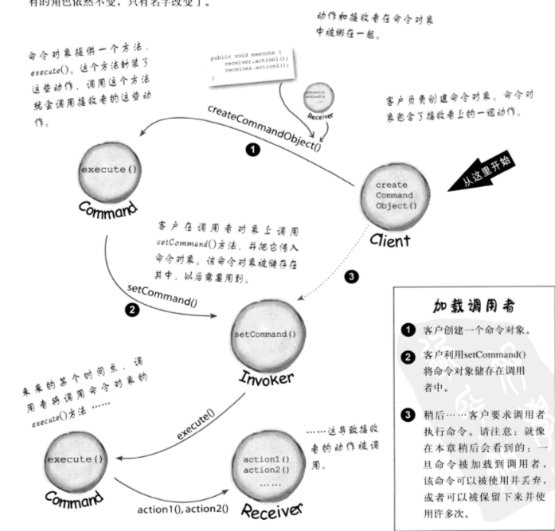
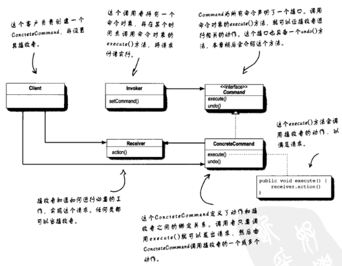
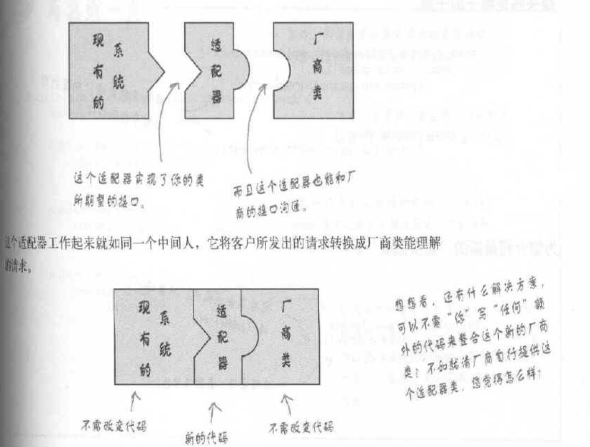
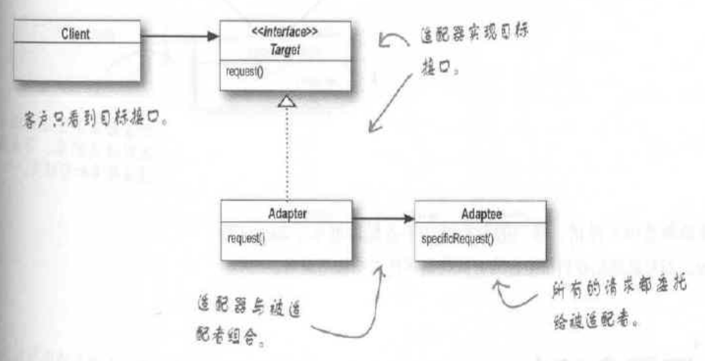
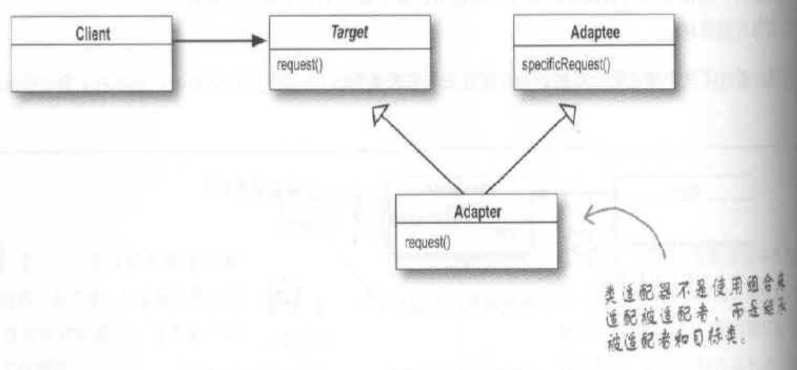
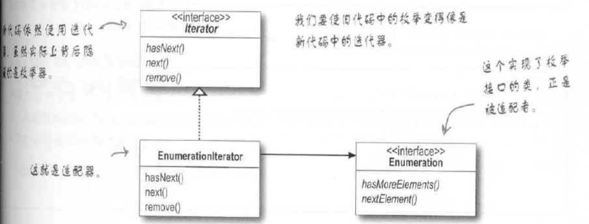
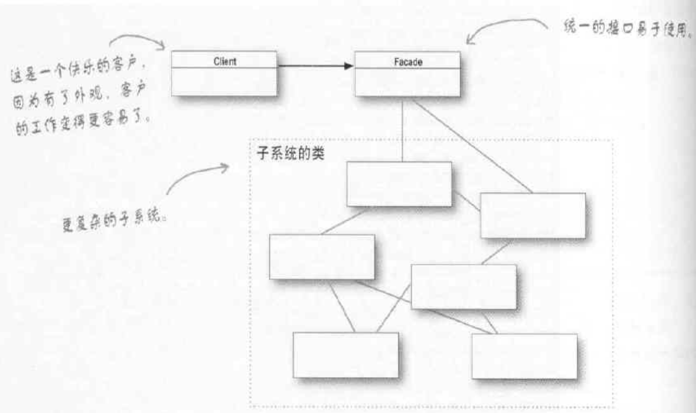
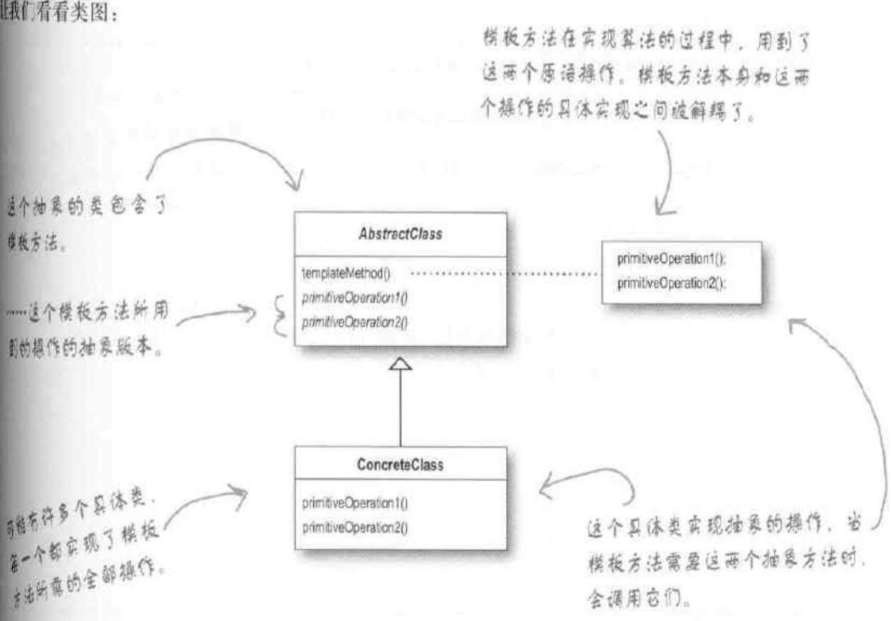
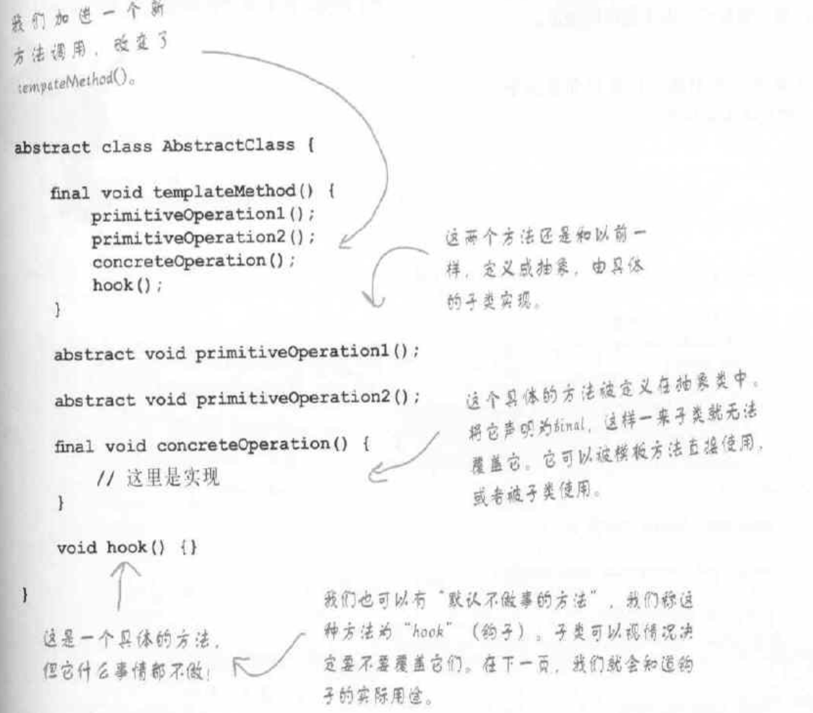

# OO设计原则

>将应用中会变化的那部分取出并封装起来。这样可以使代码变化引起的意外影响变少，使系统更有弹性

>针对接口编程，而不是针对实现编程

>多用组合，少用继承

代码复用性，扩展性，维护性
每当设计代码实现后，想想该业务在未来可能发生的变化，然后分析现在的代码在业务需求变化后好不好进行扩展

# 策略模式

## 定义

策略模式是一种行为型模式，定义了算法簇，分别封装起来，让它们之间可以互相替换【可以理解为将对象和行为分开，行为定义为一个行为接口和若干具体行为的实现】。此模式让算法的变化独立于使用算法的客户。通过使用策略模式，可以在运行时根据需要选择不同的算法，而不需要修改客户端代码。

## 例子

取自《Head First设计模式》

>现在有一个业务需求，设计鸭子类，具体的鸭子类都继承于一个鸭子超类Duck,Duck中封装好了所有鸭子都一样的行为。而现在，不同种类的鸭子在`飞行`和`鸭叫`这两个行为上表现不一样。比如绿头鸭用扇动翅膀飞行，嘎嘎嘎叫；玩具鸭不能飞行，吱吱吱叫；火箭鸭靠火箭推动器飞行，不会叫

**分析过程**

【运用继承+多态】
将fly()和quack()放入Duck，让每一个具体的鸭子继承Duck。若有需要，则在子类中重写这两个方法，覆盖Duck中原来的方法，从而实现每种鸭子都有自己特定的行为。这样的做法会有以下问题：
① 每次有新种类的鸭子，都要检查，看是否需要重写覆盖超类继承来的fly()和quack()。比如，玩具鸭不会飞行，那它就要重写覆盖继承来的fly()，使其什么都不做；另外还要重写覆盖继承来的quack()，使其有吱吱叫的鸭叫声(超类是嘎嘎嘎叫)
② 代码在多个子类中重复
③ 运行时的行为不容易改变
④ 很难得知所有鸭子的全部行为
⑤ 改变会牵一发而动全身，造成其他鸭子不想要的改变：比如未来还要引入一个“说人话”行为，那所有鸭子都会继承到这个行为，但是并不是所有鸭子都会“说人话”，那岂不是要给这些鸭子子类都进行重写覆盖？改动就很大了。

***

既然继承会那么多问题，那就用接口。
Flyable接口中有fly()行为，Quackable接口中有quack()行为。每种鸭子都继承自Duck，根据会不会飞/叫，来决定是否实现Flyable/Quackable接口（这就避免了不会飞的鸭子有fly()行为...不合理的情况），根据自己行为的特点，在类中实现fly()/quack()。这样的做法仍然不理想：
接口不具有实现代码，因此继承接口代码无法达到代码复用：某个行为需求变化了，那就要追踪到每个定义了该行为的实现类中去修改它，类一多，工作量就很大，而且可能造成新的错误

***
发现总是因为可能发生的变化(新需求的到来)而导致代码存在缺陷(某些代码要改)，那么运用OO原则：
>找出应用中可能会发生变化的那部分，取出并封装起来，将变与不变分开

fly()和quack()会随着鸭子种类的不同而变化，因此将这两个行为从Duck中抽出来，分别形成各自的一组类来实现各自的动作（比如fly行为有一个类实现“扇动翅膀飞行”，一个类实现“不能飞行”，一个类实现“依靠火箭推动器飞行”...）

但是仅仅这么做还是不够弹性，不能在创建鸭子的时候指定特定的飞行/叫行为给它，即无法在运行时动态地改变鸭子的行为（行为在编写代码的时候，通过直接继承行为类已经写死了）

要实现运行时可以动态修改行为，那还要运用到以下OO原则：
>针对接口编程，而不是针对实现编程

用接口FlyBehavior和QuackBehavior表示行为，制造一组行为类来实现这些接口。将这两个接口放入Duck，每种鸭子在继承Duck后，都可以继承到这两个接口。在创建具体鸭子的时候，通过构造函数将接口行为指定为对应的行为类。通过set方法，就可以在运行时动态地改变行为。这个做法是一个很大的突破：
无论是第一种方法：继承+多态，还是第二种方法：子类直接实现接口，都是依赖于“实现”，将实现绑死在鸭子的子类中，没法改变行为；而现在，鸭子的子类使用接口所表示的行为，具体的实现是在行为类中，鸭子不知道行为的实现细节。

每一个鸭子都“有一个”FlyBehavior和QuackBehavior，鸭子的行为不是继承  来的，而是和适当的行为对象组合来的，这也符合了OO原则：
>多用组合，少用继承。(“有一个”可能比“是一个”更好)

**代码实现**
Duck抽象类
```java
public abstract class Duck {
    //鸭子共有的，不变的属性，行为全部省略

    //针对接口编程，用接口而不是某个特定实现类
    //这两个行为是会变化的，抽离出Duck，通过对象组合在Duck中
    Flyable flyable;
    Quackable quackable;
    public abstract void display();
    //将行为委托给行为类
    public void performFly(){
        flyable.fly();
    }
    public void performQuack(){
        quackable.quack();
    }
    //设定set方法，使得可以运行时动态改变行为
    public void setFlyable(Flyable fb){
        flyable=fb;
    }

    public void setQuackable(Quackable qa) {
        quackable=qa;
    }
}
```

飞行行为接口
```java
public interface Flyable {
    void fly();
}
```

鸭叫接口
```java
public interface Quackable {
    void quack();
}
```

翅膀飞行实现类
```java
public class FlyWithWings implements Flyable{
    @Override
    public void fly() {
        System.out.println("扇动翅膀飞行");
    }
}
```

不会飞行实现类
```java
public class FlyNoWay implements Flyable{
    @Override
    public void fly() {
        System.out.println("不会飞行");
    }
}
```

靠火箭推动器飞行实现类
```java
public class FlyUseRocket implements Flyable{
    @Override
    public void fly() {
        System.out.println("靠火箭推动器飞行");
    }
}
```

嘎嘎嘎叫实现类
```java
public class QuackGa implements Quackable{
    @Override
    public void quack() {
        System.out.println("嘎嘎嘎叫");
    }
}
```

不会叫实现类
```java
public class QuackNoWay implements Quackable{
    @Override
    public void quack() {
        System.out.println("不会叫");
    }
}
```

吱吱吱叫实现类
```java
public class QuackZhi implements Quackable {
    @Override
    public void quack() {
        System.out.println("吱吱叫");
    }
}
```

绿头鸭
```java
public class GreenHeadDuck extends Duck{
    //构造函数实例化的时候，将两个接口行为创建为实现类（针对接口编程）
    public GreenHeadDuck(){
        flyable = new FlyWithWings();
        quackable = new QuackGa();
    }

    public void display(){
        System.out.println("我是绿头鸭");
    }
}
```

玩具鸭
```java
public class PlayDuck extends Duck{
    //构造函数实例化的时候，将两个接口行为创建为实现类（针对接口编程）
    public PlayDuck(){
        flyable = new FlyNoWay();
        quackable = new QuackZhi();
    }

    public void display(){
        System.out.println("我是玩具鸭");
    }
}
```

火箭鸭
```java
public class RocketDuck extends Duck{
    //构造函数实例化的时候，将两个接口行为创建为实现类（针对接口编程）
    public RocketDuck(){
        flyable = new FlyUseRocket();
        quackable = new QuackNoWay();
    }

    public void display(){
        System.out.println("我是火箭鸭");
    }
}
```

测试
```java
public class test {
    public static void main(String[] args) {
        Duck greenHeadDuck = new GreenHeadDuck();
        Duck playDuck = new PlayDuck();
        Duck rocketDuck = new RocketDuck();
        //测试
        greenHeadDuck.display();
        greenHeadDuck.performFly();
        greenHeadDuck.performQuack();
        System.out.println("************");
        playDuck.display();
        playDuck.performFly();
        playDuck.performQuack();
        System.out.println("************");
        rocketDuck.display();
        rocketDuck.performFly();
        rocketDuck.performQuack();
        //测试：运行时动态修改火箭鸭的行为
        rocketDuck.setFlyable(new FlyNoWay());
        System.out.print("糟糕，燃料用完了，");
        rocketDuck.performFly();
    }
}
```

测试结果
```
我是绿头鸭
扇动翅膀飞行
嘎嘎嘎叫
************
我是玩具鸭
不会飞行
吱吱叫
************
我是火箭鸭
靠火箭推动器飞行
不会叫
糟糕，燃料用完了，不会飞行
```

# 观察者模式

## 定义

观察者模式运用十分广泛，是JDK中使用最多的模式之一

观察者模式定义了被观察者subject和观察者observer的一对多的依赖(映射关系)，当subject里的内容更新后，会notify通知它的所有observer，observer收到通知后会自动更新

**类图**
每个被观察者必须实现subject接口
|< interface></br>Subject|
|-|
|registerObserver()</br>notifyObserver()</br>removeObserver()|

每个观察者必须实现Observer接口
|< interface></br>Observer|
|-|
|update()|

## 例子

取自《Head First 设计模式》
>气象观测站可以获取湿度，温度，气压。气象站那边提供WeatherData对象取得气象数据，目前的需求是建立一个应用，利用这个WeatherData对象拿到数据，并更新到三个显示装置上，分别是：目前状况，气象统计和天气预报。
WeatherData类中有getTemperatura()，getHumidity()，getPressure()方法和一些我们不需要知道细节也不能改动的方法。要求是实现measurementsChanged()方法，该方法会在气象数据更新的时候被自动调用

**分析过程**

最简单粗暴地想到
将三个不同的显示装置封装成三个类，在measurementsChanged()中用get方法将最新的湿度，温度，气压数据拿到，然后这三个显示装置类分别调用自己的update(temp,humidity,pressure)方法进行更新并展示数据。这样实现显然有问题：
① 针对具体实现编程，而非针对接口编程。这使得以后增加/删除显示装置时，都要对measurementsChanged()方法进行修改
② 无法在运行时动态地增加/删除显示装置
③ 没有封装改变的部分

***
采用观察者模式
创建被观察者Subject接口和观察者Observer接口。WeatherData类实现Subject接口，三个显示装置类分别实现Observer接口。在measurementsChanged()中，调用notifyObserver()方法通知所有观察者（这个方法中，遍历观察者，逐一调用自己的update方法）
另外，由于每个显示装置的display()都不同，可以将展示行为定义为接口

**代码实现**
被观察者Subject接口
```java
public interface Subject {
    public void registerObserver(Observer observer);
    public void notifyObserver();
    public void removeObserver(Observer observer);
}
```

观察者Observer接口
```java
public interface Observer {
    public void update(float temp,float humidity,float pressure);
}
```

显示装置显示数据接口
```java
public interface Display {
    void display();
}
```

WeatherData
```java
//WeatherData是被观察者，需要实现Subject接口
public class WeatherData implements Subject{
    //其他属性，行为全部省略

    //气象站观测的三个数据
    private float temperature;
    private float humidity;
    private float pressure;
    //引入一个观察者set集合，存放所有注册的观察者
    private Set<Observer> observerSet;

    public WeatherData(){
        observerSet = new HashSet<>();
    }

    //实现被观察者Subject接口的三个方法：注册，通知，删除
    @Override
    public void registerObserver(Observer observer) {
        observerSet.add(observer);
    }
    @Override
    public void notifyObserver() {
        //通知每个观察者，调用它们的update方法
        for (Observer ob:observerSet) {
            ob.update(temperature,humidity,pressure);
        }
    }
    @Override
    public void removeObserver(Observer observer) {
        observerSet.remove(observer);
    }

    //一旦气象站数据更新，就会自动调用这个方法（为啥会这样不用管）
    public void measurementsChanged(){
        //数据一旦更新，就通知所有的观察者
        notifyObserver();
    }
    //允许运行时手动更新气象数据，模拟气象站获得新数据
    public void setMeasurements(float temp, float humidity, float pressure){
        //更新数据
        temperature = temp;
        this.humidity = humidity;
        this.pressure = pressure;
        //更新数据后，触发方法
        measurementsChanged();
    }
}
```

实时数据显示装置
```java
//实时显示装置是观察者，需要实现Observer接口（这是自己写的，不是java内置的那个）
public class CurrentShow implements Observer,Display {
    //显示装置需要显示的三个数据
    private float temperature;
    private float humidity;
    private float pressure;
    //引入观察对象-被观察者（为了进行观察者注册，删除）
    private Subject weatherData;

    //构造函数需要Subject对象，用来注册
    public CurrentShow(Subject weatherData){
        this.weatherData = weatherData;
        //注册为观察者
        weatherData.registerObserver(this);
    }

    @Override
    public void update(float temp, float humidity, float pressure) {
        //显示实时数据，只需更新为最新数据即可
        temperature = temp;
        this.humidity = humidity;
        this.pressure = pressure;
        //在这个简单例子中，值变化时候就调用display()很合理。但其实有更好的方式调用它
        display();
    }
    @Override
    public void display() {
        System.out.println("当前气象情况：实时温度为"+temperature
                +"C，实时湿度为"+humidity+"%，实时气压为"+pressure);
    }
}
```

统计数据显示装置
```java
//气象统计显示装置是观察者，需要实现Observer接口（这是自己写的，不是java内置的那个）
public class StatisticsShow implements Observer,Display {
    //显示装置需要显示的三个数据
    private float temperature;
    private float humidity;
    private float pressure;
    //引入观察对象-被观察者（为了进行观察者注册，删除）
    private Subject weatherData;

    //构造函数需要Subject对象，用来注册
    public StatisticsShow(Subject weatherData){
        this.weatherData = weatherData;
        //注册为观察者
        weatherData.registerObserver(this);
    }

    @Override
    public void update(float temp, float humidity, float pressure) {
        //显示统计数据，为了方便，统计max即可
        temperature = Math.max(temperature, temp);
        this.humidity = Math.max(this.humidity, humidity);
        this.pressure = Math.max(this.pressure, pressure);
        //在这个简单例子中，值变化时候就调用display()很合理。但其实有更好的方式调用它
        display();
    }
    @Override
    public void display() {
        System.out.println("截止至最新数据的统计气象情况：最高温度为"+temperature
                +"C，最高湿度为"+humidity+"%，最大气压为"+pressure);
    }
}
```
天气预报显示装置
```java
//天气预报显示装置是观察者，需要实现Observer接口（这是自己写的，不是java内置的那个）
public class ForecastShow implements Observer,Display {
    //显示装置需要显示的三个数据
    private float temperature;
    private float humidity;
    private float pressure;
    //引入观察对象-被观察者（为了进行观察者注册，删除）
    private Subject weatherData;

    //构造函数需要Subject对象，用来注册
    public ForecastShow(Subject weatherData){
        this.weatherData = weatherData;
        //注册为观察者
        weatherData.registerObserver(this);
    }

    @Override
    public void update(float temp, float humidity, float pressure) {
        //更新预测数据，为了方便，就取平均值为预测值
        temperature = (temperature+temp)/2;
        this.humidity = (this.humidity+humidity)/2;
        this.pressure = (this.pressure+pressure)/2;
        //在这个简单例子中，值变化时候就调用display()很合理。但其实有更好的方式调用它
        display();
    }
    @Override
    public void display() {
        System.out.println("根据最新气象数据，预计接下来三小时的天气：预测温度为"+temperature
                +"C，预测湿度为"+humidity+"%，预测气压为"+pressure);
    }
}
```

测试启动气象站应用
```java
public class WeatherApp {
    public static void main(String[] args) {
        WeatherData weatherData = new WeatherData();

        //创建显示装置，传入被观察者,进行观察者注册
        CurrentShow currentShow =new CurrentShow(weatherData);
        StatisticsShow statisticsShow = new StatisticsShow(weatherData);
        ForecastShow forecastShow = new ForecastShow(weatherData);

        //手动设置更新，模拟气象站测量到新的数据
        weatherData.setMeasurements(25,65,30);
        System.out.println("*********************");
        weatherData.setMeasurements(20,50,40);
        System.out.println("*********************");
        weatherData.setMeasurements(15,95,20);
    }
}
```

测试结果
```
当前气象情况：实时温度为25.0C，实时湿度为65.0%，实时气压为30.0
根据最新气象数据，预计接下来三小时的天气：预测温度为12.5C，预测湿度为32.5%，预测气压为15.0
截止至最新数据的统计气象情况：最高温度为25.0C，最高湿度为65.0%，最大气压为30.0
*********************
当前气象情况：实时温度为20.0C，实时湿度为50.0%，实时气压为40.0
根据最新气象数据，预计接下来三小时的天气：预测温度为16.25C，预测湿度为41.25%，预测气压为27.5
截止至最新数据的统计气象情况：最高温度为25.0C，最高湿度为65.0%，最大气压为40.0
*********************
当前气象情况：实时温度为15.0C，实时湿度为95.0%，实时气压为20.0
根据最新气象数据，预计接下来三小时的天气：预测温度为15.625C，预测湿度为68.125%，预测气压为23.75
截止至最新数据的统计气象情况：最高温度为25.0C，最高湿度为95.0%，最大气压为40.0
```

## Java内置API

java.util包提供了Observeral类和Observer接口，被观察者继承Observeral类，观察者实现Observer接口


Observeral类的类图
|< class></br>Observeral|
|-|
|addObserver()</br>notifyObservers()</br>notifyObservers(Object arg)</br>deleteObserver()</br>setChanged()|

Observer接口的类图
|< interface></br>Observer|
|-|
|update(Observable o, Object arg)|

# 装饰者模式

## 定义

装饰者模式是在不改变现有对象结构的前提下，动态地将责任(额外功能)附加到对象上，提供了比继承更加弹性的替代方案。属于结构型模式

通常构成如下
① **Component**（抽象组件）：它是具体组件和抽象装饰类的共同父类，声明了在具体组件中实现的业务方法，它的引入可以使客户端以一致的方式处理未被装饰的对象以及装饰之后的对象，实现客户端的透明操作。

② **ConcreteComponent**（具体组件）：它是抽象组件类的子类，用于定义具体的组件对象，实现了在抽象组件中声明的方法，装饰器可以给它增加额外的职责（方法）。

③ **Decorator**（抽象装饰类）：它也是抽象组件类的子类，用于给具体组件增加职责，但是具体职责在其子类中实现。它维护一个指向抽象组件对象的引用，通过该引用可以调用装饰之前组件对象的方法，并通过其子类扩展该方法，以达到装饰的目的。

④ **ConcreteDecorator**（具体装饰类）：它是抽象装饰类的子类，负责向组件添加新的职责。每一个具体装饰类都定义了一些新的行为，它可以调用在抽象装饰类中定义的方法，并可以增加新的方法用以扩充对象的行为。


由于具体组件类和装饰类都实现了相同的抽象组件接口，因此装饰模式以对客户透明的方式动态地给一个对象附加上更多的责任，换言之，客户端并不会觉得对象在装饰前和装饰后有什么不同。装饰模式可以在不需要创造更多子类的情况下，将对象的功能加以扩展。

>Decorator继承于Beverage，似乎违反OO原则的少用继承。但事实上，装饰者和被装饰者必须是同一类型，也就是有同一超类，因此在这里，继承是为了达到“类型匹配”，而非“获得行为”。
>
>当装饰者与组件(被装饰者)组合时，就是在加入新行为，这个新行为不是来自超类，而是由组合对象得来。正是使用对象组合，使得装饰者和被装饰者更有弹性地混合与匹配，而且是在运行时。
除此之外，可以在任何时候，实现新的装饰者添加新行为，如果依赖继承，每有新行为，都要改代码

装饰模式的核心在于抽象装饰类的设计。

## 例子

取自《Head First 设计模式》
>开一家饮品店，主要有咖啡，奶茶，果汁三种饮品。顾客还可以在此基础上添加各种调料，比如奶泡，冰块，摩卡等。因此对于每种不同的组合，cost()方法得出的结果是不同的。
给出饮料抽象类Beverage，要求可以对每种组合，通过cost()算出正确的结果

|< abstract class></br>Beverage|
|-|
|description //由每个子类设置，用来描述饮料</br>
getDescription(Object arg)</br>cost() //抽象方法，子类必须定义自己的实现|

**分析过程**

最简单粗暴的想法
对于每一种可能的组合，都给出一个继承于Beverage的实体类，cost()按照所选饮品和配料计算价钱。这个方法显然不行，搞出来的类太多了

***
利用实例变量追踪调料+继承
Beverage抽象类中添加表示是否添加该调料的布尔变量，用has方法判断是否添加该调料，用set方法添加调料，抽象类中的cost()根据将调料为true的加在一起，子类覆盖超类cost()时，只需调用超类的cost()再加上本身饮品的价格即可。这样的做法有以下问题：
① 每次新增/删除调料时都要增/删Beverage的对于方法，并修改cost()
② 调料价格改变，cost()又要修改
③ 比如未来新增“茶”饮品，不适合“奶泡”调料，但仍会继承hasWhip()方法，显然不合适
④ 如果顾客要双倍奶泡，似乎很难应对

很显然，上面的做法违反了开闭原则
>类应该对扩展开放，对修改关闭

开闭原则的目标是让类更加弹性，可以在不修改现有代码的前提下，就可搭配新的行为(拓展)

***
采用装饰者模式

Beverage抽象类：相当于抽象组件Component，是具体组件和抽象装饰类的共同父类
```java
public abstract class Beverage {
    String description = "未点餐";
    //这个方法在抽象类中实现即可，具体饮料类直接用（但调料类需要进行覆盖）
    public String getDescription(){return description;}

    //cost()方法设置为抽象方法，让子类实现各自的算法
    public abstract double cost();
}
```

Coffee咖啡类：相当于具体组件ConcreteComponent，被装饰者，装饰器可以给它增加额外的职责（方法）
```java
//饮料类直接继承自Beverage抽象类，单点咖啡10元
public class Coffee extends Beverage {

    public Coffee(){description = "咖啡";}
    @Override
    public double cost() {
        return 10;
    }
}
```

MilkTea奶茶类：相当于具体组件ConcreteComponent，被装饰者，装饰器可以给它增加额外的职责（方法）
```java
//饮料类直接继承自Beverage抽象类，单点奶茶8元
public class MilkTea extends Beverage{
    public MilkTea(){description = "奶茶";}

    @Override
    public double cost() {
        return 8;
    }
}
```

CondimentDecorator抽象类：相当于抽象装饰类Decorator，它也是抽象组件类的子类，用于给具体组件增加职责，但是具体职责在其子类中实现
```java
//调料抽象类：需让CondimentDecorator可以取代Beverage，所以继承于Beverage
public abstract class CondimentDecorator extends Beverage {
    //设置为抽象方法，所有调料类都必须重新实现该方法
    public abstract String getDescription();
}

```

Whip奶盖类
```java
//调料类继承于CondimentDecorator，而它又继承于Beverage
public class Whip extends CondimentDecorator{
    /*引用一个Beverage，它就是被装饰者(饮料)，需要将被装饰者记录在装饰者中*/
    Beverage beverage;
    //被装饰者(饮料)通过构造函数传参，给到beverage，将饮料记录到实例变量中
    public Whip(Beverage beverage){
        this.beverage = beverage;
    }

    //利用委托的方式得到一个饮料描述，然后再追加调料描述
    @Override
    public String getDescription() {
        return beverage.getDescription()+",加奶盖";
    }

    //利用委托的方式得到饮料价钱，然后再追加调料的价钱
    @Override
    public double cost() {
        return beverage.cost() + 1.5;
    }
}
```

Ice冰块类
```java
//调料类继承于CondimentDecorator，而它又继承于Beverage
public class Ice extends CondimentDecorator{
    /*引用一个Beverage，它就是被装饰者(饮料)，需要将被装饰者记录在装饰者中*/
    Beverage beverage;
    //被装饰者(饮料)通过构造函数传参，给到beverage，将饮料记录到实例变量中
    public Ice(Beverage beverage){
        this.beverage = beverage;
    }

    //利用委托的方式得到一个饮料描述，然后再追加调料描述
    @Override
    public String getDescription() {
        return beverage.getDescription()+",加冰";
    }

    //利用委托的方式得到饮料价钱，然后再追加调料的价钱
    @Override
    public double cost() {
        return beverage.cost() + 0.5;
    }
}
```

测试
```java
public class test {
    public static void main(String[] args) {
        Beverage beverage1 = new Coffee();
        beverage1 = new Whip(beverage1);//用Whip装饰它
        System.out.println("饮品1："+beverage1.getDescription()+
                "，价格："+beverage1.cost());

        Beverage beverage2 = new MilkTea();
        beverage2 = new Whip(beverage2);//用Whip装饰它
        beverage2 = new Ice(beverage2);//用Ice装饰它
        System.out.println("饮品2："+beverage2.getDescription()+
                "，价格："+beverage2.cost());
    }
}
```

运行结果
```
饮品1：咖啡,加奶盖，价格：11.5
饮品2：奶茶,加奶盖,加冰，价格：10.0
```

## Java I/O

Java I/O在设计类的时候采用到了装饰者模式，实际上，里面的许多类都是装饰者。


看一下输入流的类图(输出流同理，Reader/Writer流略有不同，但也很类似)


>Java I/O引出装饰者模式的缺点：
① 设计中有大量的小类，过度使用会使程序变得复杂，他人在第一次接触时可能难以理解，在调用API的时候产生困惑
② 类型问题：可以透明地插入装饰者，客户程序甚至不需知道自己在和装饰者打交道。但如果某一代码会依赖特定的类型，这样的代码又插入装饰者，就会出问题。因此在插入装饰者时要小心谨慎。

# 工厂方法模式

## 定义

## 引子-简单工厂

## 例子

# 抽象工厂模式

## 定义

## 例子

## 比较   

# 单例模式

## 定义

单例模式确保一个类只有一个实例，且提供一个全局访问点

关键点：
① private的构造函数：外界不能通过new来创建该类的实例对象
② 静态的类对象属性，保存全局唯一的类实例
③ 静态的getInstance()方法，确保能通过类调用该方法（不需要提前创建对象），这个方法就是那个全局访问点

按实例化的时机，分为急切实例化和延迟实例化
前者是线程安全的，后者线程不安全

单例模式最初模型（没有解决多线程问题）
```java
public class Singleton {
    //静态的类对象，通过构造函数第一次创建它后，在类中保存这个唯一的实例对象
    //1、不立即创建，搭配延迟实例化
    private static Singleton uniqueInstance;
    /*2、急切实例化：声明的同时创建该对象，get方法直接不用判断，直接返回它即可。
    适合于该单例对象必然/会被频繁使用，或创建的负担不大的情况
    并且这样的做法是线程安全的
     */
    //private static Singleton uniqueInstance = new Singleton();

    //构造函数设置为private，外界就不能随意地用new来创建该类地实例对象了
    private Singleton(){}

    /*静态类方法可以在实例对象创建出来之前，通过类来调用
    这样就可以向外界提供获得该类实例对象的接口*/

    /*延迟实例化：在这个get方法中，检测到实例对象还没被创建，则调用构造函数
    并将它赋值给这个类的唯一实例对象。这样做的好处是，当外界需要这个实例对象时(调用该方法)
    才会进行对象创建，否则永远不会创建。

    多线程时会带来问题（而急切实例化则是线程安全的）
     */
    public static Singleton getInstance(){
        if (uniqueInstance==null)uniqueInstance=new Singleton();
        return uniqueInstance;
    }
}
```

测试
```java
public class test {
    public static void main(String[] args) {
        //由于构造函数设置为private，外界不能用new来创建实例了
        //Singleton a =new Singleton();

        //外界只能通过getInstance()这个为接口获得该类的实例对象
        Singleton a = Singleton.getInstance();
        Singleton b = Singleton.getInstance();
        //通过对象的地址，验证这两个实例对象是否是同一个
        if(a==b) System.out.println("这两个实例对象其实是同一个");
        else System.out.println("这两个实例对象不一样");

    }
}
```

结果
```java
这两个实例对象其实是同一个
```

## 解决多线程问题的方案

延迟实例化在多线程运行的环境下，可能会返回两个不同的类实例对象【多个线程同时进入getInstance()方法】，违反了“单例”，可能对运行结果带来极大的负面影响，造成混乱

如下同，居然返回两个不同的对象

|线程1|线程2|uniqueInstance的值|
|-|-|-|
|getInstance()||null|
||getInstance()|null|
|if (uniqueInstance==null)||null|
||if (uniqueInstance==null)|null|
|uniqueInstance=new Singleton()||obj1|
|return uniqueInstance||obj1|
||uniqueInstance=new Singleton()|obj2|
||return uniqueInstance|obj2|

### 急切实例化

这是最简单直接的方法，在声明唯一实例对象的同时创建它，在getInstance()中就不用判断，创建对象了，直接返回这唯一的实例对象即可
```java
//在静态初始化器中创建单例对象，在使用前就创好了，保证线程安全
private static Singleton uniqueInstance = new Singleton();
```

这种做法适合于该单例对象必然/会被频繁使用，或创建的负担不大的情况

### getInstance()设置为同步方法

为getInstance()方法添加`synchronized`关键字，迫使每个线程在进入该方法前，都需等待其他线程离开该方法。即不允许有两个线程同时进入该方法
```java
public static synchronized Singleton getInstance(){
        if (Singleton==null)uniqueInstance=new Singleton();
        return uniqueInstance;
      }
```

事实上，只有第一次调用getInstance()才需要同步，一旦uniqueInstance被设置好，就不再需要同步了。

因此这种做法在之后的每次调用，都会做没必要的同步，对性能造成一定损耗

### 双重检查加锁

针对同步方法的不足，可以进一步优化：
先检查实例是否被创建，如果没创建，才进行同步。这样一来，只有第一次会同步

```java
public class Singleton {
    /*添加volatile关键字
    synchronized保证可见性和原子性，但new对象的过程不是原子性，所以需要 volatile保证有序性。
    这也就保证了uniqueInstance在线程之间的可见性，当其他线程进入之后，
    才会拿到uniqueInstance由其他线程更新的最新值去判断*/
    private static volatile Singleton uniqueInstance;
    private Singleton(){}
    public static Singleton getInstance(){
        //检查实例，如果不存在，就进入同步块（只有第一次才彻底执行里面的代码）
        if(uniqueInstance==null){
          synchronized(Singleton.class){
            //进入后再检查一次，仍是null才创建实例
            if (uniqueInstance==null)uniqueInstance=new Singleton();
          }
        }
        return uniqueInstance;
    }
}
```

如果对性能有一定要求，可以使用这个方法，但要确保是Java5以上的版本

### 静态内部类

使用静态内部类，可以在不加锁的同时，解决多线程问题
但是这种做法跟语言本身有一定的关联，并不是所有的语言都支持这种写法。

```java
public class Singleton {
    private Singleton() {}
    /*由私有静态内部类持有单例对象，但是根据类加载特性，
    仅使用Singleton类时，不会对静态内部类进行初始化
    只有当使用到这个静态内部类时才会进行类初始化*/
    private static class Holder {   
        private final static Singleton uniqueInstance = new Singleton();
    }
    public static Singleton getInstance(){   
        return Holder.uniqueInstance;   //直接获取内部类中的
    }
}
```

# 命令模式

## 定义

命令模式将请求和请求的接收方分离，将请求封装为特定的命令对象，其中包含它的接收方以及执行请求的execute()方法(调用接收方的行为)。还需要一个调用者，通过setCommand()来设置命令(请求)，通过某方法触发命令的执行。
通过这样的设计，就可以把“动作的请求者”(调用者)从“动作的执行者”(接收方)中解耦出来

从以上描述，可以得知命令模式由三部分组成
(1) 请求对象
(2) 请求接收方
(3) 调用方

设计思路以及类图如下：





## 例子

取自《Head First 设计模式》
> 为厂家的遥控器编写好功能：
遥控器有三个槽slot，分别代表电视，音箱和卧室灯，给遥控器插入对应槽即可控制对应家电。每个槽都有一对on，off按钮，整个遥控器还有一个undo按钮，用来撤销上一步

厂家提供的各个家电的API如下：

|TV|
|-|
|on()</br>off()</br>setChannel()</br>setVolume()|

|BrLight|
|-|
|on()</br>off()</br>dim()|

|Stereo|
|-|
|on()</br>off()</br>setCD()</br>setVolume()</br>setRadio()|

**分析过程**

最简单直接的想法
给on/off按钮写一个函数，用if-else语句判断每个槽的类型，调用对应的方法。
这样的设计很糟糕：如果未来有更多厂商加入，只要有新的家电进来，就要修改代码。这是因为遥控器知道厂家具体的调用细节，“动作的请求者”(遥控器)和“动作的执行者”(家电)强耦合在一起

***
采用命令模式
>涉及到：
NoCommand空对象
undo操作：如果想undo多步，可以用一个堆栈结构存储执行过的命令
宏命令

RemoteControl类：调用者
```java
//遥控器类，也就是调用者
public class RemoteControl {
    //开/关命令集合
    Command[] onCommands;
    Command[] offCommands;
    //保存上一步命令，用来undo
    Command lastCommand;

    //创建控制器时，将三个命令槽创建出来，并初始化为空命令
    public RemoteControl(){
        onCommands = new Command[3];
        offCommands = new Command[3];

        Command noCommand = new NoCommand();
        for(int i=0; i<3; i++){
            onCommands[i] = noCommand;
            offCommands[i] = noCommand;
        }
        lastCommand = noCommand;
    }

    //三个参数：插入槽的位置，开命令，关命令
    public void setCommand(int slot,Command onCommand, Command offCommand){
        onCommands[slot] = onCommand;
        offCommands[slot] = offCommand;
    }

    //按下on按钮就调用该方法，需要传入是按哪个槽的on按钮
    public void onButtonWasPushed(int slot){
        //执行对应槽的命令
        onCommands[slot].execute();
        //将刚刚执行的命令保存为“上一条命令”，用于undo
        lastCommand = onCommands[slot];
    }

    //按下off按钮就调用该方法，需要传入是按哪个槽的off按钮
    public void offButtonWasPushed(int slot){
        //执行对应槽的命令
        offCommands[slot].execute();
        //将刚刚执行的命令保存为“上一条命令”，用于undo
        lastCommand = offCommands[slot];
    }

    public void undoButtonWasPushed(){
        //执行上一条命令
        lastCommand.undo();
    }

    @Override
    public String toString() {
        StringBuilder stringBuffer =new StringBuilder();
        stringBuffer.append("\n******控制器当前状态*******\n");
        for(int i=0;i<3;i++){
            stringBuffer.append("第").append(i + 1).append("号槽：")
                    .append(onCommands[i].getClass().getName()).append(" ,")
                    .append(offCommands[i].getClass().getName()).append("\n");
        }
        return stringBuffer.toString();
    }
}
```

Tv类：电视实体类
```java
public class Tv {
    public void on(){
        System.out.println("电视开机");
    }
    public void off(){
        System.out.println("电视关机");
    }
    public void setChannel(){
        System.out.println("跳转到电视默认频道：cctv1");
    }
    public void setVolume(int volume){
        System.out.println("电视音量设置为："+volume);
    }
}
```

BrLight类：卧室灯实体类
```java
public class BrLight {
    public void on(){
        System.out.println("卧室灯开启");
    }
    public void off(){
        System.out.println("卧室灯关闭");
    }
    public void dim(){
        System.out.println("卧室灯进入暗淡模式");
    }

}
```
Stereo类：音箱类
```java
public class Stereo {
    public void on(){
        System.out.println("音箱开启");
    }
    public void off(){
        System.out.println("音箱关闭");
    }
    public void setCD(){
        System.out.println("放入并读取CD");
    }
    public void setVolume(int volume){
        System.out.println("音量设置为："+volume);
    }
}
```

Command接口：所有命令对象都要实现该接口
```java
//所有命令对象都需要execute()方法
public interface Command {
    public void execute();
    public void undo();
}
```

BrLightOffCommand类：关闭卧室灯命令
```java
public class BrLightOffCommand implements Command{
    BrLight brLight;//命令对象需要封装一个接收者，即动作执行者

    //创建时传入命令的接收对象
    public BrLightOffCommand(BrLight brLight){
        this.brLight = brLight;
    }

    //execute()执行命令，实际上是委托接收者进行动作执行
    @Override
    public void execute() {
        brLight.off();
    }

    //撤销卧室灯的off命令，其实就是调用卧室灯的on命令
    @Override
    public void undo() {
        brLight.on();
        brLight.dim();
    }
}
```

BrLightOnCommand类：打开卧室灯命令
```java
public class BrLightOnCommand implements Command {
    BrLight brLight;//命令对象需要封装一个接收者，即动作执行者

    //创建时传入命令的接收对象
    public BrLightOnCommand(BrLight brLight){
        this.brLight = brLight;
    }

    //execute()执行命令，实际上是委托接收者进行动作执行
    @Override
    public void execute() {
        brLight.on();
        brLight.dim();
    }

    //撤销卧室灯的on按钮，其实就是调用卧室灯的off按钮
    @Override
    public void undo() {
        brLight.off();
    }
}
```

TvOnCommand类：打开Tv命令
```java
public class TvOnCommand implements Command{
    Tv tv;//命令对象需要封装一个接收者，即动作执行者

    //创建时传入命令的接收对象
    public TvOnCommand( Tv tv){
        this.tv = tv;
    }

    //execute()执行命令，实际上是委托接收者进行动作执行
    @Override
    public void execute() {
        tv.on();
        tv.setChannel();
        tv.setVolume(5);
    }

    //撤销”开电视“命令，其实就是”关电视“
    @Override
    public void undo() {
        tv.off();
    }
}
```

TvOffCommand类：关闭电视命令
```java
public class TvOffCommand implements Command{
    Tv tv;//命令对象需要封装一个接收者，即动作执行者
    //execute()执行命令，实际上是委托接收者进行动作执行

    //创建时传入命令的接收对象
    public TvOffCommand( Tv tv){
        this.tv = tv;
    }

    @Override
    public void execute() {
        tv.off();
    }

    //撤销”关电视“命令，其实就是”开电视“
    @Override
    public void undo() {
        tv.on();
        tv.setChannel();
        tv.setVolume(5);
    }
}
```

StereoOnCommand类：打开音箱命令
```java
public class StereoOnCommand implements Command{
    Stereo stereo;//命令对象需要封装一个接收者，即动作执行者

    //创建时传入命令的接收对象
    public StereoOnCommand(Stereo stereo){
        this.stereo = stereo;
    }

    //execute()执行命令，实际上是委托接收者进行动作执行
    @Override
    public void execute() {
        stereo.on();
        stereo.setCD();
        stereo.setVolume(10);
    }

    //撤销”开启音箱“命令，其实就是”关音箱“
    @Override
    public void undo() {
        stereo.off();
    }
}
```

StereoOffCommand类：关闭音箱命令
```java
public class StereoOffCommand implements Command {
    Stereo stereo;//命令对象需要封装一个接收者，即动作执行者

    //创建时传入命令的接收对象
    public StereoOffCommand(Stereo stereo){
        this.stereo = stereo;
    }

    //execute()执行命令，实际上是委托接收者进行动作执行
    @Override
    public void execute() {
        stereo.off();
    }

    //撤销”关音箱“命令，其实就是”开启音箱“
    @Override
    public void undo() {
        stereo.on();
        stereo.setCD();
        stereo.setVolume(10);
    }
}
```

NoCommand类：空命令
```java
/*
可以将返回null的责任转给空对象，这种对象什么都不做
在许多设计模式中，空对象是很常见的
1、一个产品设计出来后，不可能马上有功能，此时可以先用空对象
2、避免if来判断null
*/
public class NoCommand implements Command {

    public NoCommand(){}

    //空命令什么都不做
    @Override
    public void execute() {}

    @Override
    public void undo() {}
}
```

测试
```java
public class test {
    public static void main(String[] args) {
        RemoteControl remoteControl = new RemoteControl();
        //将第一个槽和卧室灯绑定
        BrLight brLight = new BrLight();
        BrLightOnCommand brLightOnCommand = new BrLightOnCommand(brLight);
        BrLightOffCommand brLightOffCommand = new BrLightOffCommand(brLight);
        remoteControl.setCommand(0, brLightOnCommand, brLightOffCommand);
        //测试：第一个槽的按钮on/off操作
        remoteControl.onButtonWasPushed(0);
        remoteControl.offButtonWasPushed(0);
        //测试：撤销卧室灯关闭的命令
        System.out.println("********\n"+"撤销卧室灯关闭的命令后：");
        remoteControl.undoButtonWasPushed();

        //测试：尚未设置命令的槽，应该什么都不做
        remoteControl.onButtonWasPushed(1);
        remoteControl.offButtonWasPushed(1);

        //测试：查看遥控器当前各个槽的状态（用到了重写的toString方法）
        System.out.println(remoteControl);
    }
}
```

测试结果
```
卧室灯开启
卧室灯进入暗淡模式
卧室灯关闭
********
撤销卧室灯关闭的命令后：
卧室灯开启
卧室灯进入暗淡模式

******控制器当前状态*******
第1号槽：Command.BrLightOnCommand ,Command.BrLightOffCommand
第2号槽：Command.NoCommand ,Command.NoCommand
第3号槽：Command.NoCommand ,Command.NoCommand
```

***
宏命令：该命令将一次性执行多个命令，并且可以动态指定命令的组成

MarcoCommand类：宏命令类
```java
package Command;
//宏命令：用一个命令来执行一组命令
public class MarcoCommand implements Command{
    //一组命令的集合
    Command[] commands;

    public MarcoCommand(Command[] commands){
        this.commands = commands;
    }
    @Override
    public void execute() {
        for(int i=0;i < commands.length; i++){
            commands[i].execute();
        }
    }

    @Override
    public void undo() {
        for(int i=commands.length - 1;i >= 0; i--){
            commands[i].undo();
        }
    }
}
```

测试
```java
public class test {
    public static void main(String[] args) {
        RemoteControl remoteControl = new RemoteControl();
        //创建卧室灯的开，关命令
        BrLight brLight = new BrLight();
        BrLightOnCommand brLightOnCommand = new BrLightOnCommand(brLight);
        BrLightOffCommand brLightOffCommand = new BrLightOffCommand(brLight);
        //创建电视的开，关命令
        Tv tv = new Tv();
        TvOnCommand tvOnCommand = new TvOnCommand(tv);
        TvOffCommand tvOffCommand = new TvOffCommand(tv);
        //创建音箱的开，关命令
        Stereo stereo = new Stereo();
        StereoOnCommand stereoOnCommand = new StereoOnCommand(stereo);
        StereoOffCommand stereoOffCommand = new StereoOffCommand(stereo);

        //一个数组记录所有on命令，一个数组记录所有off命令
        Command[] onCommands = {brLightOnCommand, tvOnCommand, stereoOnCommand};
        Command[] offCommands = {brLightOffCommand, tvOffCommand, stereoOffCommand};

        //创建一个on宏命令和一个off宏命令
        MarcoCommand onMarco = new MarcoCommand(onCommands);
        MarcoCommand offMarco = new MarcoCommand(offCommands);

        //将宏命令指定给控制器的第一个槽
        remoteControl.setCommand(0, onMarco, offMarco);

        //测试：查看当前控制器的状态
        System.out.println(remoteControl);
        //测试：按下第一个槽的on和第一个槽的off
        System.out.println("********按下on按钮**********");
        remoteControl.onButtonWasPushed(0);
        System.out.println("********按下off按钮**********");
        remoteControl.offButtonWasPushed(0);
        System.out.println("********按下undo按钮**********");
        //测试：undo操作
        remoteControl.undoButtonWasPushed();
    }
}
```

结果
```
******控制器当前状态*******
第1号槽：Command.MarcoCommand ,Command.MarcoCommand
第2号槽：Command.NoCommand ,Command.NoCommand
第3号槽：Command.NoCommand ,Command.NoCommand
********按下on按钮**********
卧室灯开启
卧室灯进入暗淡模式
电视开机
跳转到电视默认频道：cctv1
电视音量设置为：5
音箱开启
放入并读取CD
音量设置为：10
********按下off按钮**********
卧室灯关闭
电视关机
音箱关闭
********按下undo按钮**********
音箱开启
放入并读取CD
音量设置为：10
电视开机
跳转到电视默认频道：cctv1
电视音量设置为：5
卧室灯开启
卧室灯进入暗淡模式
```

## 队列请求

## 日志请求

# 适配器模式

## 定义

适配器相当于一个转换器，中间人，将一个类的接口转换成客户期望的另一个接口，从而使得接口不兼容的类可以相互合作



适配器模式有三个组成部分：目标接口(客户)，适配器，被适配者
运行机制：
1. 客户通过目标接口调用适配器方法，向适配器发送请求
2. 适配器把请求转换成调用一/多个被适配者接口
3. 客户得到响应，察觉不到适配器在其中起到转换作用，且客户与被适配者是解耦的，相互不认识

实际上，适配器有两种：对象适配器，类适配器

对象适配器的类图如下
特点：
(1) 使用对象组合：适配器中组合许多被适配者
(2) 适配器实现目标接口
(3) 被适配者的任何子类都可以搭配适配器【组合的优势】


类适配器的类图如下
>注：只有允许多继承的语言才可以实现类适配器。比如Java就不行

特点：
(1) 使用多重继承：适配器继承于目标接口和被适配者
(2) 不需要重新实现整个被适配者，只在必要时候覆盖行为即可【继承的优势】
(3) 对象~ 的设计更弹性，类~ 的设计更有效率(使用时，只需要一个类适配器，而不用适配器+被适配者)


注意：
(1) 大多数情况下，一个适配器只包装一个被适配者，但实际上，可以包装多个。
(2) 双向适配器可以做到两边兼容

## 例子

取自《Head First 设计模式》
>早期Java集合类型都要实现elements()方法，返回一个Enumeration，这个接口可以遍历集合中的每个元素。
>
>最新的集合类型开始使用Iterator接口，该接口与Enumeration相似，但还提供了删除元素的的能力
>
>像这样类似的改版，会产生一些历史遗留代码：这些代码暴露出枚举类接口，但现在又希望所有新代码都只使用迭代器。
此时，就可以构造一个适配器，将枚举适配到迭代器



***
Iteration接口是目标接口，Enumeration接口是被适配者，构造一个EIAdapter实现适配

```java
//要适配成迭代器，需要实现迭代器，使得这个适配器看起来像迭代器
public class EIAdapter implements Iterator {
    //利用组合的方式将枚举结合进入适配器，在适配器创建的时候指定它
    Enumeration enumeration;
    
    public EIAdapter(Enumeration enumeration){
        this.enumeration = enumeration;
    }
    //迭代器的hasNext()方法委托给枚举的hasMoreElements()方法
    @Override
    public boolean hasNext() {
        return enumeration.hasMoreElements();
    }
    //迭代器的next()方法委托给枚举的nextElement()方法
    @Override
    public Object next() {
        return enumeration.nextElement();
    }
    //枚举不支持删除，因此抛出异常即可
    @Override
    public void remove() {
        throw new UnsupportedOperationException();
    }
}
```

这样，就可以通过这个适配器去处理那些依然会产生枚举的遗留类


# 外观模式

## 定义

外观模式提供了一个统一的接口，用来访问子系统中的一组接口，使得子系统更易使用。主要有两个特点：
(1) 简化并统一接口(目的)
(2) 将客户从子系统中解耦
(3) 体现OO原则—"最少知识"原则

类图如下：


注意：
(1) 外观模式没有封装子系统的类，只是提供了一个简化的，统一的接口。如果需要，客户仍然可以单独使用子系统的类。
(2) 外观模式可以附加新功能，使得子系统的使用更加方便
(3) 可以为一个子系统创建多个外观
(4) 子系统中类的数量是没有关系的。比如外观模式可以只针对一个拥有复杂接口的类提供简化的接口。

## 例子

# 模板方法模式

## 定义

模板方法定义了算法的骨架(一组步骤)，将一些步骤延迟到子类中去实现，使得子类在不改变算法结构的情况下，能重新定义算法的某些步骤。是提高代码复用性的一个技巧。
该模板方法存放在一个抽象类中，主要有四个组成部分：
(1) 模板方法：包含算法执行的步骤，即一组方法的调用。通常用`final`修饰，防止子类修改模板方法
(2) 具体方法：算法中能公共使用的方法(复用)，在抽象类中给它们具体的实现。通常用`final`修饰，防止子类修改它
(3) 抽象方法：算法中个性的方法定义为抽象方法，交给子类去实现
(4) 钩子：算法中可选的方法，一般什么都不做，或给一个默认行为。子类可以选择覆盖也可以不覆盖它。

类图如下：



注意：
(1) 子类必须实现的步骤，定义为抽象方法；若步骤是可选的，子类并不被强制要求实现它时，定义为为钩子
(2) 模板方法体现OO原则—“好莱坞原则”
(3) 模板方法模式非常常见，特别是在创建框架的时候：由框架决定如何做事，使用框架的人指定框架算法中每个步骤的细节
(4) 对于特定环境和约束，一些采用该模式的地方，在表现上和上面的定义会有些出入
(5) 策略模式和模板方法模式都封装算法，一个用组合，一个用继承
(6) 工厂方法是模板方法的一种特殊版本


## 例子

